# ERD — web-app-ducker-id

> Schema MongoDB cho **IDMS (Identity Management System)**. Source-of-truth: file này (sync tay với Mongoose schemas trong `server/src/modules/*/entities/`).
> Render: GitHub native, hoặc VS Code extension `bierner.markdown-mermaid`.
> Phạm vi: chỉ Identity + App Registry + Entitlement + OAuth. ERD của app vệ tinh xem [Satellite ERDs](#satellite-erds).

## Module groups

| Module                         | Collections                                          |
| ------------------------------ | ---------------------------------------------------- |
| Identity                       | `auths`, `refresh_tokens`, `login_histories`         |
| Profile                        | `users`, `user_addresses`                            |
| App Registry                   | `web_apps`, `web_app_categories`                     |
| Entitlement & Personalization  | `entitlements` (grant + recently-used), `user_favorites` (favorite — tách riêng, xem DR-FAV)|
| OAuth                          | `oauth_consents` (auth codes lưu Redis, không phải Mongo) |
| Notification                   | `notifications`                                      |
| Support                        | `contacts`                                           |

## Schema

```mermaid
erDiagram
    AUTH ||--|| USER : "1 auth → 1 profile"
    AUTH ||--o{ REFRESH_TOKEN : "issues"
    AUTH ||--o{ LOGIN_HISTORY : "logs (auth_id nullable)"
    USER ||--o{ USER_ADDRESS : "has"
    USER ||--o{ ENTITLEMENT : "granted-to"
    WEB_APP ||--o{ ENTITLEMENT : "grants-on"
    USER ||--|| USER : "granted_by (admin self-ref)"
    WEB_APP_CATEGORY ||--o{ WEB_APP : "groups"
    USER ||--o{ OAUTH_CONSENT : "consented"
    WEB_APP ||--o{ OAUTH_CONSENT : "for-client"
    USER ||--o{ NOTIFICATION : "receives"
    USER ||--o{ USER_FAVORITE : "favorites"
    WEB_APP ||--o{ USER_FAVORITE : "favorited-as"
    USER ||--o{ CONTACT : "submits (nullable — guest submit = no owner)"

    AUTH {
        ObjectId _id PK
        String password_hash
        Boolean is_email_verified "default false"
        Enum global_role "USER|ADMIN, default USER"
        Boolean is_active "default true"
        Date locked_until "nullable — lock window từ failed attempts hoặc admin lock"
        Number failed_login_count "default 0"
        Boolean must_change_password "default false — admin reset đặt true"
        Date last_login_at "nullable"
        Date password_changed_at "nullable"
        Date created_at
        Date updated_at
    }

    USER {
        ObjectId _id PK
        ObjectId auth_id FK,UK "→ AUTH"
        String email UK "lowercase"
        String username UK "sparse"
        String full_name "len 2-100"
        String phone "nullable"
        String avatar "nullable"
        Date date_of_birth "nullable"
        Enum gender "nullable"
        Date deleted_at "soft-delete"
        Date created_at
        Date updated_at
    }

    REFRESH_TOKEN {
        ObjectId _id PK
        ObjectId auth_id FK "→ AUTH"
        ObjectId web_app_id FK "→ WEB_APP, nullable (null = IDMS UI session)"
        String token_hash UK
        Boolean is_revoked "default false"
        Date revoked_at "nullable"
        Date expires_at "TTL index"
        String ip "max 45"
        Date created_at
    }

    LOGIN_HISTORY {
        ObjectId _id PK
        ObjectId auth_id FK "→ AUTH, nullable on failed login"
        String username_attempted "lowercase"
        Enum method
        Enum status "SUCCESS|FAILED"
        Enum fail_reason "nullable"
        String ip "max 45"
        String country "default UNKNOWN"
        String city "default UNKNOWN"
        Enum device_type "default UNKNOWN"
        String os "default UNKNOWN"
        String browser "default UNKNOWN"
        String user_agent
        Enum client_type "default WEB"
        String timezone_offset "nullable"
        Boolean is_anomaly "default false"
        StringArray anomaly_reasons
        Date created_at "TTL index"
    }

    USER_ADDRESS {
        ObjectId _id PK
        ObjectId user_id FK "→ USER"
        String street
        String city
        String province
        String country
        String postal_code "nullable"
        Date created_at
        Date updated_at
    }

    WEB_APP_CATEGORY {
        ObjectId _id PK
        String name UK
        String display_name
        String icon "nullable"
        Number sort_order "default 0"
        Date created_at
        Date updated_at
    }

    WEB_APP {
        ObjectId _id PK
        ObjectId category_id FK "→ WEB_APP_CATEGORY"
        String name UK
        String display_name
        String description "nullable"
        String icon_url "nullable"
        String home_url "URL tile click → mở app"
        String client_id UK "OAuth client identifier"
        String client_secret_hash "bcrypt, nullable cho public client (PKCE-only)"
        StringArray redirect_uris "OAuth redirect_uri whitelist"
        StringArray post_logout_redirect_uris "RP-initiated logout targets"
        String backchannel_logout_uri "nullable — IDMS POST khi global sign-out"
        StringArray grant_types "default [authorization_code, refresh_token]"
        StringArray response_types "default [code]"
        StringArray scopes "scopes app này được phép request"
        Enum token_endpoint_auth_method "client_secret_basic | none"
        EnumArray required_roles "default [USER]"
        Enum status "ACTIVE | INACTIVE, default ACTIVE"
        Number sort_order "default 0"
        Date created_at
        Date updated_at
    }

    ENTITLEMENT {
        ObjectId _id PK
        ObjectId user_id FK,UK "→ USER"
        ObjectId web_app_id FK,UK "→ WEB_APP"
        ObjectId granted_by FK "→ USER (admin who granted)"
        Date granted_at
        Date revoked_at "nullable — soft revoke, audit trail"
        Boolean is_favorite "default false — user star app"
        Date last_launched_at "nullable — recently used tracking"
        Number launch_count "default 0"
        Date created_at
        Date updated_at
    }

    USER_FAVORITE {
        ObjectId _id PK
        ObjectId user_id FK,UK "→ USER"
        ObjectId web_app_id FK,UK "→ WEB_APP"
        Date created_at "append-only, no updated_at"
    }

    OAUTH_CONSENT {
        ObjectId _id PK
        ObjectId user_id FK,UK "→ USER"
        ObjectId web_app_id FK,UK "→ WEB_APP"
        StringArray scopes "scopes user đã consent"
        String scope_set_hash UK "hash sorted scopes — phát hiện scope mới cần re-consent"
        Date consented_at
        Date revoked_at "nullable"
    }

    NOTIFICATION {
        ObjectId _id PK
        ObjectId user_id FK "→ USER"
        Enum type "LOGIN_ANOMALY | ACCOUNT_LOCKED | APP_AVAILABLE | ENTITLEMENT_GRANTED | ENTITLEMENT_REVOKED | ..."
        String title
        String message
        Object meta "context data nullable"
        Boolean is_read "default false"
        Date read_at "nullable"
        Date created_at
    }

    CONTACT {
        ObjectId _id PK
        String email "nullable lowercase"
        String subject
        Enum priority "default MEDIUM"
        String message
        Enum status "default NEW"
        ObjectId user_id FK "nullable — → USER, null khi guest submit (không login)"
        Date created_at
        Date updated_at
    }
```

## Notes (semantics ngoài schema)

### TTL indexes
- `refresh_tokens.expires_at` — auto-cleanup khi token hết hạn
- `login_histories.created_at` — rolling window (xem schema để biết retention days)

### Soft-delete
- `users` dùng `deleted_at` (null = active)
- `entitlements`, `oauth_consents` dùng `revoked_at` (null = active) — giữ record cho audit trail thay vì hard delete
- Repository **bắt buộc** filter `deleted_at: null` (hoặc `revoked_at: null`) khi list — KHÔNG dùng `find()` trần

### Embedded arrays (denormalized, không có junction table)
- `web_apps.redirect_uris: [String]`
- `web_apps.post_logout_redirect_uris: [String]`
- `web_apps.grant_types: [String]`
- `web_apps.response_types: [String]`
- `web_apps.scopes: [String]`
- `web_apps.required_roles: [Enum]`
- `oauth_consents.scopes: [String]`
- `login_histories.anomaly_reasons: [String]`

### Composite unique constraints
- `entitlements`: `(user_id, web_app_id)` unique — 1 cặp user-app chỉ 1 entitlement record
- `user_favorites`: `(user_id, web_app_id)` unique — 1 cặp user-app chỉ 1 favorite record (POST favorite idempotent qua index này)
- `oauth_consents`: `(user_id, web_app_id, scope_set_hash)` unique — phát hiện scope mới yêu cầu re-consent
- `web_apps`: `client_id` unique (đã đánh dấu UK ở field)

### Single-collection patterns
- **ENTITLEMENT** gộp 2 concern còn lại: (1) grant của admin, (2) recently-used tracking. 1 user × 1 app = 1 document duy nhất.

### DR-MYCONTACTS — CONTACT gắn owner `user_id` (2026-07)
- **Quyết định**: `CONTACT.user_id` (ObjectId, nullable, ref `USER`, index `{user_id:1, created_at:-1}`) — gắn khi user đăng nhập lúc submit (`POST /contact/submit` dùng `optionalAuthGuard`), `null` khi guest submit.
- **Lý do**: feature MyContacts (user xem list + detail contact của chính mình) cần owner-scope filter; KHÔNG match theo email (không đáng tin — email tùy chọn, guest có thể giả mạo email của người khác).
- **Hệ quả**: contact ẩn danh/guest cũ (`user_id = null`) không thuộc MyContacts của ai — chấp nhận (feature mới, không cần backfill).

### DR-FAV — Favorite tách khỏi ENTITLEMENT (2026-06)
- **Quyết định**: favorite lưu ở collection riêng `user_favorites` `{user_id, web_app_id, created_at}`, KHÔNG dùng `entitlements.is_favorite`.
- **Lý do**: catalog `/apps` hiển thị app theo role (chưa gate theo entitlement), nên user thường favorite app **chưa có** entitlement record. Upsert vào `entitlements` sẽ buộc đặt `granted_by` (nghĩa "admin cấp") sai ngữ nghĩa. Collection riêng cho ngữ nghĩa sạch, không đụng grant lifecycle.
- **Hệ quả**: field `entitlements.is_favorite` không còn được feature favorite dùng (giữ lại trong schema cũ nếu có, nhưng nguồn sự thật favorite là `user_favorites`). Annotate `isFavorite` trên `GET /apps` join từ `user_favorites`.
- API: `POST/DELETE /users/me/favorites/:appId`, `GET /users/me/favorites`. Xem `specs/favorite-apps/`.

### OAuth client pattern
- `WEB_APP` đồng thời là **OAuth client metadata holder** — không tách entity riêng (1-1 quan hệ).
- Khi admin tạo app: generate `client_id` (uuid/random) + `client_secret` (random string, lưu hash bcrypt, plaintext chỉ show 1 lần).
- Public client (SPA/mobile dùng PKCE): `token_endpoint_auth_method = "none"`, `client_secret_hash = null`.
- Confidential client (BE-rendered): `token_endpoint_auth_method = "client_secret_basic"`, có `client_secret_hash`.

### External reference pattern (cho satellite apps)
- App vệ tinh KHÔNG share Mongo DB với IDMS.
- Satellite lưu `user_id` (ObjectId) trỏ về `users._id` của IDMS như một **external reference** — không có FK constraint DB-level, không $lookup được.
- Lookup profile satellite → IDMS qua `GET /oauth/userinfo` (access token) hoặc `GET /users/:id` (admin/service token), cache TTL ngắn 5–15 phút.

### OAuth authorization codes — lưu Redis, không Mongo
- Authorization code (code flow) TTL 10 phút, chỉ dùng 1 lần → lưu Redis với key `oauth:authcode:{code}` và TTL.
- Không cần persist DB vì: audit trail đã có ở `login_histories` + `entitlements.granted_at`, code lifetime quá ngắn.

### Naming note
Field `login_histories.userId` (theo memory: `project_login_history_userid_naming`) thực tế lưu `auth._id`, **không phải** `user._id`. ERD đã đổi label thành `auth_id` cho đúng semantics. Code cũ vẫn có thể đọc/ghi field `userId` — kiểm tra Mongoose schema để xác nhận tên field thực tế.

## Satellite ERDs

Các app vệ tinh có ERD riêng. IDMS chỉ giữ ObjectId `user_id` làm external reference (xem [External reference pattern](#external-reference-pattern-cho-satellite-apps)):

- [Blog](./erd-blog.md) — sẽ migrate sang repo blog vệ tinh khi vào MVP-3 (xem [`project-goals.md`](../project-goals.md) §10).

## How to update

Khi sửa Mongoose schema trong `server/src/modules/*/entities/*.schema.ts`:
1. Tìm entity tương ứng trong ERD này
2. Sửa field block (type/key/comment) — Mermaid sẽ tự re-render
3. Nếu thêm/đổi relationship → sửa cả ERD diagram lẫn FK ở entity block
4. Commit cùng PR sửa schema (KHÔNG để drift)

Khi thêm satellite app mới: tạo file `docs/erd-{app-name}.md`, link vào mục [Satellite ERDs](#satellite-erds) ở trên.
