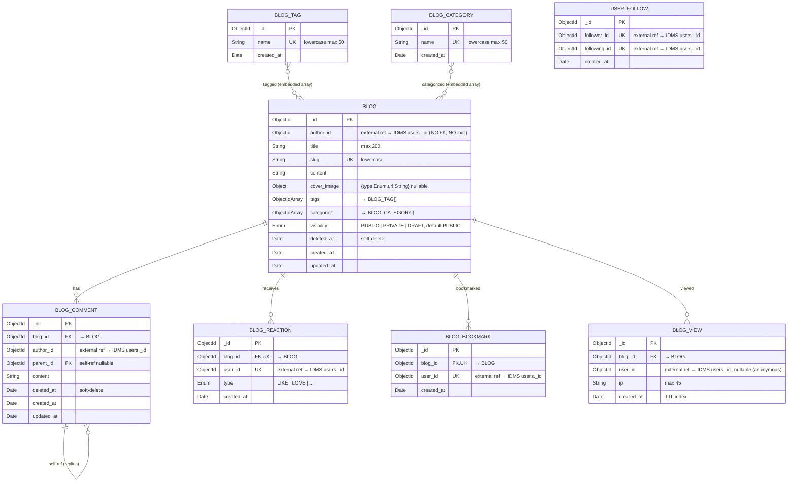

# ERD — Blog Satellite

> Schema MongoDB cho **Blog**, một app vệ tinh của IDMS (xem [`project-goals.md`](../project-goals.md) §2 Constellation Concept).
> Trạng thái: code blog đã được gỡ khỏi IDMS server. File ERD này là **schema reference** giữ lại cho MVP-3 — khi scaffold project blog vệ tinh, dùng file này làm starting point và di chuyển vào repo blog mới.
> Render: GitHub native, hoặc VS Code extension `bierner.markdown-mermaid`.

## Module groups

| Module     | Collections                                       |
| ---------- | ------------------------------------------------- |
| Content    | `blogs`, `blog_categories`, `blog_tags`           |
| Engagement | `blog_comments`, `blog_reactions`, `blog_bookmarks` |
| Analytics  | `blog_views`                                      |
| Social     | `user_follows`                                    |

## Schema



## Notes (semantics ngoài schema)

### External reference pattern
- Tất cả field `user_id`, `author_id`, `follower_id`, `following_id` là ObjectId trỏ về `users._id` của **IDMS**, KHÔNG có FK constraint DB-level, KHÔNG `$lookup`/`populate` được.
- Lấy profile tác giả: query IDMS qua `GET /oauth/userinfo` (với access token của user hiện tại) hoặc `GET /users/:id` (service-to-service token, nếu cần show author của bài viết public).
- Cache profile (username, avatar, fullName) ở blog với TTL 5–15 phút để giảm round-trip → IDMS.
- Khi user bị xóa ở IDMS (soft-delete `users.deleted_at`): blog KHÔNG tự xóa bài; UI hiển thị author là "Deleted user" khi lookup miss.

### TTL indexes
- `blog_views.created_at` — rolling window cho analytics (xem schema để biết retention days)

### Soft-delete
- `blogs`, `blog_comments` dùng `deleted_at` (null = active)
- Repository **bắt buộc** filter `deleted_at: null` khi list — KHÔNG dùng `find()` trần

### Embedded arrays (denormalized, không có junction table)
- `blogs.tags: [ObjectId]` → tham chiếu `blog_tags._id`
- `blogs.categories: [ObjectId]` → tham chiếu `blog_categories._id`

### Composite unique constraints
- `blog_reactions`: `(blog_id, user_id)` unique — 1 user 1 reaction per blog (update `type` nếu đổi)
- `blog_bookmarks`: `(blog_id, user_id)` unique
- `user_follows`: `(follower_id, following_id)` unique — chống duplicate follow

### Self-referential
- `blog_comments.parent_id` self-ref → comment replies dạng tree

### Auth & permission (sau khi tách)
- Blog là OAuth client của IDMS — đăng ký vào IDMS với `client_id` riêng.
- Mỗi request authenticated → blog validate access token bằng JWKS local (xem [`project-goals.md`](../project-goals.md) ADR-003).
- Action nhạy cảm (delete blog, delete comment người khác): gọi `/oauth/introspect` real-time check token revoke.
- Author authorization: so sánh `author_id` của blog với `sub` claim của token. Admin override: kiểm tra `roles` claim chứa `ADMIN`.

## Future (defer)

### BLOG_USER_PROFILE — tier-2 profile cho blog

Hiện chưa cần — sẽ thêm khi có nhu cầu lưu metadata riêng cho author trong blog (bio, signature, social links) mà không muốn nhồi vào IDMS profile (tier-1).

Khi cần, schema dự kiến:

```
BLOG_USER_PROFILE {
    ObjectId _id PK
    ObjectId user_id UK "external ref → IDMS users._id"
    String bio "nullable max 500"
    String signature "nullable"
    Object social_links "nullable {twitter, github, ...}"
    Object notification_prefs "nullable — preference cho blog notification"
    Date created_at
    Date updated_at
}
```

Khi thêm: `BLOG.author_id` có thể giữ trỏ thẳng IDMS user_id (như hiện tại), hoặc đổi sang trỏ `BLOG_USER_PROFILE._id` — chốt khi spec feature tương ứng qua pipeline SDD.

## How to update

File này là **schema reference** đến khi blog satellite được scaffold (MVP-3). Hiện chưa có Mongoose schema thực tế nào tham chiếu vào ERD này (code blog đã được gỡ khỏi IDMS server).

Khi scaffold blog satellite ở MVP-3:
1. Dùng ERD này làm starting point cho `entities/*.schema.ts` của blog repo mới
2. Di chuyển file này vào `docs/` của repo blog mới — gỡ khỏi IDMS repo
3. Từ đó về sau: sửa schema → sửa ERD trong cùng PR (như rule sync ở erd.md)
