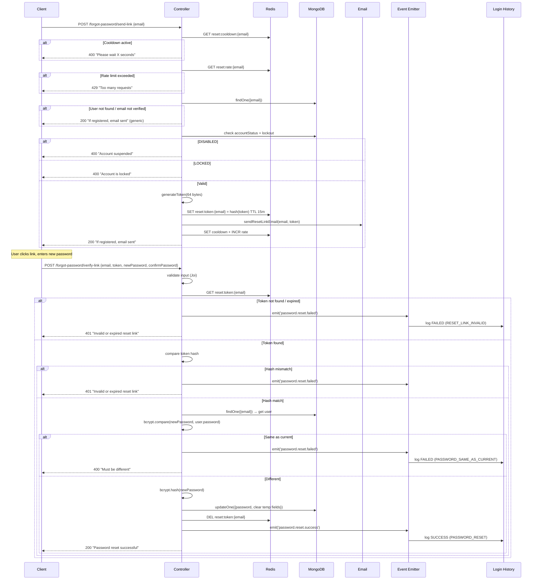
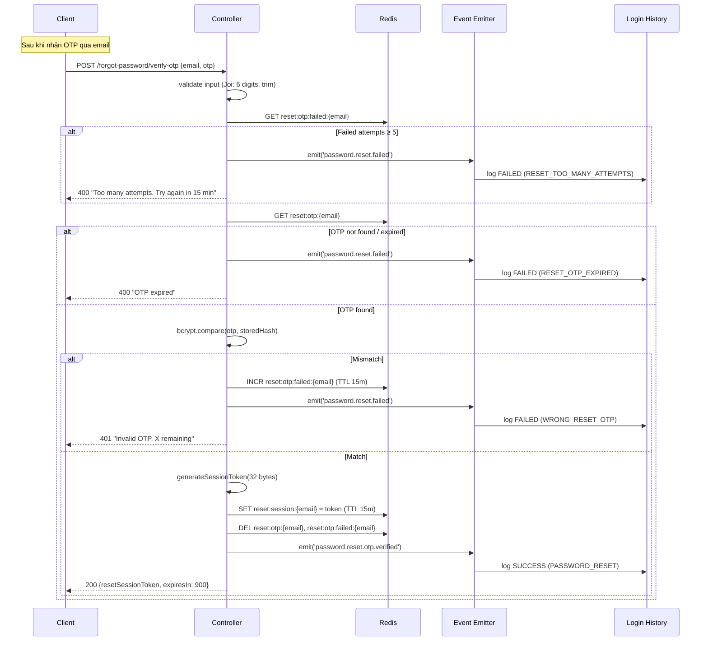
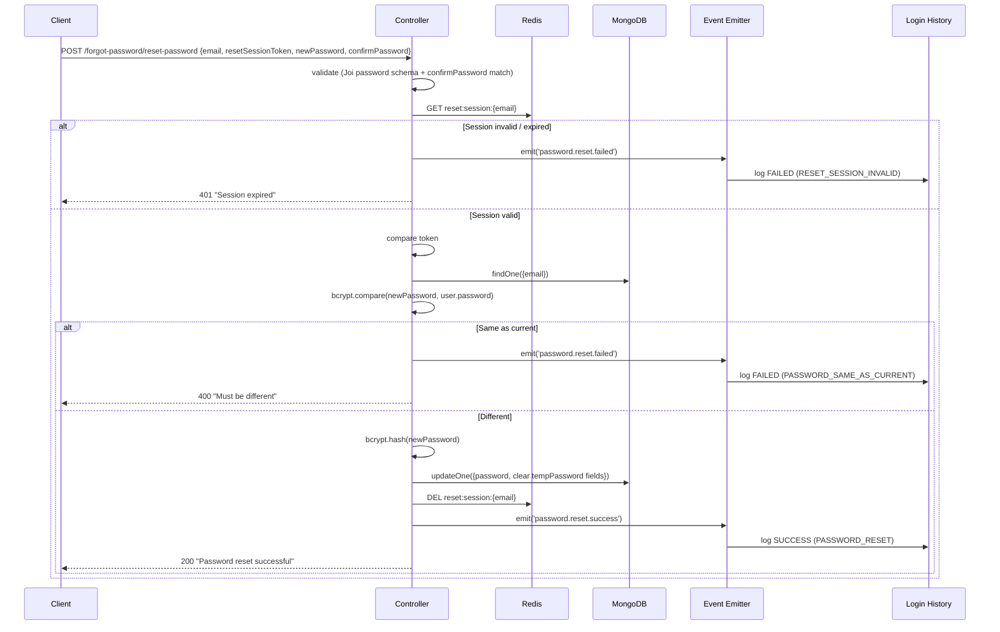

# 🏗️ TECHNICAL DESIGN DOCUMENT
## Tính năng: Quên Mật Khẩu (Forgot Password)

**Phiên bản:** 1.0  
**Ngày tạo:** 08/02/2026  
**Tài liệu tham chiếu:** Forgot Password FRA v1.0 · Login History TDD v1.0 · Sign-in FRA v2.0 · Signup FRA v1.1  

---

## 1. TÓM TẮT THIẾT KẾ

Feature tạo module `forgot-password` mới với 5 endpoints. Tái sử dụng password validation (Joi schema) từ Signup, OTP generation pattern từ Sign-in, và Event Emitter từ Login History (ghi log sự kiện). Reset Link flow gộp verify + đặt mật khẩu trong 1 request. OTP flow tách 3 bước (gửi → verify → đặt mật khẩu) với reset session token trung gian.

**Tech Stack — chỉ liệt kê thêm mới:**

| Hạng mục | Công nghệ | Ghi chú |
|---|---|---|
| Tất cả stack hiện có | Node.js, Express, MongoDB, Redis, Nodemailer, Joi, Bcrypt, Winston, JWT | Hiện có — không thay đổi |
| GeoIP + UA Parser | geoip-lite, ua-parser-js | Hiện có — từ Login History (ghi log) |

> Không cần thêm library mới. Tái sử dụng hoàn toàn.

---

## 2. KIẾN TRÚC HỆ THỐNG

### 2.1 High-Level Architecture

```
┌───────────┐       HTTPS       ┌──────────────────────────────────┐
│  Client   │ ◄──────────────  │  Express API Server              │
│           │ ──────────────►  │                                  │
└───────────┘                   │  ┌────────────────────────────┐  │
                                │  │  Auth Module (hiện có)     │  │
                                │  │  - Sign-in controllers     │  │
                                │  │  - Signup controllers      │  │
                                │  └────────────────────────────┘  │
                                │                                  │
                                │  ┌────────────────────────────┐  │
                                │  │  Forgot Password Module    │  │
                                │  │  (MỚI)                     │  │
                                │  └──┬─────────┬───────┬───────┘  │
                                │     │         │       │          │
                                │  ┌──▼──┐  ┌──▼──┐ ┌──▼────────┐ │
                                │  │Login│  │Event│ │Password   │ │
                                │  │Hist.│  │Emit.│ │Validation │ │
                                │  │(log)│  │(có) │ │(Signup)   │ │
                                │  └─────┘  └─────┘ └───────────┘ │
                                └──┬─────────┬──────────┬──────────┘
                                   │         │          │
                              ┌────▼──┐  ┌───▼──┐  ┌───▼──────┐
                              │MongoDB│  │Redis │  │Nodemailer│
                              │       │  │      │  │(Email)   │
                              └───────┘  └──────┘  └──────────┘
```

**Tái sử dụng từ modules hiện có:**
- **Signup:** Joi password validation schema, bcrypt config (cost factor)
- **Sign-in:** OTP generation pattern (crypto-secure, 6 digits, hash storage)
- **Login History:** Event Emitter (ghi log sự kiện), GeoIP + UA Parser utils

### 2.2 Design Patterns Applied

| Pattern | Áp dụng ở đâu | Lý do |
|---|---|---|
| **Strategy Pattern** | 2 phương thức reset (Link vs OTP) — cùng interface, khác implementation | Dễ thêm phương thức mới. SOLID: **O** (Open/Closed) |
| **Event Emitter** (tái sử dụng) | Ghi log sự kiện vào login_histories qua event | Tách biệt reset logic khỏi logging. SOLID: **S** |
| **Template Method** | Luồng reset: validate → generate credential → send email → verify → update password. 2 strategy override bước generate + verify | Tránh duplicate code giữa Link flow và OTP flow |
| **Middleware Pattern** | Rate limiting, input validation | Tái sử dụng Express pattern |

---

## 3. DATA MODELS

### 3.1 Redis Key Design — Forgot Password

| Key Pattern | Value | TTL | Mục đích |
|---|---|---|---|
| `reset:token:{email}` | Hash của reset token (bcrypt/SHA256) | 15 phút | Lưu reset link token |
| `reset:otp:{email}` | Hash của OTP (bcrypt) | 15 phút | Lưu reset OTP |
| `reset:session:{email}` | Reset session token (plain — vì đã crypto-secure) | 15 phút | Session sau verify OTP, dùng cho bước đặt mật khẩu |
| `reset:cooldown:{email}` | `"1"` (placeholder) | 60 giây | Cooldown giữa 2 lần gửi email |
| `reset:rate:{email}` | Counter (number) | 15 phút | Rate limit: max 3 requests / 15 phút |
| `reset:otp:failed:{email}` | Counter (number) | 15 phút | Đếm số lần nhập OTP sai (max 5) |

### 3.2 User Model Updates — Không thêm fields mới

> Forgot Password **KHÔNG cần thêm fields** vào User model. Password field (`password`) đã có sẵn — chỉ cần update giá trị.
>
> Các fields liên quan đã có từ Login History: `tempPasswordHash`, `tempPasswordUsed`, `mustChangePassword` — Forgot Password sẽ **clear** chúng khi reset thành công.

### 3.3 LoginHistory Model Updates — Thêm enum values

**Bổ sung vào `loginMethod` enum:**

| Giá trị mới | Mô tả |
|---|---|
| `PASSWORD_RESET` | Sự kiện liên quan đến forgot password |

**Bổ sung vào `failureReason` enum:**

| Giá trị mới | Mô tả |
|---|---|
| `RESET_LINK_INVALID` | Reset link không hợp lệ hoặc đã hết hạn |
| `WRONG_RESET_OTP` | Nhập sai OTP reset |
| `RESET_OTP_EXPIRED` | OTP reset đã hết hạn |
| `RESET_TOO_MANY_ATTEMPTS` | Quá 5 lần nhập sai OTP reset |
| `PASSWORD_SAME_AS_CURRENT` | Mật khẩu mới trùng mật khẩu hiện tại |
| `RESET_SESSION_INVALID` | Reset session token không hợp lệ/hết hạn |

---

## 4. API DESIGN (Chi tiết)

### 4.1 `POST /api/v1/auth/forgot-password/send-link` — Gửi reset link

**Request:**

```json
{
  "email": "user@example.com"
}
```

**Validation Rules:**

| Field | Rules |
|---|---|
| `email` | required, email format (RFC 5322), trim, lowercase |

**Response Success (200):**

```json
{
  "statusCode": 200,
  "message": "If this email is registered, a reset link has been sent",
  "data": {
    "cooldown": 60,
    "expiresIn": 900
  }
}
```

> Message **generic** — trả cùng response dù email tồn tại hay không.

> Response errors: xem **Section 9 — Error Codes Mapping**.

---

### 4.2 `POST /api/v1/auth/forgot-password/send-otp` — Gửi reset OTP

**Request:**

```json
{
  "email": "user@example.com"
}
```

**Validation Rules:** Giống 4.1.

**Response Success (200):**

```json
{
  "statusCode": 200,
  "message": "If this email is registered, a reset code has been sent",
  "data": {
    "cooldown": 60,
    "expiresIn": 900
  }
}
```

> Response errors: xem **Section 9 — Error Codes Mapping**.

---

### 4.3 `POST /api/v1/auth/forgot-password/verify-link` — Verify link + Đặt mật khẩu mới

> **Gộp 2 bước:** verify token + đặt mật khẩu mới trong 1 request.

**Request:**

```json
{
  "email": "user@example.com",
  "token": "a1b2c3d4e5f6...128_hex_chars",
  "newPassword": "NewSecurePass123!",
  "confirmPassword": "NewSecurePass123!"
}
```

**Validation Rules:**

| Field | Rules |
|---|---|
| `email` | required, email, trim, lowercase |
| `token` | required, string, length 128 (hex) |
| `newPassword` | required, Joi password schema (tái sử dụng từ Signup) |
| `confirmPassword` | required, must match `newPassword` |

**Response Success (200):**

```json
{
  "statusCode": 200,
  "message": "Password reset successful. Please login with your new password",
  "data": {
    "success": true
  }
}
```

> Response errors: xem **Section 9 — Error Codes Mapping**.

---

### 4.4 `POST /api/v1/auth/forgot-password/verify-otp` — Verify reset OTP

**Request:**

```json
{
  "email": "user@example.com",
  "otp": "123456"
}
```

**Validation Rules:**

| Field | Rules |
|---|---|
| `email` | required, email, trim, lowercase |
| `otp` | required, string, length 6, digits only, trim |

**Response Success (200):**

```json
{
  "statusCode": 200,
  "message": "OTP verified. Please set your new password",
  "data": {
    "resetSessionToken": "a1b2c3d4...64_hex_chars",
    "expiresIn": 900
  }
}
```

> Response errors: xem **Section 9 — Error Codes Mapping**.

---

### 4.5 `POST /api/v1/auth/forgot-password/reset-password` — Đặt mật khẩu mới (sau verify OTP)

**Request:**

```json
{
  "email": "user@example.com",
  "resetSessionToken": "a1b2c3d4...64_hex_chars",
  "newPassword": "NewSecurePass123!",
  "confirmPassword": "NewSecurePass123!"
}
```

**Validation Rules:**

| Field | Rules |
|---|---|
| `email` | required, email, trim, lowercase |
| `resetSessionToken` | required, string, length 64 (hex) |
| `newPassword` | required, Joi password schema (Signup) |
| `confirmPassword` | required, must match `newPassword` |

**Response Success (200):**

```json
{
  "statusCode": 200,
  "message": "Password reset successful. Please login with your new password",
  "data": {
    "success": true
  }
}
```

> Response errors: xem **Section 9 — Error Codes Mapping**.

---

## 5. SEQUENCE DIAGRAMS

### 5.1 Reset Link Flow



### 5.2 OTP Flow — Verify OTP Step



### 5.3 Set New Password (Dùng chung cho cả OTP flow bước cuối)



---

## 6. EDGE CASE HANDLING

> 📎 Danh sách edge cases: xem **[FRA Section 5](./forgot-password-fra.md)**.
> Tất cả edge cases đã được xử lý trong Sequence Diagrams (Section 5) và Error Codes (Section 9).

---

## 7. EVENT DESIGN (Tái sử dụng Login History Event Emitter)

### 7.1 Events mới

| Event | Khi nào | Payload bổ sung |
|---|---|---|
| `password.reset.success` | Verify link thành công + password updated | `{ resetMethod: 'LINK' \| 'OTP' }` |
| `password.reset.otp.verified` | Verify OTP thành công (chưa đặt mật khẩu) | `{ resetMethod: 'OTP' }` |
| `password.reset.failed` | Bất kỳ lỗi nào trong flow reset | `{ failureReason: '...' }` |

### 7.2 Handler — Ghi log vào login_histories

| Event | LoginHistory status | loginMethod | failureReason |
|---|---|---|---|
| `password.reset.success` | `SUCCESS` | `PASSWORD_RESET` | `null` |
| `password.reset.otp.verified` | `SUCCESS` | `PASSWORD_RESET` | `null` |
| `password.reset.failed` | `FAILED` | `PASSWORD_RESET` | Từ payload |

> Handler tái sử dụng **cùng Event Emitter instance** từ Login History. Chỉ thêm listener mới cho 3 events trên. Logic handler giống pattern hiện có: parse UA, GeoIP, insert DB, wrap try-catch, không throw.

---

## 8. UTILS DESIGN — Tái sử dụng

| Utility | Nguồn | Ghi chú |
|---|---|---|
| OTP generation (6 digits, crypto-secure) | Sign-in / Signup | Tái sử dụng hàm hiện có |
| Token generation (64 bytes) | Sign-in (Magic Link token cũng 64 bytes) | Tái sử dụng |
| Session token generation (32 bytes) | Signup (session token cũng 32 bytes) | Tái sử dụng |
| Password validation (Joi schema) | Signup | Import trực tiếp |
| Bcrypt hash/compare | Signup / Sign-in | Cùng config (cost factor) |
| GeoIP lookup | Login History | Tái sử dụng cho ghi log |
| UA Parser | Login History | Tái sử dụng cho ghi log |

> **Không cần tạo utility mới.** Tất cả đã có.

---

## 9. ERROR CODES MAPPING

| HTTP Status | Error Code | Khi nào | Message |
|---|---|---|---|
| 200 | — | Thành công (hoặc generic anti-enum) | Tuỳ endpoint |
| 400 | `COOLDOWN_ACTIVE` | Gửi email chưa hết cooldown 60s | "Please wait X seconds before requesting again" |
| 400 | `ACCOUNT_LOCKED` | Account đang bị lock | "Account is locked. Please use Unlock feature or wait" |
| 400 | `ACCOUNT_DISABLED` | Account bị admin disable | "Account suspended. Contact support" |
| 400 | `OTP_EXPIRED` | OTP reset hết hạn | "OTP expired. Please request a new one" |
| 400 | `RESET_TOO_MANY_ATTEMPTS` | OTP sai ≥ 5 lần | "Too many failed attempts. Try again in 15 minutes" |
| 400 | `PASSWORD_SAME_AS_CURRENT` | Mật khẩu mới trùng cũ | "New password must be different from current password" |
| 400 | `PASSWORD_MISMATCH` | confirmPassword ≠ newPassword | "Passwords do not match" |
| 400 | `WEAK_PASSWORD` | Không đáp ứng password policy | "Password does not meet requirements" |
| 401 | `INVALID_RESET_LINK` | Token invalid/expired | "Invalid or expired reset link" |
| 401 | `INVALID_RESET_OTP` | OTP sai | "Invalid OTP. X attempts remaining" |
| 401 | `RESET_SESSION_EXPIRED` | Session token invalid/expired | "Session expired. Please start the reset process again" |
| 429 | `RATE_LIMITED` | Vượt 3 requests / 15 phút | "Too many requests. Please try again later" |

---

*Tài liệu sẵn sàng cho implementation. Bắt đầu từ Phase 1 theo WBS.*
