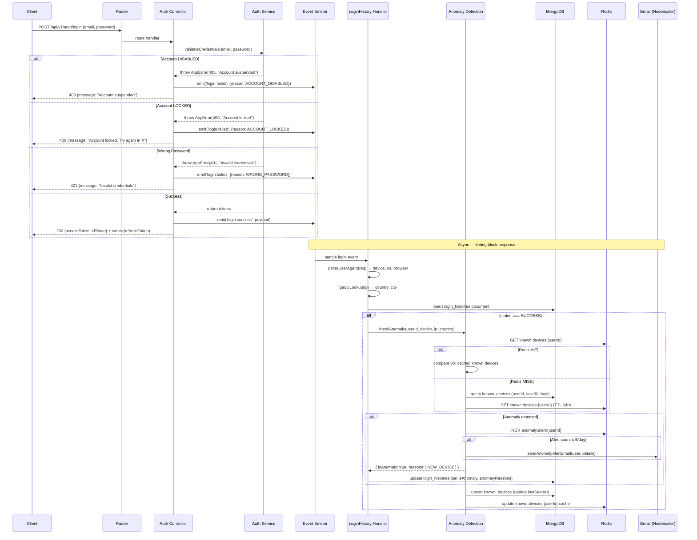
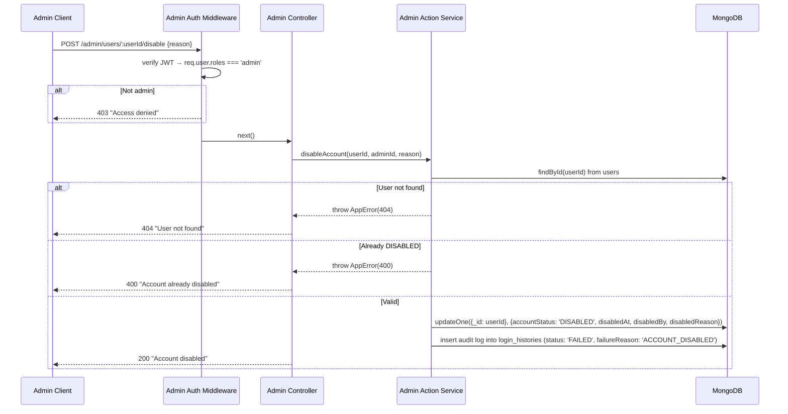

# 🏗️ TECHNICAL DESIGN DOCUMENT (TDD)
## Tính năng: Ghi lại Lịch sử Đăng nhập

**Phiên bản:** 1.0  
**Ngày tạo:** 08/02/2026  
**Tài liệu tham chiếu:** Login History FRA v4.0 · Sign-in FRA v2.0 · Login History WBS  

---

## 1. TÓM TẮT THIẾT KẾ

Feature bổ sung module `login-history` vào hệ thống, tích hợp logging vào 5 endpoint Sign-in hiện có và tạo 8 endpoint mới. Thiết kế tuân thủ kiến trúc feature-based hiện tại, sử dụng **Event Emitter pattern** để tách biệt logging logic khỏi authentication logic — chuẩn bị cho migration sang message queue ở phase sau.

**Tech Stack (Confirmed):**

| Hạng mục | Công nghệ | Ghi chú |
|---|---|---|
| Runtime | Node.js + TypeScript | Hiện có |
| Framework | Express | Hiện có |
| Database | MongoDB + Mongoose | Hiện có |
| Cache | Redis | Hiện có (OTP, rate limiting) |
| Validation | Joi | Hiện có |
| Error Handling | Global error handler + custom AppError class | Hiện có |
| Logging | Winston | Hiện có |
| Email | Nodemailer | Hiện có |
| Auth | JWT → `req.user = { userId, authId, email, roles }` | Hiện có |
| GeoIP | geoip-lite (offline DB) | **Mới** |
| User-Agent Parser | ua-parser-js | **Mới** |
| CSV Export | json2csv | **Mới** |
| Cron Job | node-cron | **Mới** |
| Response Format | `{ statusCode, message, data }` | Hiện có |

---

## 2. KIẾN TRÚC HỆ THỐNG

### 2.1 High-Level Architecture

```
┌─────────────┐       HTTPS        ┌──────────────────────────────┐
│  Client App │ ◄──────────────── │  Express API Server          │
│  (Web/Mobile)│ ──────────────► │                              │
└─────────────┘                    │  ┌─────────────────────┐    │
                                   │  │  Auth Module         │    │
                                   │  │  (Sign-in - hiện có) │    │
                                   │  └──────────┬──────────┘    │
                                   │             │ emit event    │
                                   │             ▼               │
                                   │  ┌─────────────────────┐    │
                                   │  │  Login History Module│    │
                                   │  │  (MỚI)              │    │
                                   │  └──┬──────┬───────┬───┘    │
                                   └─────┼──────┼───────┼────────┘
                                         │      │       │
                                   ┌─────▼──┐ ┌─▼────┐ ┌▼────────┐
                                   │MongoDB │ │Redis │ │Nodemailer│
                                   │        │ │      │ │(Email)   │
                                   └────────┘ └──────┘ └──────────┘
```

### 2.2 Design Patterns Applied

| Pattern | Áp dụng ở đâu | Lý do |
|---|---|---|
| **Event Emitter** | Auth controller emit `login.success` / `login.failed` → Login History handler lắng nghe | Tách biệt auth logic khỏi logging logic. Dễ migrate sang Bull queue sau (chỉ thay emitter bằng producer). SOLID: **S** — auth không biết về logging |
| **Repository Pattern** | Mỗi Mongoose model có service riêng để query | Tách data access khỏi business logic. SOLID: **S**, **D** |
| **Strategy Pattern** | `anomalyDetection.service.ts` — check device/IP/country là 3 strategies riêng | Dễ thêm strategy mới (vd: check thời gian bất thường). SOLID: **O** |
| **Middleware Pattern** | `adminAuth.middleware.ts` — chain vào routes | Express pattern hiện có. SOLID: **S** |
| **Builder Pattern** | `loginHistoryLogger.service.ts` — build log entry từ nhiều nguồn (req, geoip, ua-parser) | Tạo object phức tạp từ nhiều bước. Clean code |
| **Singleton Pattern** | Redis client, GeoIP database | Tái sử dụng connection, tránh duplicate |

---

## 3. DATA MODELS (Mongoose Schemas)

### 3.1 LoginHistory Model — `login_histories` collection

```typescript
// src/modules/login-history/models/loginHistory.model.ts

const LoginHistorySchema = new Schema({
  userId: {
    type: Schema.Types.ObjectId,
    ref: 'User',
    default: null,            // NULL nếu account not found
    index: true
  },
  usernameAttempted: {
    type: String,
    required: true,
    trim: true,
    lowercase: true
  },
  status: {
    type: String,
    required: true,
    enum: ['SUCCESS', 'FAILED'],
    index: true
  },
  failureReason: {
    type: String,
    enum: [
      'WRONG_PASSWORD', 'WRONG_OTP', 'OTP_EXPIRED',
      'MAGIC_LINK_EXPIRED', 'MAGIC_LINK_INVALID',
      'ACCOUNT_LOCKED', 'ACCOUNT_DISABLED', 'ACCOUNT_NOT_FOUND',
      'EMAIL_NOT_VERIFIED', 'COOLDOWN_ACTIVE', 'RESEND_LIMIT_EXCEEDED',
      'TEMP_PASSWORD_EXPIRED', 'IP_BLOCKED', 'TOO_MANY_ATTEMPTS',
      'UNKNOWN'
    ],
    default: null
  },
  loginMethod: {
    type: String,
    required: true,
    enum: ['PASSWORD', 'OTP', 'MAGIC_LINK']
  },
  ipAddress: {
    type: String,
    required: true,
    index: true
  },
  country: {
    type: String,
    default: 'UNKNOWN'
  },
  city: {
    type: String,
    default: 'UNKNOWN'
  },
  deviceType: {
    type: String,
    enum: ['DESKTOP', 'MOBILE', 'TABLET', 'UNKNOWN'],
    default: 'UNKNOWN'
  },
  os: {
    type: String,
    default: 'UNKNOWN'
  },
  browser: {
    type: String,
    default: 'UNKNOWN'
  },
  userAgent: {
    type: String,
    default: ''
  },
  clientType: {
    type: String,
    enum: ['WEB', 'MOBILE_IOS', 'MOBILE_ANDROID'],
    default: 'WEB'
  },
  timezoneOffset: {
    type: String,
    default: null               // vd: '+07:00'
  },
  isAnomaly: {
    type: Boolean,
    default: false
  },
  anomalyReasons: {
    type: [String],             // ['NEW_DEVICE', 'NEW_IP', 'NEW_COUNTRY']
    default: []
  }
}, {
  timestamps: { createdAt: true, updatedAt: false },  // chỉ cần createdAt
  collection: 'login_histories'
});

// === INDEXES ===
// Query user history (Phase 3): user xem lịch sử của mình
LoginHistorySchema.index({ userId: 1, createdAt: -1 });

// Query user + status filter
LoginHistorySchema.index({ userId: 1, status: 1, createdAt: -1 });

// Admin query: filter by IP
LoginHistorySchema.index({ ipAddress: 1, createdAt: -1 });

// Admin query: filter by username
LoginHistorySchema.index({ usernameAttempted: 1, createdAt: -1 });

// Admin query: general listing sorted by time
LoginHistorySchema.index({ createdAt: -1 });

// TTL index: auto-delete sau retention period (mặc định 3 năm = 94,608,000s)
LoginHistorySchema.index(
  { createdAt: 1 },
  { expireAfterSeconds: 94608000 }
);
```

### 3.2 KnownDevice Model — `known_devices` collection

```typescript
// src/modules/login-history/models/knownDevice.model.ts

const KnownDeviceSchema = new Schema({
  userId: {
    type: Schema.Types.ObjectId,
    ref: 'User',
    required: true,
    index: true
  },
  deviceFingerprint: {
    type: String,              // SHA256 hash of (os + browser + deviceType)
    required: true
  },
  ipAddress: {
    type: String,
    required: true
  },
  country: {
    type: String,
    required: true
  },
  lastSeenAt: {
    type: Date,
    default: Date.now
  }
}, {
  timestamps: true,
  collection: 'known_devices'
});

// Compound index: lookup nhanh khi check anomaly
KnownDeviceSchema.index({ userId: 1, deviceFingerprint: 1 });
KnownDeviceSchema.index({ userId: 1, ipAddress: 1 });
KnownDeviceSchema.index({ userId: 1, country: 1 });

// TTL: tự xoá device không thấy trong 90 ngày
KnownDeviceSchema.index(
  { lastSeenAt: 1 },
  { expireAfterSeconds: 7776000 }  // 90 days
);
```

### 3.3 User Model Updates — Thêm fields vào `users` collection hiện có

```typescript
// Thêm vào schema User hiện có (src/modules/auth/models/user.model.ts)

// --- ADMIN DISABLE (Phase 4) ---
accountStatus:        { type: String, enum: ['ACTIVE', 'DISABLED'], default: 'ACTIVE', index: true },
disabledAt:           { type: Date, default: null },
disabledBy:           { type: Schema.Types.ObjectId, ref: 'User', default: null },
disabledReason:       { type: String, default: null },

// --- AUDIT (Phase 4) ---
lastUnlockedAt:       { type: Date, default: null },
lastUnlockedBy:       { type: Schema.Types.ObjectId, ref: 'User', default: null },
```

### 3.4 Redis Key Design

| Key Pattern | Value | TTL | Mục đích |
|---|---|---|---|
| `anomaly:alert:{userId}` | Counter (number) | 24 giờ | Rate limit email cảnh báo: 5/ngày |
| `known:devices:{userId}` | JSON string `[{fingerprint, ip, country}]` | 24 giờ | Cache known devices cho anomaly check |

---

## 4. API DESIGN (Chi tiết)

### 4.1 Endpoints tích hợp logging vào Sign-in (SỬA — Không thay đổi request/response)

> 5 endpoint hiện có **giữ nguyên** request/response format. Chỉ thêm logic: emit login event sau khi auth xong.

| # | Endpoint hiện có | Thay đổi |
|---|---|---|
| 1 | `POST /api/v1/auth/login` | Thêm emit `login.success` / `login.failed` |
| 2 | `POST /api/v1/auth/login/otp/send` | Thêm emit `login.failed` khi validate fail (cooldown, resend limit, account issues) |
| 3 | `POST /api/v1/auth/login/otp/verify` | Thêm emit `login.success` / `login.failed` |
| 4 | `POST /api/v1/auth/login/magic-link/send` | Thêm emit `login.failed` khi validate fail |
| 5 | `POST /api/v1/auth/login/magic-link/verify` | Thêm emit `login.success` / `login.failed` |

**Login Event Payload (chung cho tất cả):**

```typescript
interface LoginEventPayload {
  userId: string | null;
  usernameAttempted: string;
  status: 'SUCCESS' | 'FAILED';
  failureReason: string | null;
  loginMethod: 'PASSWORD' | 'OTP' | 'MAGIC_LINK';
  req: Request;               // extract IP, User-Agent, client-type
  timezoneOffset?: string;    // từ request header hoặc body
}
```

---

### 4.2 `GET /api/v1/me/login-history` — User xem danh sách

**Query Parameters:**

| Param | Type | Default | Mô tả |
|---|---|---|---|
| `page` | number | 1 | Trang hiện tại |
| `limit` | number | 20 | Số bản ghi/trang (max 100) |
| `status` | string | - | Filter: `SUCCESS`, `FAILED` |
| `startDate` | string (ISO) | - | Từ ngày |
| `endDate` | string (ISO) | - | Đến ngày |

**Joi Validation:**
```typescript
const listHistorySchema = Joi.object({
  page: Joi.number().integer().min(1).default(1),
  limit: Joi.number().integer().min(1).max(100).default(20),
  status: Joi.string().valid('SUCCESS', 'FAILED'),
  startDate: Joi.date().iso(),
  endDate: Joi.date().iso().greater(Joi.ref('startDate'))
});
```

**Response Success (200):**
```json
{
  "statusCode": 200,
  "message": "Login history retrieved",
  "data": {
    "items": [
      {
        "id": "65a1b2c3d4e5f6...",
        "status": "SUCCESS",
        "loginMethod": "PASSWORD",
        "deviceType": "DESKTOP",
        "os": "Windows 11",
        "browser": "Chrome 121",
        "ipAddress": "103.45.xxx.xxx",
        "country": "Viet Nam",
        "city": "Ho Chi Minh",
        "isAnomaly": false,
        "createdAt": "2026-02-08T07:30:00.000Z"
      }
    ],
    "pagination": {
      "page": 1,
      "limit": 20,
      "totalItems": 156,
      "totalPages": 8
    }
  }
}
```

> IP **masked**: `103.45.xxx.xxx`. Chỉ trả fields đại diện — không trả raw userAgent.

---

### 4.3 `GET /api/v1/me/login-history/:id` — User xem chi tiết

**Response Success (200):**
```json
{
  "statusCode": 200,
  "message": "Login history detail",
  "data": {
    "id": "65a1b2c3d4e5f6...",
    "status": "FAILED",
    "failureReason": "WRONG_PASSWORD",
    "loginMethod": "PASSWORD",
    "deviceType": "MOBILE",
    "os": "iOS 17.2",
    "browser": "Safari 17",
    "userAgent": "Mozilla/5.0 (iPhone; CPU iPhone OS 17_2 like Mac OS X)...",
    "ipAddress": "103.45.xxx.xxx",
    "country": "Viet Nam",
    "city": "Ho Chi Minh",
    "clientType": "WEB",
    "isAnomaly": true,
    "anomalyReasons": ["NEW_DEVICE"],
    "timezoneOffset": "+07:00",
    "createdAt": "2026-02-08T07:30:00.000Z"
  }
}
```

**Response Error (404):**
```json
{ "statusCode": 404, "message": "Login history record not found" }
```

**Response Error (403):** — user cố xem record của user khác:
```json
{ "statusCode": 403, "message": "Access denied" }
```

---

### 4.4 `GET /api/v1/admin/login-history` — Admin xem toàn bộ

**Query Parameters:** *(bao gồm tất cả params của user + thêm)*

| Param | Type | Default | Mô tả |
|---|---|---|---|
| `page` | number | 1 | Trang |
| `limit` | number | 20 | Bản ghi/trang (max 100) |
| `status` | string | - | `SUCCESS`, `FAILED` |
| `startDate` | string (ISO) | - | Từ ngày |
| `endDate` | string (ISO) | - | Đến ngày |
| `userId` | string | - | Filter theo user ID |
| `email` | string | - | Search theo email (partial match) |
| `ipAddress` | string | - | Filter theo IP |
| `loginMethod` | string | - | `PASSWORD`, `OTP`, `MAGIC_LINK` |
| `country` | string | - | Filter theo quốc gia |
| `failureReason` | string | - | Filter theo lý do thất bại |

**Response Success (200):**
```json
{
  "statusCode": 200,
  "message": "Login history retrieved",
  "data": {
    "items": [
      {
        "id": "65a1b2c3d4e5f6...",
        "user": {
          "userId": "64f1a2b3c4d5...",
          "email": "user@example.com",
          "isDeleted": false
        },
        "status": "FAILED",
        "failureReason": "WRONG_PASSWORD",
        "loginMethod": "PASSWORD",
        "deviceType": "DESKTOP",
        "os": "Windows 11",
        "browser": "Chrome 121",
        "ipAddress": "103.45.67.89",
        "country": "Viet Nam",
        "city": "Ho Chi Minh",
        "isAnomaly": false,
        "createdAt": "2026-02-08T07:30:00.000Z"
      }
    ],
    "pagination": { "page": 1, "limit": 20, "totalItems": 5230, "totalPages": 262 }
  }
}
```

> IP admin: **đầy đủ** (không mask). User đã xoá: `{ userId: "...", email: "old@email.com", isDeleted: true }`.

---

### 4.5 `GET /api/v1/admin/login-history/:id` — Admin chi tiết

Giống 4.3 nhưng: IP **đầy đủ**, thêm field `user` object, không check ownership.

---

### 4.6 `POST /api/v1/admin/users/:userId/unlock` — Admin unlock

**Request:** Không cần body. `userId` từ URL param.

**Response Success (200):**
```json
{
  "statusCode": 200,
  "message": "Account unlocked successfully",
  "data": {
    "userId": "64f1a2b3c4d5...",
    "previousLockState": { "failedAttempts": 7, "lockUntil": "2026-02-08T08:00:00Z" },
    "currentState": { "failedAttempts": 0, "lockUntil": null }
  }
}
```

**Response Error (400):** — Account bị DISABLED, cần enable thay vì unlock:
```json
{
  "statusCode": 400,
  "message": "Account is disabled. Use /enable endpoint instead"
}
```

**Response Error (400):** — Account không bị lock:
```json
{ "statusCode": 400, "message": "Account is not locked" }
```

---

### 4.7 `POST /api/v1/admin/users/:userId/disable` — Admin khoá vĩnh viễn

**Request:**
```json
{
  "reason": "Suspicious activity reported by customer"
}
```

**Joi Validation:**
```typescript
const disableSchema = Joi.object({
  reason: Joi.string().required().min(10).max(500)
});
```

**Response Success (200):**
```json
{
  "statusCode": 200,
  "message": "Account disabled successfully",
  "data": {
    "userId": "64f1a2b3c4d5...",
    "accountStatus": "DISABLED",
    "disabledAt": "2026-02-08T10:00:00Z",
    "disabledBy": "admin-user-id",
    "reason": "Suspicious activity reported by customer"
  }
}
```

**Response Error (400):** — Đã bị disable rồi:
```json
{ "statusCode": 400, "message": "Account is already disabled" }
```

---

### 4.8 `POST /api/v1/admin/users/:userId/enable` — Admin mở khoá

**Request:** Không cần body.

**Response Success (200):**
```json
{
  "statusCode": 200,
  "message": "Account enabled successfully",
  "data": {
    "userId": "64f1a2b3c4d5...",
    "accountStatus": "ACTIVE",
    "enabledBy": "admin-user-id"
  }
}
```

---

### 4.9 `GET /api/v1/admin/login-history/export` — Export CSV

**Query Parameters:** Giống 4.6 (tất cả filter params), bỏ `page` và `limit` (thay bằng max 10,000).

**Response:** Stream CSV file.

```
Content-Type: text/csv
Content-Disposition: attachment; filename="login-history-2026-02-08.csv"
```

**CSV Columns:**
```
id,email,status,failureReason,loginMethod,ipAddress,country,city,deviceType,os,browser,clientType,createdAt
```

---

## 5. DATA FLOW

### 5.1 Luồng ghi log đăng nhập (Phase 1)

```
1. Client gửi POST /login
2. Express Router → Auth Controller
3. Auth Controller:
   a. Validate input (Joi) → nếu fail → emit login.failed + return error
   b. Check account lock → nếu locked → emit login.failed + return error
   c. Check account status → nếu DISABLED → emit login.failed + return error
   d. Verify credentials → nếu sai → emit login.failed + return error
   e. Credentials đúng → emit login.success
   f. Return tokens response
4. Login Event Handler (lắng nghe event):
   a. Extract IP từ req (req.ip hoặc x-forwarded-for)
   b. Parse User-Agent → device_type, os, browser (ua-parser-js)
   c. GeoIP lookup → country, city (geoip-lite)
   d. Build LoginHistory document
   e. Try: save to MongoDB
   f. Catch: log error via Winston → KHÔNG throw (không block response)
   g. Nếu status === SUCCESS:
      - Check anomaly (Redis cache → fallback MongoDB)
      - Nếu anomaly → gửi email cảnh báo (non-blocking)
      - Update known_devices (MongoDB + Redis cache)
```

---

## 6. SEQUENCE DIAGRAMS

### 6.1 Login với Logging + Anomaly Detection (Luồng chính)



### 6.2 Admin Disable Account



---

## 7. EDGE CASE → DESIGN MAPPING

*Mapping edge cases từ FRA sang quyết định thiết kế cụ thể.*

| FRA Edge Case | Quyết định thiết kế |
|---|---|
| **EC-01**: Email không tồn tại | `userId: null` trong LoginHistory document. Auth controller emit event với `failureReason: 'ACCOUNT_NOT_FOUND'`. Response: generic "Invalid credentials". |
| **EC-02**: Email chưa verify | Check `user.emailVerified` trước credentials check. `failureReason: 'EMAIL_NOT_VERIFIED'`. Response nhất quán Sign-in. |
| **EC-04**: Account DISABLED cố đăng nhập | Check `user.accountStatus === 'DISABLED'` **trước** check lockout. Priority: DISABLED > LOCKED > credentials. |
| **EC-05**: OTP cooldown active | Sign-in đã handle. Login History chỉ ghi log `failureReason: 'COOLDOWN_ACTIVE'` qua event. |
| **EC-08**: GeoIP fail | `geoip.util.ts` wrap trong try-catch. Default: `{ country: 'UNKNOWN', city: 'UNKNOWN' }`. Winston log warning. |
| **EC-09**: User-Agent rỗng | `userAgent.util.ts` return defaults `{ deviceType: 'UNKNOWN', os: 'UNKNOWN', browser: 'UNKNOWN' }`. Vẫn lưu raw string. |
| **EC-10**: Ghi log DB fail | Event handler wrap toàn bộ trong try-catch. `logger.error()` via Winston. **KHÔNG re-throw** — response đã trả cho client. |
| **EC-11**: Redis down → anomaly fail | `anomalyDetection.service.ts`: try Redis → catch → fallback query MongoDB. Nếu cả 2 fail → skip anomaly, log error. |
| **EC-12**: Admin unlock account đang DISABLED | `adminAction.service.ts` check `accountStatus`. Nếu DISABLED → throw AppError(400, "Use /enable instead"). Phân biệt rõ unlock (reset lockout) vs enable (DISABLED → ACTIVE). |
| **EC-16**: VPN user → spam cảnh báo | Redis counter `anomaly:alert:{userId}` với TTL 24h. `INCR` mỗi lần gửi. Nếu ≥ 5 → skip gửi email, chỉ log. |
| **EC-17**: Export > 10,000 | `exportCsv.service.ts`: query với `limit(10000)`. Nếu count > 10,000 → response header `X-Truncated: true`. |

---

## 8. EVENT EMITTER DESIGN (Prep cho Message Queue)

### 8.1 Emitter — Singleton

| Thuộc tính | Mô tả |
|---|---|
| Pattern | Singleton + Observer (Event Emitter) |
| Instance | Duy nhất 1 instance trong toàn app |
| Events | `login.success` · `login.failed` |
| Payload | `LoginEventPayload` (xem Section 4.1) |

Auth controller gọi emitter sau khi xử lý xong authentication. Emitter publish event — **không chờ** handler hoàn thành trước khi trả response cho client.

### 8.2 Handler — Xử lý event

**Handler `login.success`:**

| Bước | Hành động | Lỗi thì sao |
|---|---|---|
| 1 | Parse User-Agent → device, os, browser | Default `UNKNOWN`, tiếp tục |
| 2 | GeoIP lookup → country, city | Default `UNKNOWN`, tiếp tục |
| 3 | Build & save LoginHistory document vào DB | Log error, **KHÔNG throw** |
| 4 | Check anomaly (Redis cache → fallback DB) | Skip anomaly, log error |
| 5 | Nếu anomaly → update LoginHistory (isAnomaly, reasons) | Log error |
| 6 | Nếu anomaly → gửi email cảnh báo (nếu ≤ 5/ngày) | Log error |
| 7 | Update known_devices (DB + Redis cache) | Log error |

> **Nguyên tắc cốt lõi:** Toàn bộ handler wrap trong try-catch. Mọi lỗi chỉ log — **KHÔNG throw** — vì response đã trả cho client.

**Handler `login.failed`:**

| Bước | Hành động | Lỗi thì sao |
|---|---|---|
| 1 | Parse User-Agent + GeoIP (giống trên) | Default `UNKNOWN` |
| 2 | Build & save LoginHistory document | Log error, **KHÔNG throw** |

> Không check anomaly cho login failed — lockout đã xử lý ở Sign-in.

### 8.3 Migration path sang Message Queue (Phase 8 WBS)

| Trước (Event Emitter) | Sau (Message Queue) |
|---|---|
| Auth controller gọi `emitter.emitLoginSuccess(payload)` | Auth controller gọi `queue.add('login.success', payload)` |
| Handler lắng nghe event trong cùng process | Worker consume job từ queue (process riêng) |
| Handler logic | **KHÔNG ĐỔI** — chỉ chuyển nơi chạy |

Chỉ cần thay **1 lớp** (emitter → producer). Toàn bộ handler logic giữ nguyên.

---

## 9. UTILS DESIGN

### 9.1 GeoIP Lookup

| Thuộc tính | Mô tả |
|---|---|
| Input | IP address (string — IPv4 hoặc IPv6) |
| Output | `{ country: string, city: string }` |
| Library gợi ý | `geoip-lite` (offline DB, không cần API ngoài) hoặc tương đương |
| Error handling | Mọi lỗi → return `{ country: 'UNKNOWN', city: 'UNKNOWN' }` |
| Ghi chú | IP private / localhost → return UNKNOWN. Không block login flow. |

### 9.2 User-Agent Parser

| Thuộc tính | Mô tả |
|---|---|
| Input | User-Agent string (từ request header) |
| Output | `{ deviceType: string, os: string, browser: string }` |
| Library gợi ý | `ua-parser-js` hoặc tương đương |
| Error handling | Mọi lỗi hoặc input rỗng → return `{ deviceType: 'UNKNOWN', os: 'UNKNOWN', browser: 'UNKNOWN' }` |

**Mapping `deviceType`:**

| Parser trả về | Map thành |
|---|---|
| `mobile` | `MOBILE` |
| `tablet` | `TABLET` |
| `undefined` / `null` / empty | `DESKTOP` (hầu hết parser không trả device type cho desktop) |
| Giá trị khác | `UNKNOWN` |

### 9.3 IP Mask

| Thuộc tính | Mô tả |
|---|---|
| Input | IP address (string) |
| Output | Masked IP (string) |
| IPv4 | Mask 2 octet cuối: `103.45.67.89` → `103.45.xxx.xxx` |
| IPv6 | Mask 4 group cuối: `2001:0db8:85a3:0000:0000:8a2e:0370:7334` → `2001:0db8:85a3:0000:xxxx:xxxx:xxxx:xxxx` |
| Input rỗng/null | Return `UNKNOWN` |

---

## 10. ADMIN AUTH MIDDLEWARE

| Thuộc tính | Mô tả |
|---|---|
| Vị trí | Middleware chain, đặt **sau** JWT auth middleware |
| Input | `req.user` (đã được set bởi JWT middleware) |
| Logic | Kiểm tra `req.user.roles === 'admin'` |
| Nếu không phải admin | Throw error 403 "Access denied. Admin role required" |
| Nếu `req.user` không tồn tại | Throw error 401 (JWT middleware đã chặn trước, nhưng defensive check) |

**Chain middleware cho admin routes:**

```
JWT Auth Middleware → Admin Auth Middleware → Controller
       ↓                    ↓
  set req.user         check roles
  (userId, email,      === 'admin'
   authId, roles)
```

Tất cả admin endpoints (Phase 3, 4) đều chain 2 middleware này trước controller.

---

## 11. INDEX STRATEGY TỔNG HỢP

### MongoDB Indexes

| Collection | Index | Type | Mục đích |
|---|---|---|---|
| `login_histories` | `{ userId: 1, createdAt: -1 }` | Compound | User xem lịch sử (Phase 2) |
| `login_histories` | `{ userId: 1, status: 1, createdAt: -1 }` | Compound | User filter theo status |
| `login_histories` | `{ ipAddress: 1, createdAt: -1 }` | Compound | Admin search theo IP (Phase 3) |
| `login_histories` | `{ usernameAttempted: 1, createdAt: -1 }` | Compound | Admin search theo email (Phase 3) |
| `login_histories` | `{ createdAt: -1 }` | Single | Admin listing mặc định |
| `login_histories` | `{ createdAt: 1 }` | TTL (3 năm) | Auto-delete expired data (Phase 6) |
| `known_devices` | `{ userId: 1, deviceFingerprint: 1 }` | Compound | Anomaly check device (Phase 5) |
| `known_devices` | `{ userId: 1, ipAddress: 1 }` | Compound | Anomaly check IP |
| `known_devices` | `{ userId: 1, country: 1 }` | Compound | Anomaly check country |
| `known_devices` | `{ lastSeenAt: 1 }` | TTL (90 ngày) | Auto-delete inactive devices |
| `users` | `{ accountStatus: 1 }` | Single | Admin query disabled accounts |

### Redis Keys Summary

| Key | TTL | Phase |
|---|---|---|
| `anomaly:alert:{userId}` | 24 giờ | 5 |
| `known:devices:{userId}` | 24 giờ | 5 |

---

## 12. ERROR CODES MAPPING

| HTTP Status | AppError Code | Khi nào | Response message |
|---|---|---|---|
| 200 | - | Thành công | Tuỳ endpoint |
| 400 | `ACCOUNT_LOCKED` | Account đang bị lock | "Account locked. Try again in X" |
| 400 | `ACCOUNT_DISABLED` | Account bị admin disable | "Account suspended. Contact support" |
| 400 | `ACCOUNT_NOT_LOCKED` | Admin unlock account không bị lock | "Account is not locked" |
| 400 | `ALREADY_DISABLED` | Admin disable account đã disable | "Account already disabled" |
| 400 | `ALREADY_ACTIVE` | Admin enable account đang active | "Account is already active" |
| 400 | `USE_ENABLE_INSTEAD` | Admin unlock account DISABLED | "Account is disabled. Use /enable" |
| 401 | `INVALID_CREDENTIALS` | Sai password/OTP/magic link | "Invalid credentials" |
| 403 | `ACCESS_DENIED` | Không đủ quyền | "Access denied" |
| 403 | `NOT_OWNER` | User xem record người khác | "Access denied" |
| 404 | `NOT_FOUND` | Record/User không tìm thấy | "Not found" |
| 429 | `RATE_LIMITED` | Vượt quá rate limit | "Too many requests" |
| 500 | `INTERNAL_ERROR` | Lỗi server | "Internal server error" |

---

*Tài liệu sẵn sàng cho implementation. Bắt đầu từ Phase 1 theo WBS.*
