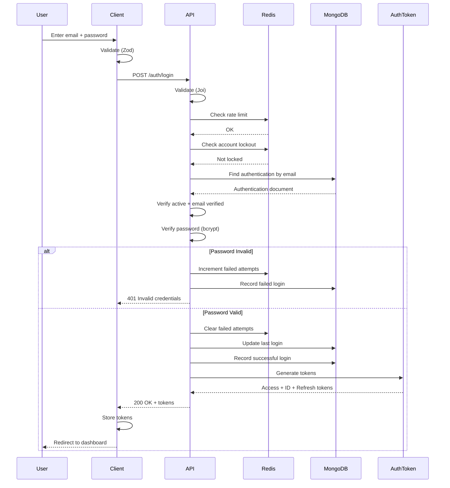
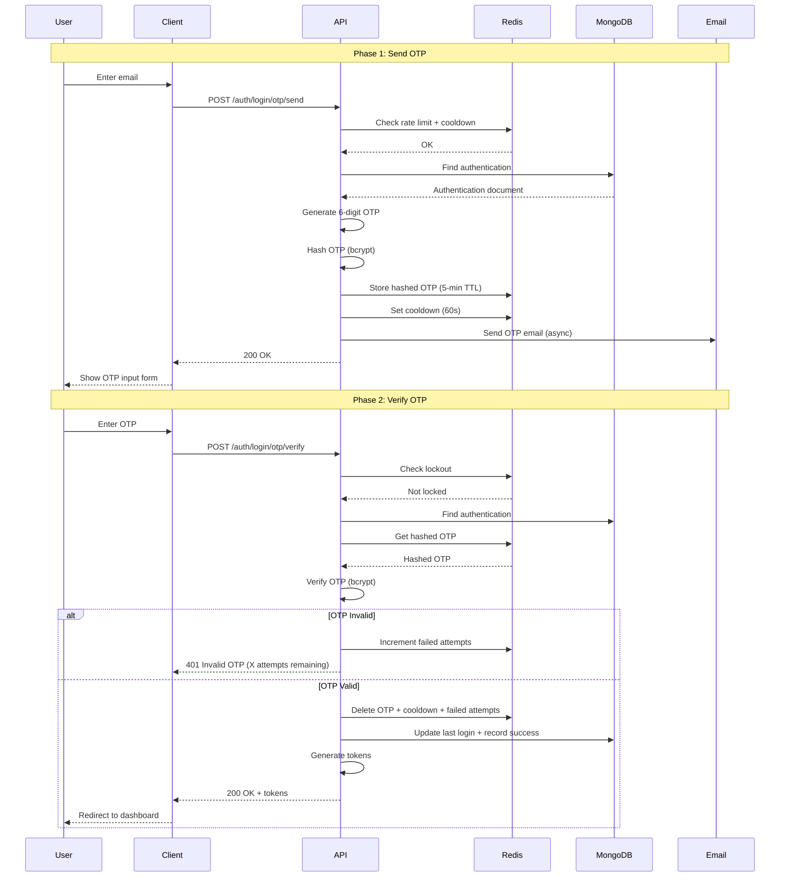
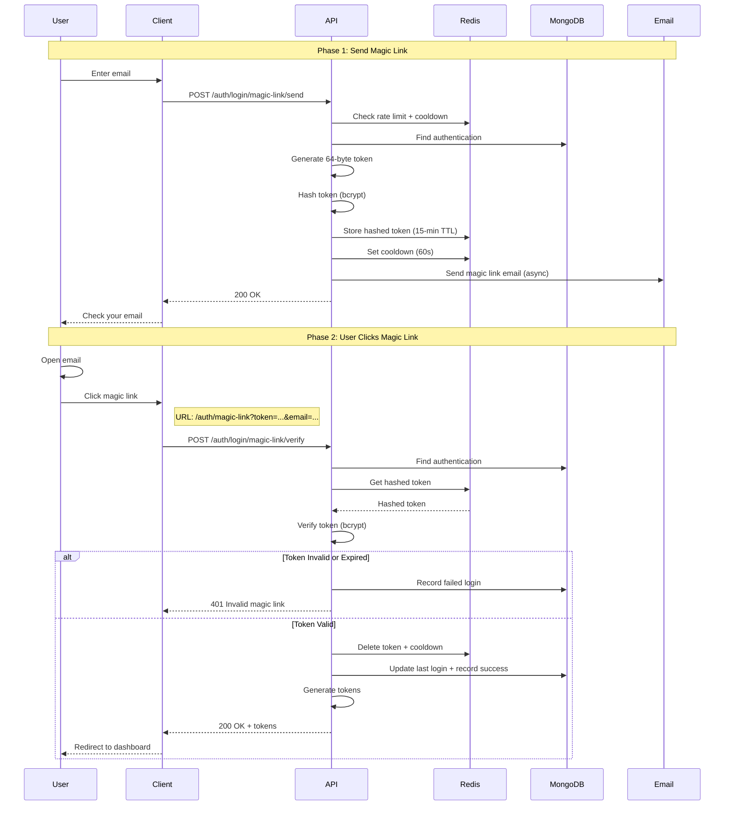

# Sign-in Feature - System Design & Architecture

---

## Document Information

**Version**: 2.0 (Updated based on actual implementation)

**Date**: February 2026

**Author**: System Analysis & Documentation Team

**Last Updated**: Based on server implementation analysis

---

## Executive Summary

### Design Overview

This document describes the **Sign-in (Login)** system design with a **3-tier architecture**:

- **Presentation Layer**: Next.js (React) with Server-Side Rendering
- **Application Layer**: Express.js REST API with modular architecture
- **Data Layer**: MongoDB (persistent storage) + Redis (cache/temporary data)

### Architecture Pattern

The login module follows **Clean Architecture** principles:

- **Controllers**: Handle HTTP requests/responses
- **Services**: Contain business logic
- **Repositories**: Abstract data access
- **Stores**: Manage Redis operations
- **Validators**: Reusable validation logic

### Key Design Decisions

| Decision               | Choice                                         | Rationale                                   |
| ---------------------- | ---------------------------------------------- | ------------------------------------------- |
| Architecture Pattern   | Layered + Repository Pattern                   | Separation of concerns, testability         |
| API Style              | RESTful                                        | Standard, stateless, scalable               |
| Token System           | Access + ID + Refresh Tokens                   | Security, separation of concerns            |
| Token Storage          | Memory (Access/ID) + httpOnly Cookie (Refresh) | XSS protection, CSRF mitigation             |
| Password Security      | BCrypt (12+ rounds)                            | Industry standard, resistant to brute force |
| OTP/Magic Link Storage | Redis with bcrypt hashing                      | Fast access, automatic expiry, secure       |
| Account Lockout        | Progressive duration (30s → 30min)             | Balance security and UX                     |
| Rate Limiting          | Multi-layer (IP + Email specific)              | Prevent abuse, protect resources            |

### Authentication Methods

| Method                 | Use Case                     | Security Level       | Expiry                 |
| ---------------------- | ---------------------------- | -------------------- | ---------------------- |
| **Email + Password**   | Default login                | ⭐⭐⭐⭐ High        | Password never expires |
| **Email + OTP**        | Passwordless login, secure   | ⭐⭐⭐⭐⭐ Very High | 5 minutes              |
| **Email + Magic Link** | One-click login, convenience | ⭐⭐⭐⭐ High        | 15 minutes             |

---

## Table of Contents

1. [High-Level System Architecture](#1-high-level-system-architecture)
2. [API Endpoints Specification](#3-api-endpoints-specification)
3. [Authentication Methods Detail](#4-authentication-methods-detail)
4. [Data Models & Database Schema](#5-data-models--database-schema)
5. [Security Implementation](#6-security-implementation)
6. [Business Logic Flow](#7-business-logic-flow)
7. [Sequence Diagrams](#8-sequence-diagrams)
8. [Error Handling & Internationalization](#9-error-handling--internationalization)
9. [Performance & Scalability](#10-performance--scalability)
10. [Configuration & Constants](#11-configuration--constants)

---

## 1. High-Level System Architecture

### 1.1 System Components Diagram

```
┌─────────────────────────────────────────────────────────────────────────────┐
│                        SIGN-IN SYSTEM ARCHITECTURE                           │
└─────────────────────────────────────────────────────────────────────────────┘

┌──────────────┐        ┌────────────────────────────────────────────────────┐
│   CLIENT     │        │                    SERVER                           │
│  (Browser)   │        │                                                     │
├──────────────┤        │  ┌────────────┐  ┌──────────┐  ┌───────────────┐  │
│              │        │  │   Nginx    │  │  Rate    │  │  Express.js   │  │
│  Next.js     │─HTTPS──│  │  Reverse   │─▶│ Limiter  │─▶│  Application  │  │
│  React SPA   │        │  │   Proxy    │  │ (Redis)  │  │               │  │
│              │        │  └────────────┘  └──────────┘  │  ┌──────────┐ │  │
├──────────────┤        │                                 │  │Controller│ │  │
│  Features:   │        │                                 │  ├──────────┤ │  │
│  - Login     │        │                                 │  │ Service  │ │  │
│    Forms     │        │                                 │  ├──────────┤ │  │
│  - Token     │        │                                 │  │Repository│ │  │
│    Storage   │        │                                 │  └──────────┘ │  │
│  - Session   │        │                                 └───────────────┘  │
│    Refresh   │        │                                                     │
└──────────────┘        └────────────────────────────────────────────────────┘
                                          │
                ┌─────────────────────────┼─────────────────────────┐
                │                         │                         │
                ▼                         ▼                         ▼
      ┌──────────────────┐    ┌──────────────────┐    ┌──────────────────┐
      │    MongoDB       │    │      Redis       │    │  Email Service   │
      │  (Primary DB)    │    │  (Cache/Session) │    │ (SendGrid/SES)   │
      ├──────────────────┤    ├──────────────────┤    ├──────────────────┤
      │ - Authentication │    │ - Login OTP      │    │ - OTP Email      │
      │ - Users          │    │ - Magic Link     │    │ - Magic Link     │
      │ - Login History  │    │ - Rate Limits    │    │                  │
      │                  │    │ - Failed Attempts│    │                  │
      └──────────────────┘    └──────────────────┘    └──────────────────┘
```

### 1.2 Technology Stack

| Layer              | Technology                     | Purpose                         |
| ------------------ | ------------------------------ | ------------------------------- |
| **Frontend**       | Next.js 14+, React, TypeScript | UI rendering, form handling     |
| **Backend**        | Express.js, TypeScript         | REST API, business logic        |
| **Database**       | MongoDB                        | Persistent data storage         |
| **Cache**          | Redis                          | Temporary data, rate limiting   |
| **Email**          | Nodemailer + SMTP Provider     | OTP & Magic Link delivery       |
| **Authentication** | JWT                            | Token-based authentication      |
| **Validation**     | Joi (Backend), Zod (Frontend)  | Request/form validation         |
| **Security**       | BCrypt, express-rate-limit     | Password hashing, rate limiting |

---

## 3. API Endpoints Specification

### 3.1 Endpoint Overview

| Method | Path                            | Description               | Auth Required | Rate Limit            |
| ------ | ------------------------------- | ------------------------- | ------------- | --------------------- |
| POST   | `/auth/login`                   | Password login            | No            | 30 req/IP/15min       |
| POST   | `/auth/login/otp/send`          | Send OTP                  | No            | 10 IP + 5 email/15min |
| POST   | `/auth/login/otp/verify`        | Verify OTP & login        | No            | 30 req/IP/15min       |
| POST   | `/auth/login/magic-link/send`   | Send magic link           | No            | 10 IP + 5 email/15min |
| POST   | `/auth/login/magic-link/verify` | Verify magic link & login | No            | 30 req/IP/15min       |

### 3.2 Detailed API Specifications

---

#### **1. POST /auth/login** - Password Login

**Request Headers:**

```
Content-Type: application/json
Accept-Language: en | vi
User-Agent: Mozilla/5.0...
```

**Request Body:**

```json
{
  "email": "user@example.com",
  "password": "SecurePass123!"
}
```

**Validation Rules:**

- `email`: Valid email format, required
- `password`: String, required

**Response (Success - 200):**

```json
{
  "statusCode": 200,
  "message": "Login successful",
  "data": {
    "accessToken": "eyJhbGciOiJIUzI1NiIs...",
    "idToken": "eyJhbGciOiJIUzI1NiIs..."
  }
}
```

**Response Headers (Success):**

```
Set-Cookie: refreshToken=eyJ...; HttpOnly; Secure; SameSite=Strict; Max-Age=604800; Path=/
```

**Response (Error - 400 Account Locked):**

```json
{
  "statusCode": 400,
  "message": "Account temporarily locked due to 5 failed login attempts. Try again in 30 seconds."
}
```

**Response (Error - 401 Invalid Credentials):**

```json
{
  "statusCode": 401,
  "message": "Invalid email or password"
}
```

**Response (Error - 401 Account Inactive):**

```json
{
  "statusCode": 401,
  "message": "Account is inactive. Please contact support."
}
```

**Response (Error - 401 Email Not Verified):**

```json
{
  "statusCode": 401,
  "message": "Please verify your email before logging in"
}
```

**Response (Error - 429 Rate Limited):**

```json
{
  "statusCode": 429,
  "message": "Too many login attempts. Please try again later"
}
```

**Security Features:**

- Progressive account lockout after 5 failed attempts
- Rate limiting: 30 attempts per IP per 15 minutes
- Failed attempts logged to login history
- IP address tracking

---

#### **2. POST /auth/login/otp/send** - Send OTP

**Request Body:**

```json
{
  "email": "user@example.com"
}
```

**Validation Rules:**

- `email`: Valid email format, required

**Response (Success - 200):**

```json
{
  "statusCode": 200,
  "message": "If the email exists in our system, an OTP has been sent",
  "data": {
    "success": true,
    "expiresIn": 300,
    "cooldown": 60
  }
}
```

**Response (Error - 400 Cooldown Active):**

```json
{
  "statusCode": 400,
  "message": "Please wait 45 seconds before requesting a new OTP"
}
```

**Response (Error - 400 Resend Limit):**

```json
{
  "statusCode": 400,
  "message": "Maximum OTP resend attempts exceeded. Please try again later"
}
```

**Response (Error - 429 Rate Limited):**

```json
{
  "statusCode": 429,
  "message": "Too many OTP requests. Please try again later"
}
```

**Security Features:**

- 60-second cooldown between requests
- Max 3 resend attempts per OTP window
- Rate limiting: 10 req/IP + 5 req/email per 15 minutes
- User enumeration protection (generic success message)
- 6-digit OTP, valid for 5 minutes
- OTP hashed with bcrypt in Redis

---

#### **3. POST /auth/login/otp/verify** - Verify OTP

**Request Body:**

```json
{
  "email": "user@example.com",
  "otp": "123456"
}
```

**Validation Rules:**

- `email`: Valid email format, required
- `otp`: 6-digit numeric string, required

**Response (Success - 200):**

```json
{
  "statusCode": 200,
  "message": "Login successful",
  "data": {
    "accessToken": "eyJhbGciOiJIUzI1NiIs...",
    "idToken": "eyJhbGciOiJIUzI1NiIs..."
  }
}
```

**Response Headers (Success):**

```
Set-Cookie: refreshToken=eyJ...; HttpOnly; Secure; SameSite=Strict; Max-Age=604800; Path=/
```

**Response (Error - 401 Invalid OTP):**

```json
{
  "statusCode": 401,
  "message": "Invalid OTP. 3 attempts remaining"
}
```

**Response (Error - 400 OTP Locked):**

```json
{
  "statusCode": 400,
  "message": "Account locked due to 5 failed OTP attempts. Please try again in 15 minutes"
}
```

**Security Features:**

- Max 5 failed attempts → 15-minute lockout
- OTP deleted after successful verification (one-time use)
- Remaining attempts displayed in error message
- Failed attempts logged to login history

---

#### **4. POST /auth/login/magic-link/send** - Send Magic Link

**Request Body:**

```json
{
  "email": "user@example.com"
}
```

**Validation Rules:**

- `email`: Valid email format, required

**Response (Success - 200):**

```json
{
  "statusCode": 200,
  "message": "If the email exists in our system, a magic link has been sent",
  "data": {
    "success": true,
    "expiresIn": 900,
    "cooldown": 60
  }
}
```

**Response (Error - 400 Cooldown Active):**

```json
{
  "statusCode": 400,
  "message": "Please wait 45 seconds before requesting a new magic link"
}
```

**Response (Error - 429 Rate Limited):**

```json
{
  "statusCode": 429,
  "message": "Too many magic link requests. Please try again later"
}
```

**Security Features:**

- 60-second cooldown between requests
- Rate limiting: 10 req/IP + 5 req/email per 15 minutes
- User enumeration protection
- 64-byte (128 hex chars) cryptographically secure token
- Valid for 15 minutes
- Token hashed with bcrypt in Redis

---

#### **5. POST /auth/login/magic-link/verify** - Verify Magic Link

**Request Body:**

```json
{
  "email": "user@example.com",
  "token": "a1b2c3d4e5f6...128_hex_characters"
}
```

**Validation Rules:**

- `email`: Valid email format, required
- `token`: 128-character hex string, required

**Response (Success - 200):**

```json
{
  "statusCode": 200,
  "message": "Login successful",
  "data": {
    "accessToken": "eyJhbGciOiJIUzI1NiIs...",
    "idToken": "eyJhbGciOiJIUzI1NiIs..."
  }
}
```

**Response Headers (Success):**

```
Set-Cookie: refreshToken=eyJ...; HttpOnly; Secure; SameSite=Strict; Max-Age=604800; Path=/
```

**Response (Error - 401 Invalid Token):**

```json
{
  "statusCode": 401,
  "message": "Invalid or expired magic link"
}
```

**Security Features:**

- Token deleted after successful verification (one-time use)
- Failed attempts logged to login history
- Token expiry enforced (15 minutes)

---

## 4. Authentication Methods Detail

### 4.1 Password-Based Login

**Flow Overview:**

```
User submits credentials → Validation → Rate limit check → Account lockout check →
Fetch authentication → Verify account status → Verify password →
Clear failed attempts → Generate tokens → Return response
```

**Key Features:**

- BCrypt password verification (12+ rounds)
- Progressive lockout mechanism:
  - Attempts 1-4: No lockout
  - Attempt 5: 30 seconds
  - Attempt 6: 60 seconds
  - Attempt 7: 120 seconds
  - Attempt 8: 240 seconds
  - Attempt 9: 480 seconds
  - Attempt 10+: 1800 seconds (30 minutes)
- Failed attempts reset after 30 minutes of no activity
- All failures logged to login history

**Redis Data:**

```
login-failed-attempts:{email}  → counter (30-min TTL)
login-lockout:{email}          → attempt count (variable TTL)
```

### 4.2 OTP (One-Time Password) Login

**Flow Overview:**

**Phase 1: Send OTP**

```
User requests OTP → Validation → Rate limit → Cooldown check →
Verify account → Generate 6-digit OTP → Hash & store in Redis →
Set cooldown → Send email → Return response
```

**Phase 2: Verify OTP**

```
User submits OTP → Validation → Lockout check → Fetch hashed OTP from Redis →
Verify OTP (bcrypt compare) → If valid: Delete OTP, generate tokens →
If invalid: Increment failed attempts → Return response
```

**Key Features:**

- 6-digit numeric OTP
- Valid for 5 minutes
- 60-second cooldown between sends
- Max 3 resend attempts
- Max 5 verification attempts (15-min lockout)
- OTP hashed with bcrypt before storing
- One-time use (deleted after success)

**Redis Data:**

```
otp-login:{email}                 → bcrypt-hashed OTP (5-min TTL)
otp-login-cooldown:{email}        → "1" (60-sec TTL)
otp-login-failed-attempts:{email} → counter (15-min TTL)
otp-login-resend-count:{email}    → counter (5-min window TTL)
```

### 4.3 Magic Link Login

**Flow Overview:**

**Phase 1: Send Magic Link**

```
User requests magic link → Validation → Rate limit → Cooldown check →
Verify account → Generate 64-byte token → Hash & store in Redis →
Compose URL → Send email → Return response
```

**Phase 2: Verify Magic Link**

```
User clicks link → Validation → Fetch hashed token from Redis →
Verify token (bcrypt compare) → If valid: Delete token, generate tokens →
Return response
```

**Key Features:**

- 64-byte (128 hex chars) cryptographically secure token
- Valid for 15 minutes
- 60-second cooldown between sends
- Token hashed with bcrypt before storing
- One-time use (deleted after success)

**Magic Link URL Format:**

```
{CLIENT_URL}/auth/magic-link?token={TOKEN}&email={EMAIL}
```

**Redis Data:**

```
magic-link-login:{email}         → bcrypt-hashed token (15-min TTL)
magic-link-login-cooldown:{email}→ "1" (60-sec TTL)
```

---

## 5. Data Models & Database Schema

### 5.1 Authentication Model (MongoDB)

**Collection:** `auths`

```typescript
interface AuthenticationDocument {
  _id: ObjectId;
  email: string; // unique, required, lowercase
  password: string; // bcrypt-hashed
  verifiedEmail: boolean; // default: false
  roles: "user" | "admin"; // default: 'user'
  isActive: boolean; // default: true
  createdAt: Date;
  updatedAt: Date;
  lastLogin?: Date; // Updated on successful login
}
```

**Indexes:**

```javascript
{
  email: 1;
} // Unique index for fast email lookups
```

**Validation:**

- Email: RFC 5322 format + safe pattern (no control characters)
- Password: Required, bcrypt-hashed (never stored plain)
- Roles: Enum constraint ('user' | 'admin')

### 5.2 User Model (MongoDB)

**Collection:** `users`

```typescript
interface UserDocument {
  _id: ObjectId;
  authId: ObjectId; // ref to auths collection, unique
  fullName: string; // 2-100 characters
  phone?: string;
  avatar?: string;
  address?: string;
  dateOfBirth?: Date;
  gender?: "male" | "female" | "other";
  createdAt: Date;
  updatedAt: Date;
}
```

**Indexes:**

```javascript
{
  authId: 1;
} // Unique, ref to authentication
{
  phone: 1;
} // For phone lookups
```

**Relationship:**

```
Authentication (1) ←→ (1) User
```

### 5.3 Login History Model (MongoDB)

**Collection:** `login_histories`

```typescript
interface LoginHistoryDocument {
  _id: ObjectId;
  userId: ObjectId; // ref to auths collection
  method: "password" | "otp" | "magic-link";
  status: "success" | "failed";
  failReason?:
    | "invalid_credentials"
    | "account_locked"
    | "account_inactive"
    | "email_not_verified"
    | "invalid_otp"
    | "otp_expired"
    | "invalid_magic_link"
    | "magic_link_expired"
    | "rate_limited"
    | "passwordless_account";
  ip: string; // Client IP (from X-Forwarded-For or X-Real-IP)
  createdAt: Date;
}
```

**Indexes:**

```javascript
{ userId: 1, createdAt: -1 }  // User's login history
{ createdAt: 1 }              // TTL index (90 days)
{ ip: 1, status: 1, createdAt: -1 }  // Suspicious activity detection
```

**Retention:** 90 days (automatic deletion via TTL index)

### 5.4 Redis Data Structures

**Password Login Failures:**

```
Key: login-failed-attempts:{email}
Value: counter (integer)
TTL: 1800 seconds (30 minutes)

Key: login-lockout:{email}
Value: attempt count (integer)
TTL: Variable (based on attempt count: 30s → 1800s)
```

**OTP Login:**

```
Key: otp-login:{email}
Value: bcrypt-hashed OTP
TTL: 300 seconds (5 minutes)

Key: otp-login-cooldown:{email}
Value: "1"
TTL: 60 seconds

Key: otp-login-failed-attempts:{email}
Value: counter (integer)
TTL: 900 seconds (15 minutes)

Key: otp-login-resend-count:{email}
Value: counter (integer)
TTL: 300 seconds (5 minutes)
```

**Magic Link Login:**

```
Key: magic-link-login:{email}
Value: bcrypt-hashed token
TTL: 900 seconds (15 minutes)

Key: magic-link-login-cooldown:{email}
Value: "1"
TTL: 60 seconds
```

**Rate Limiting:**

```
Key: rate-limit:login:ip:{ip}
Key: rate-limit:login-otp:ip:{ip}
Key: rate-limit:login-otp:email:{email}
Key: rate-limit:magic-link:ip:{ip}
Key: rate-limit:magic-link:email:{email}
```

---

## 6. Security Implementation

### 6.1 Rate Limiting

**Implementation:** Express middleware + Redis

**Password Login:**

- 30 attempts per IP per 15 minutes
- Applied at route level: `getRateLimiterMiddleware().loginByIp`

**OTP Send:**

- 10 attempts per IP per 15 minutes
- 5 attempts per email per 15 minutes
- Both limiters applied (AND condition)

**OTP Verify:**

- 30 attempts per IP per 15 minutes (shares with password login)

**Magic Link Send:**

- 10 attempts per IP per 15 minutes
- 5 attempts per email per 15 minutes
- Both limiters applied (AND condition)

**Magic Link Verify:**

- 30 attempts per IP per 15 minutes

### 6.2 Account Lockout Mechanism

**Password Login Lockout:**

```typescript
FREE_ATTEMPTS: 4
LOCKOUT_DURATIONS: {
  5: 30,    // 5th attempt: 30 seconds
  6: 60,
  7: 120,
  8: 240,
  9: 480,
  10: 1800  // 30 minutes maximum
}
```

**Lockout Features:**

- Progressive duration (increases with each failure)
- Reset window: 30 minutes (no attempts = counter resets)
- User receives informative error with remaining time
- Implemented via `failedAttemptsStore.trackAttempt()`

**OTP Verification Lockout:**

- 5 failed attempts → 15-minute lockout
- User receives remaining attempts in error message
- Implemented via `otpStore.trackFailedAttempt()`

### 6.3 Cryptographic Security

**Password Hashing:**

- Algorithm: BCrypt
- Cost factor: 12+ rounds
- Verification: Timing-safe comparison
- Function: `isValidHashedValue(password, hash)`

**OTP Security:**

- Generation: Cryptographically secure random (6 digits)
- Storage: BCrypt-hashed in Redis
- Expiry: 5 minutes
- One-time use: Deleted after successful verification

**Magic Link Security:**

- Generation: `crypto.randomBytes(64)` → 256-bit entropy
- Format: Hex-encoded (128 characters)
- Storage: BCrypt-hashed in Redis
- Expiry: 15 minutes
- One-time use: Deleted after successful verification

### 6.4 Token Management

**JWT Tokens:**

```typescript
{
  accessToken: {
    type: "JWT",
    expiry: "15 minutes",
    storage: "Memory (client)",
    purpose: "API authentication"
  },
  idToken: {
    type: "JWT",
    expiry: "15 minutes",
    storage: "Memory (client)",
    purpose: "User identity"
  },
  refreshToken: {
    type: "JWT",
    expiry: "7 days",
    storage: "HTTP-only cookie",
    purpose: "Access token renewal"
  }
}
```

**Cookie Configuration:**

```typescript
{
  httpOnly: true,      // JavaScript cannot access
  secure: true,        // HTTPS only
  sameSite: 'strict',  // CSRF protection
  path: '/',
  maxAge: 604800000    // 7 days
}
```

### 6.5 IP Tracking

**IP Extraction Logic:**

```typescript
getClientIp(req) {
  // Priority order:
  // 1. X-Forwarded-For header (first IP)
  // 2. X-Real-IP header
  // 3. req.ip (Express default)
}
```

**Usage:**

- All login attempts logged with IP
- Rate limiting by IP
- Suspicious activity detection
- Audit trail

### 6.6 User Enumeration Protection

**Strategy:** Generic success messages for sensitive operations

**Examples:**

```typescript
// OTP Send
"If the email exists in our system, an OTP has been sent";
// Prevents attacker from knowing if email is registered

// Magic Link Send
"If the email exists in our system, a magic link has been sent";
// Same protection
```

### 6.7 Account Status Validation

**Pre-Login Checks:**

1. Account exists
2. Account is active (`isActive === true`)
3. Email is verified (`verifiedEmail === true`)

**Failed Login Recording:**

- All validation failures logged to `login_histories`
- Includes `failReason` field for audit

---

## 7. Business Logic Flow

### 7.1 Password Login Flow (Detailed)

```
┌─────────────────────────────────────────────────────────────┐
│ 1. REQUEST VALIDATION                                        │
│ • Joi schema: email + password required                      │
│ • Email format validation                                    │
│ → Response: 422 if invalid                                   │
└─────────────────────────────────────────────────────────────┘
                        ↓
┌─────────────────────────────────────────────────────────────┐
│ 2. RATE LIMITING (Middleware)                                │
│ • Check: 30 attempts per IP per 15 minutes                   │
│ • Redis key: rate-limit:login:ip:{ip}                        │
│ • If exceeded → 429 Too Many Requests                        │
└─────────────────────────────────────────────────────────────┘
                        ↓
┌─────────────────────────────────────────────────────────────┐
│ 3. ACCOUNT LOCKOUT CHECK                                     │
│ Function: ensureLoginNotLocked(email, language)              │
│ • Redis key: login-lockout:{email}                           │
│ • Get TTL (remaining lockout time)                           │
│ • If locked → 400 Bad Request with time remaining           │
│ • Logger.warn() if locked                                    │
└─────────────────────────────────────────────────────────────┘
                        ↓
┌─────────────────────────────────────────────────────────────┐
│ 4. FETCH AUTHENTICATION                                      │
│ Query: AuthenticationModel.findOne({ email })                │
│ • Uses MongoDB index on email                                │
│ • If not found → 401 Unauthorized                            │
│ • Assertion: ensureAccountExists()                           │
└─────────────────────────────────────────────────────────────┘
                        ↓
┌─────────────────────────────────────────────────────────────┐
│ 5. VERIFY ACCOUNT ACTIVE                                     │
│ Function: ensureAccountActiveWithLogging()                   │
│ • Check: auth.isActive === true                              │
│ • If not → recordFailedLogin() with 'account_inactive'       │
│          → 401 Unauthorized                                  │
└─────────────────────────────────────────────────────────────┘
                        ↓
┌─────────────────────────────────────────────────────────────┐
│ 6. VERIFY EMAIL                                              │
│ Function: ensureEmailVerifiedWithLogging()                   │
│ • Check: auth.verifiedEmail === true                         │
│ • If not → recordFailedLogin() with 'email_not_verified'     │
│          → 401 Unauthorized                                  │
└─────────────────────────────────────────────────────────────┘
                        ↓
┌─────────────────────────────────────────────────────────────┐
│ 7. VERIFY PASSWORD                                           │
│ Function: verifyPasswordOrFail()                             │
│ • isValidHashedValue(password, auth.password)                │
│ • BCrypt comparison (timing-safe)                            │
│                                                              │
│ IF INVALID:                                                  │
│   → trackFailedPasswordAttempt()                             │
│     • Redis.incr(login-failed-attempts:{email})              │
│     • Calculate lockout via calculateLockoutDuration()       │
│     • If lockout > 0: Redis.setex(login-lockout:{email})     │
│   → recordFailedLogin() with 'invalid_credentials'           │
│   → throwPasswordError()                                     │
│     • If attempts >= 5 → 400 "Account locked"                │
│     • Else → 401 "Invalid credentials"                       │
└─────────────────────────────────────────────────────────────┘
                        ↓
┌─────────────────────────────────────────────────────────────┐
│ 8. CLEAR FAILED ATTEMPTS (Success)                           │
│ Function: withRetry(() => failedAttemptsStore.resetAll())    │
│ • Delete: login-failed-attempts:{email}                      │
│ • Delete: login-lockout:{email}                              │
│ • Retries on transient failures (up to 3 attempts)           │
└─────────────────────────────────────────────────────────────┘
                        ↓
┌─────────────────────────────────────────────────────────────┐
│ 9. UPDATE LAST LOGIN                                         │
│ Query: AuthenticationModel.findByIdAndUpdate()               │
│ • Set: lastLogin = new Date()                                │
│ • Async with retry wrapper                                   │
│ • Logger.info() on success                                   │
└─────────────────────────────────────────────────────────────┘
                        ↓
┌─────────────────────────────────────────────────────────────┐
│ 10. RECORD SUCCESSFUL LOGIN                                  │
│ Function: recordSuccessfulLogin()                            │
│ • Create LoginHistoryDocument:                               │
│   - userId: auth._id                                         │
│   - method: 'password'                                       │
│   - status: 'success'                                        │
│   - ip: getClientIp(req)                                     │
│   - createdAt: Date.now()                                    │
│ • Save to login_histories collection                         │
└─────────────────────────────────────────────────────────────┘
                        ↓
┌─────────────────────────────────────────────────────────────┐
│ 11. GENERATE TOKENS                                          │
│ Function: generateAuthTokensResponse()                       │
│ • Input: { userId, authId, email, roles }                    │
│ • Returns:                                                    │
│   - accessToken (15-min expiry)                              │
│   - idToken                                                  │
│   - refreshToken (7-day expiry)                              │
└─────────────────────────────────────────────────────────────┘
                        ↓
┌─────────────────────────────────────────────────────────────┐
│ 12. SEND RESPONSE                                            │
│ Status: 200 OK                                               │
│ Body: { statusCode, data: { accessToken, idToken }, message }│
│ Headers: Set-Cookie: refreshToken=...; HttpOnly; Secure     │
└─────────────────────────────────────────────────────────────┘
```

### 7.2 OTP Login Flow (Detailed)

**Phase 1: Send OTP**

```
Request → Validation → Rate limit (IP + Email) → Cooldown check →
Fetch auth → Verify active → Verify email verified →
Check resend limit → Generate 6-digit OTP → Hash with bcrypt →
Store in Redis (5-min TTL) → Set cooldown (60s) → Increment resend count →
Send email (async) → Return response
```

**Phase 2: Verify OTP**

```
Request → Validation → Rate limit → Lockout check →
Fetch auth → Get hashed OTP from Redis →
IF NOT FOUND: Increment failed attempts → 401 "Invalid or expired OTP"
IF FOUND: Verify OTP (bcrypt compare)
  IF INVALID: Increment failed attempts
    - If 5th attempt: Set lockout → 400 "Account locked"
    - Else: → 401 "Invalid OTP. X attempts remaining"
  IF VALID: Delete OTP → Delete cooldown → Delete failed attempts →
            Update last login → Record success → Generate tokens →
            Return response
```

### 7.3 Magic Link Login Flow (Detailed)

**Phase 1: Send Magic Link**

```
Request → Validation → Rate limit (IP + Email) → Cooldown check →
Fetch auth → Verify active → Verify email verified →
Generate 64-byte token → Hash with bcrypt →
Store in Redis (15-min TTL) → Set cooldown (60s) →
Compose URL: {CLIENT_URL}/auth/magic-link?token={TOKEN}&email={EMAIL} →
Send email (async) → Return response
```

**Phase 2: Verify Magic Link**

```
Request → Validation → Rate limit →
Fetch auth → Get hashed token from Redis →
IF NOT FOUND: Record failed login → 401 "Invalid or expired magic link"
IF FOUND: Verify token (bcrypt compare)
  IF INVALID: Record failed login → 401 "Invalid or expired magic link"
  IF VALID: Delete token → Delete cooldown →
            Update last login → Record success → Generate tokens →
            Return response
```

---

## 8. Sequence Diagrams

### 8.1 Password Login Sequence



### 8.2 OTP Login Sequence



### 8.3 Magic Link Login Sequence



---

## 9. Error Handling & Internationalization

### 9.1 Error Response Format

**Standard Error Response:**

```typescript
{
  statusCode: number;    // HTTP status code
  message: string;       // Localized error message
  data?: {              // Optional additional data
    // Context-specific fields
  }
}
```

### 9.2 Error Types & Status Codes

| Status | Error Class          | Use Case                                      |
| ------ | -------------------- | --------------------------------------------- |
| 400    | BadRequestError      | Account locked, cooldown active, resend limit |
| 401    | UnauthorizedError    | Invalid credentials, OTP, magic link          |
| 422    | Joi ValidationError  | Invalid request body                          |
| 429    | TooManyRequestsError | Rate limit exceeded                           |
| 500    | InternalServerError  | Unexpected server error                       |

### 9.3 Internationalization (i18n)

**Namespace:** `login`

**Supported Languages:** `en`, `vi`

**Message Structure:**

```
login:
  errors:
    accountLocked
    invalidCredentials
    accountInactive
    emailNotVerified
    invalidOtp
    invalidOtpWithRemaining
    otpCooldown
    otpLocked
    otpResendLimitExceeded
    invalidMagicLink
    magicLinkCooldown
  success:
    loginSuccessful
    otpSent
    magicLinkSent
  validation:
    tokenRequired
    tokenInvalid
```

**Usage Example:**

```typescript
// With interpolation
t("login:errors.accountLocked", {
  attempts: 5,
  time: "30 seconds",
  lng: language,
});

// Result (English):
// "Account temporarily locked due to 5 failed login attempts. Try again in 30 seconds."

// Result (Vietnamese):
// "Tài khoản tạm thời bị khóa do 5 lần đăng nhập thất bại. Vui lòng thử lại sau 30 giây."
```

### 9.4 Error Scenarios

**Password Login Errors:**

```typescript
// Account locked
{
  statusCode: 400,
  message: "Account temporarily locked due to 5 failed login attempts. Try again in 30 seconds."
}

// Invalid credentials
{
  statusCode: 401,
  message: "Invalid email or password"
}

// Account inactive
{
  statusCode: 401,
  message: "Account is inactive. Please contact support."
}

// Email not verified
{
  statusCode: 401,
  message: "Please verify your email before logging in"
}
```

**OTP Errors:**

```typescript
// Cooldown active
{
  statusCode: 400,
  message: "Please wait 45 seconds before requesting a new OTP"
}

// Resend limit
{
  statusCode: 400,
  message: "Maximum OTP resend attempts exceeded. Please try again later"
}

// Invalid OTP with remaining attempts
{
  statusCode: 401,
  message: "Invalid OTP. 3 attempts remaining"
}

// OTP locked
{
  statusCode: 400,
  message: "Account locked due to 5 failed OTP attempts. Please try again in 15 minutes"
}
```

**Magic Link Errors:**

```typescript
// Cooldown active
{
  statusCode: 400,
  message: "Please wait 45 seconds before requesting a new magic link"
}

// Invalid or expired
{
  statusCode: 401,
  message: "Invalid or expired magic link"
}
```

---

## 10. Performance & Scalability

### 10.1 Database Query Optimization

**Indexes:**

```javascript
// Authentication collection
{ email: 1 }  // Unique index - O(log n) lookup

// Login history collection
{ userId: 1, createdAt: -1 }  // User history queries
{ createdAt: 1 }              // TTL index (automatic cleanup)
{ ip: 1, status: 1, createdAt: -1 }  // Suspicious activity detection
```

**Query Performance:**

- Email lookup: ~1ms (indexed)
- Login history insert: ~5ms
- Last login update: ~3ms (async, non-blocking)

### 10.2 Redis Performance

**Data Structures:**

- All rate limiting: O(1) operations
- Lockout checks: O(1) GET + TTL check
- OTP/Magic link: O(1) GET/SET/DELETE

**Memory Optimization:**

- All temporary data has TTL (automatic cleanup)
- No memory leaks
- Estimated memory per user session: ~500 bytes

### 10.3 Caching Strategy

**What is cached:**

- Rate limit counters (15-minute window)
- Failed login attempts (30-minute window)
- OTP data (5-minute window)
- Magic link tokens (15-minute window)
- Cooldown flags (60-second window)

**Cache invalidation:**

- Automatic via Redis TTL
- Manual on successful login (failed attempts cleared)
- Manual on OTP/magic link verification (data deleted)

### 10.4 Scalability Considerations

**Horizontal Scaling:**

- Stateless API (scales horizontally)
- Redis for shared state
- MongoDB replica set for high availability

**Load Distribution:**

- Rate limiting prevents abuse
- Progressive lockout reduces attack surface
- Async operations (email sending) don't block response

**Bottleneck Mitigation:**

- Database indexes for fast queries
- Redis for hot data (rate limits, lockouts)
- Email queue for async delivery
- Retry mechanism for transient failures

---

## 11. Configuration & Constants

### 11.1 Login Configuration

```typescript
// LOGIN_LOCKOUT
{
  FREE_ATTEMPTS: 4,
  LOCKOUT_DURATIONS: {
    5: 30,    // 5th attempt: 30 seconds
    6: 60,
    7: 120,
    8: 240,
    9: 480,
    10: 1800  // 30 minutes
  },
  MAX_LOCKOUT_SECONDS: 1800,
  RESET_WINDOW_SECONDS: 1800  // 30 minutes
}

// LOGIN_OTP_CONFIG
{
  LENGTH: 6,
  EXPIRY_MINUTES: 5,
  COOLDOWN_SECONDS: 60,
  MAX_FAILED_ATTEMPTS: 5,
  MAX_RESEND_ATTEMPTS: 3,
  LOCKOUT_DURATION_MINUTES: 15
}

// MAGIC_LINK_CONFIG
{
  TOKEN_LENGTH: 64,              // bytes (128 hex chars)
  EXPIRY_MINUTES: 15,
  COOLDOWN_SECONDS: 60,
  MAX_RESEND_ATTEMPTS: 3
}

// LOGIN_HISTORY_CONFIG
{
  RETENTION_DAYS: 90,
  TTL_SECONDS: 7776000           // 90 days
}
```

### 11.2 Rate Limit Configuration

```typescript
// Applied via middleware
{
  passwordLogin: {
    maxRequests: 30,
    windowMs: 15 * 60 * 1000     // 15 minutes
  },
  otpSend: {
    byIp: {
      maxRequests: 10,
      windowMs: 15 * 60 * 1000
    },
    byEmail: {
      maxRequests: 5,
      windowMs: 15 * 60 * 1000
    }
  },
  magicLinkSend: {
    byIp: {
      maxRequests: 10,
      windowMs: 15 * 60 * 1000
    },
    byEmail: {
      maxRequests: 5,
      windowMs: 15 * 60 * 1000
    }
  }
}
```

### 11.3 Token Configuration

```typescript
{
  accessToken: {
    expiresIn: '15m',
    algorithm: 'HS256'
  },
  refreshToken: {
    expiresIn: '7d',
    algorithm: 'HS256',
    cookie: {
      httpOnly: true,
      secure: true,
      sameSite: 'strict',
      maxAge: 604800000  // 7 days
    }
  }
}
```

---

## Appendix A: Future Enhancements

### Potential Improvements

1. **Two-Factor Authentication (2FA)**
   - Add TOTP/SMS verification after password
   - Increase security for sensitive accounts

2. **Biometric Authentication**
   - WebAuthn/FIDO2 support
   - Passwordless future

3. **Social Login**
   - OAuth integration (Google, Facebook, GitHub)
   - Simplified onboarding

4. **Device Management**
   - Trusted device fingerprinting
   - Suspicious login alerts

5. **Geographic Anomaly Detection**
   - Unusual location warnings
   - Geolocation-based blocking

6. **Adaptive Rate Limiting**
   - Adjust limits based on threat level
   - Machine learning for pattern detection

7. **Session Management UI**
   - View all active sessions
   - Remote logout capability

8. **Login Analytics Dashboard**
   - Success/failure rates
   - Geographic distribution
   - Peak usage times

---

## Appendix B: Glossary

| Term                    | Definition                                         |
| ----------------------- | -------------------------------------------------- |
| **BCrypt**              | Password hashing algorithm with built-in salt      |
| **JWT**                 | JSON Web Token for stateless authentication        |
| **OTP**                 | One-Time Password, valid for single use            |
| **Magic Link**          | One-click login URL sent via email                 |
| **Rate Limiting**       | Restrict number of requests per time window        |
| **Progressive Lockout** | Increasing penalty duration with each failure      |
| **User Enumeration**    | Attack to discover valid email addresses           |
| **HTTP-only Cookie**    | Cookie inaccessible to JavaScript (XSS protection) |
| **CSRF**                | Cross-Site Request Forgery attack                  |
| **TTL**                 | Time To Live, automatic expiry for cached data     |

---

## Document Change Log

| Version | Date     | Changes                                | Author               |
| ------- | -------- | -------------------------------------- | -------------------- |
| 1.0     | Dec 2025 | Initial design                         | Le Van Anh Duc       |
| 2.0     | Feb 2026 | Updated based on actual implementation | System Analysis Team |
