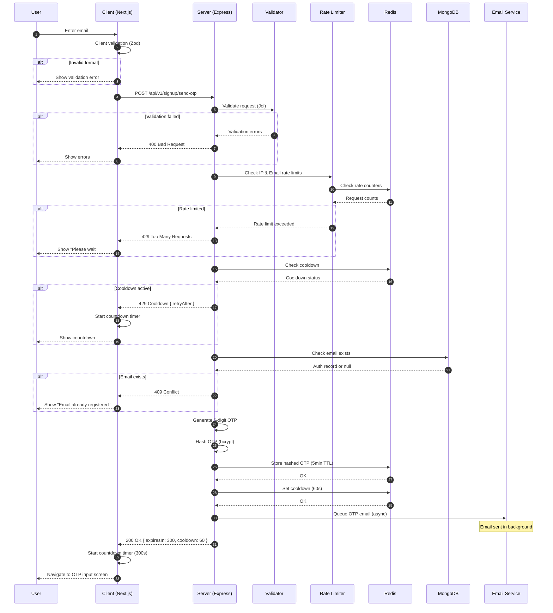
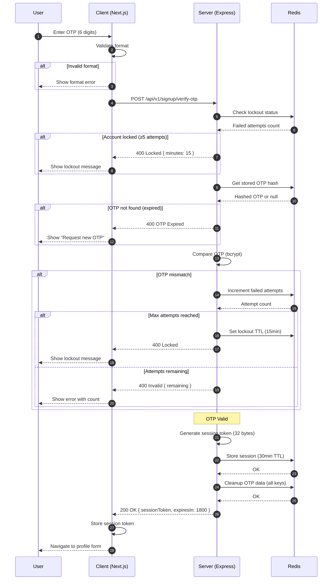
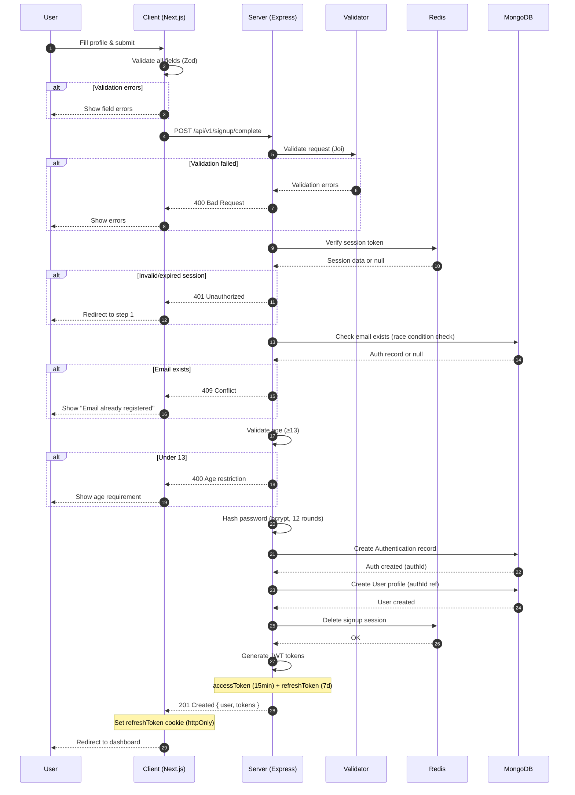

# Signup Feature - System Design & Architecture

---

## Executive Summary

**Document**: System Design & Architecture for Signup Feature

**Version**: 2.0

**Date**: January 2026

**Author**: Le Van Anh Duc (Updated based on actual implementation)

### Design Overview

Tài liệu này mô tả thiết kế hệ thống cho tính năng **Signup** (đăng ký tài khoản mới) với kiến trúc **3-tier architecture**:

- **Presentation Layer**: Next.js (React) với Server-Side Rendering
- **Application Layer**: Express.js REST API với modular architecture
- **Data Layer**: MongoDB (persistent) + Redis (cache/session/security)

### Key Design Decisions

| Decision | Choice | Rationale |
|----------|--------|-----------|
| Verification Method | Email OTP (6-digit) | Balance security & usability |
| Architecture Pattern | Layered + Repository + Store Pattern | Separation of concerns, testability |
| Session Management | Redis-based temporary session | Prevents race conditions, allows revocation |
| OTP Storage | Redis with bcrypt hash | Defense in depth - secure even if Redis compromised |
| Token Generation | Cryptographic random (32 bytes) | High entropy prevents guessing attacks |
| Email Delivery | Async (fire-and-forget) | Non-blocking, doesn't fail signup if email fails |
| Security Strategy | Multi-layer (Rate Limiting + Cooldown + Lockout) | Defense in depth against abuse |
| User Model | Two collections (Auth + User) | Clean separation, flexible for multiple auth methods |

---

## Table of Contents

1. [High-Level Design](#1-high-level-design)
2. [Low-Level Design](#2-low-level-design)
3. [System Architecture](#3-system-architecture)
4. [Sequence Diagrams](#4-sequence-diagrams)
5. [Edge Cases Handling](#5-edge-cases-handling)
6. [Design Patterns Applied](#6-design-patterns-applied)
7. [Technology Stack](#7-technology-stack)
8. [Security Implementation](#8-security-implementation)
9. [Scalability Considerations](#9-scalability-considerations)
10. [Trade-offs & Future Improvements](#10-trade-offs--future-improvements)

---

## 1. High-Level Design

### 1.1 System Architecture Overview

```
┌─────────────────────────────────────────────────────────────────────────────────┐
│                              SIGNUP SYSTEM ARCHITECTURE                          │
└─────────────────────────────────────────────────────────────────────────────────┘

┌─────────────┐     ┌─────────────────────────────────────────────────────────────┐
│   CLIENT    │     │                        SERVER                                │
│  (Browser)  │     │                                                              │
├─────────────┤     │  ┌─────────────┐  ┌─────────────┐  ┌─────────────────────┐ │
│             │     │  │   Nginx     │  │  Rate       │  │    Express.js       │ │
│  Next.js    │────────│   Reverse   │──│  Limiter    │──│    Application      │ │
│  React SPA  │ HTTPS  │   Proxy     │  │  Middleware │  │                     │ │
│             │     │  └─────────────┘  └─────────────┘  │  ┌───────────────┐  │ │
├─────────────┤     │                                     │  │  Controllers  │  │ │
│  Features:  │     │                                     │  ├───────────────┤  │ │
│  - Wizard   │     │                                     │  │  Services     │  │ │
│  - Forms    │     │                                     │  ├───────────────┤  │ │
│  - OTP      │     │                                     │  │  Repositories │  │ │
│  - State    │     │                                     │  ├───────────────┤  │ │
│  - i18n     │     │                                     │  │  Store        │  │ │
│             │     │                                     │  └───────────────┘  │ │
└─────────────┘     └─────────────────────────────────────────────────────────────┘
                                              │
                    ┌─────────────────────────┼─────────────────────────┐
                    │                         │                         │
                    ▼                         ▼                         ▼
          ┌─────────────────┐      ┌─────────────────┐      ┌─────────────────┐
          │    MongoDB      │      │     Redis       │      │  Email Service  │
          │  (Primary DB)   │      │ (Cache/Security)│      │  (SendGrid/SES) │
          ├─────────────────┤      ├─────────────────┤      ├─────────────────┤
          │ - Authentication│      │ - OTP Storage   │      │ - Signup OTP    │
          │ - Users         │      │ - Sessions      │      │                 │
          │                 │      │ - Rate Limits   │      │                 │
          │                 │      │ - Lockouts      │      │                 │
          └─────────────────┘      └─────────────────┘      └─────────────────┘
```

### 1.2 Component Breakdown

| Component | Technology | Responsibility |
|-----------|------------|----------------|
| **Client** | Next.js 14+ | Wizard UI, form handling, client-side validation |
| **API Gateway** | Express.js | Request routing, rate limiting |
| **Signup Module** | Express.js | Business logic for signup flow (4 stages) |
| **OTP Service** | Express.js | OTP generation, verification, storage |
| **Email Service** | Nodemailer + Provider | Email composition and delivery |
| **Primary Database** | MongoDB | User + Authentication persistence |
| **Cache/Security** | Redis | OTP storage, sessions, rate limiting, lockouts |

### 1.3 Signup Stages Overview

The signup flow consists of **4 main stages** (+ 1 optional):

| Stage | Endpoint | Description | Redis Keys Used |
|-------|----------|-------------|-----------------|
| **1. Send OTP** | `POST /send-otp` | Generate & send OTP to email | `otp:{email}`, `otp:cooldown:{email}` |
| **2. Verify OTP** | `POST /verify-otp` | Verify OTP, create session | `otp:{email}`, `otp:failed:{email}`, `session:{email}` |
| **3. Resend OTP** | `POST /resend-otp` | Resend OTP if expired/lost | `otp:resend:{email}` (+ same as stage 1) |
| **4. Complete** | `POST /complete` | Create account with session | `session:{email}` |
| **5. Check Email** | `GET /check-email/:email` | Check email availability | (None - direct DB query) |

---

## 2. Low-Level Design

### 2.1 Signup Flow - Complete Journey

#### **Stage 1: SEND OTP** (`POST /api/v1/signup/send-otp`)

**Purpose**: Initiate signup by sending OTP to user's email

**Request**:
```json
{
  "email": "user@example.com"
}
```

**Server Flow**:
1. **Rate Limiting** (2 limiters):
   - IP-based: Prevent single IP from overwhelming server
   - Email-based: Prevent targeting specific email

2. **Cooldown Check**:
   - Query Redis: `GET signup:otp:cooldown:{email}`
   - If exists (< 60s since last send): Throw error with remaining seconds

3. **Email Availability Check**:
   - Query MongoDB: `Authentication.findOne({ email })`
   - If exists: Throw "Email already registered" error

4. **OTP Generation**:
   - Generate 6-digit cryptographically secure OTP
   - Hash OTP using bcrypt (cost factor 10)
   - Store hashed OTP in Redis with 5-minute TTL

5. **Cooldown Set**:
   - Set cooldown marker in Redis (60-second TTL)

6. **Email Delivery**:
   - Send OTP email asynchronously (fire-and-forget)
   - Template: `signup-otp.html`
   - Variables: `{ otp, expiryMinutes: 5 }`

**Response (Success - 200)**:
```json
{
  "statusCode": 200,
  "message": "OTP sent successfully",
  "data": {
    "success": true,
    "expiresIn": 300,
    "cooldownSeconds": 60
  }
}
```

**Response (Error - 409 Email Exists)**:
```json
{
  "statusCode": 409,
  "message": "Email already registered"
}
```

**Response (Error - 429 Cooldown Active)**:
```json
{
  "statusCode": 429,
  "message": "Please wait 45 seconds before requesting a new OTP"
}
```

**Redis Keys Created**:
```
SET signup:otp:{email} = <bcrypt_hash>  EX 300
SET signup:otp:cooldown:{email} = "1"   EX 60
```

---

#### **Stage 2: VERIFY OTP** (`POST /api/v1/signup/verify-otp`)

**Purpose**: Verify OTP and create temporary session for signup completion

**Request**:
```json
{
  "email": "user@example.com",
  "otp": "123456"
}
```

**Server Flow**:
1. **Lockout Check**:
   - Query Redis: `GET signup:otp:failed:{email}`
   - If count ≥ 5: Throw "Locked for 15 minutes" error

2. **OTP Verification**:
   - Retrieve hashed OTP from Redis: `GET signup:otp:{email}`
   - If not found: Throw "OTP expired" error
   - Compare user-provided OTP with stored hash using bcrypt
   - If mismatch:
     - Increment failed attempts counter: `INCR signup:otp:failed:{email}`
     - Set TTL on counter if first increment (15 minutes)
     - Throw error with remaining attempts

3. **Session Creation** (on success):
   - Generate 32-byte cryptographically secure token (64 hex chars)
   - Store session in Redis with 30-minute TTL
   - Session data: `{ email, verified: true, sessionToken, createdAt, expiresAt }`

4. **Cleanup**:
   - Delete all OTP-related keys:
     - `DEL signup:otp:{email}`
     - `DEL signup:otp:cooldown:{email}`
     - `DEL signup:otp:failed:{email}`

**Response (Success - 200)**:
```json
{
  "statusCode": 200,
  "message": "OTP verified successfully",
  "data": {
    "success": true,
    "sessionToken": "a1b2c3...64_hex_chars",
    "expiresIn": 1800
  }
}
```

**Response (Error - 400 Invalid OTP)**:
```json
{
  "statusCode": 400,
  "message": "Invalid OTP. 3 attempts remaining"
}
```

**Response (Error - 400 OTP Expired)**:
```json
{
  "statusCode": 400,
  "message": "OTP has expired. Please request a new one"
}
```

**Response (Error - 400 OTP Locked)**:
```json
{
  "statusCode": 400,
  "message": "Too many failed attempts. Account locked for 15 minutes"
}
```

**Redis Keys Modified**:
```
DEL signup:otp:{email}
DEL signup:otp:cooldown:{email}
DEL signup:otp:failed:{email}
SET signup:session:{email} = <session_data>  EX 1800
```

---

#### **Stage 3: RESEND OTP** (`POST /api/v1/signup/resend-otp`)

**Purpose**: Resend OTP if user didn't receive or OTP expired

**Request**:
```json
{
  "email": "user@example.com"
}
```

**Server Flow**:
1. **Rate Limiting**: Same as Stage 1 (IP + Email)

2. **Cooldown Check**: Same as Stage 1 (60 seconds)

3. **Email Availability Check**: Same as Stage 1

4. **Resend Limit Check**:
   - Query Redis: `GET signup:otp:resend:{email}`
   - If count ≥ 5: Throw "Resend limit exceeded" error
   - Increment resend counter: `INCR signup:otp:resend:{email}`
   - Set TTL on counter if first increment (1 hour)

5. **OTP Generation**: Same as Stage 1

6. **Cooldown Set**: Same as Stage 1

7. **Email Delivery**: Same as Stage 1

**Response (Success - 200)**:
```json
{
  "statusCode": 200,
  "message": "OTP resent successfully",
  "data": {
    "success": true,
    "expiresIn": 300,
    "cooldownSeconds": 60,
    "resendCount": 2,
    "maxResends": 5,
    "remainingResends": 3
  }
}
```

**Response (Error - 400 Resend Limit)**:
```json
{
  "statusCode": 400,
  "message": "Maximum OTP resend limit reached. Please try again later"
}
```

**Redis Keys Modified**:
```
SET signup:otp:{email} = <new_bcrypt_hash>  EX 300
SET signup:otp:cooldown:{email} = "1"       EX 60
INCR signup:otp:resend:{email}
EXPIRE signup:otp:resend:{email} 3600       (if first increment)
```

---

#### **Stage 4: COMPLETE SIGNUP** (`POST /api/v1/signup/complete`)

**Purpose**: Create user account after OTP verification

**Request**:
```json
{
  "email": "user@example.com",
  "sessionToken": "a1b2c3...64_hex_chars",
  "fullName": "John Doe",
  "gender": "male",
  "dateOfBirth": "1990-05-15",
  "password": "SecurePass123!",
  "confirmPassword": "SecurePass123!",
  "acceptTerms": true
}
```

**Server Flow**:
1. **Session Validation**:
   - Query Redis: `GET signup:session:{email}`
   - If not found: Throw "Session expired" error
   - Verify session token matches
   - Verify session email matches request email

2. **Email Availability Check** (race condition prevention):
   - Query MongoDB: `Authentication.findOne({ email })`
   - If exists: Throw "Email already registered" error

3. **Password Validation**:
   - Verify password matches confirmPassword
   - Validate password strength (Joi schema)

4. **User Account Creation** (atomic):
   - **Create Authentication record**:
     - Email (unique, indexed, lowercased)
     - Password (hashed with bcrypt, 12+ rounds)
     - `verifiedEmail: true` (OTP already verified)
     - `roles: ["user"]`
     - `isActive: true`

   - **Create User profile**:
     - Link to auth via `authId` (ObjectId reference)
     - Full name (validated with safe pattern)
     - Gender (enum: male, female, other)
     - Date of birth (validated: 13-120 years old)

5. **Token Generation**:
   - Generate JWT access token (15 minutes expiry)
   - Generate JWT refresh token (7 days expiry)

6. **Cleanup**:
   - Delete session from Redis: `DEL signup:session:{email}`
   - Delete any remaining OTP data

**Response (Success - 201)**:
```json
{
  "statusCode": 201,
  "message": "Account created successfully",
  "data": {
    "user": {
      "id": "507f1f77bcf86cd799439011",
      "email": "user@example.com",
      "fullName": "John Doe"
    },
    "tokens": {
      "accessToken": "eyJhbGciOiJIUzI1NiIs...",
      "refreshToken": "eyJhbGciOiJIUzI1NiIs...",
      "expiresIn": 900
    }
  }
}
```

**Response Headers**:
```
Set-Cookie: refreshToken=eyJhbG...; HttpOnly; Secure; SameSite=Strict; Max-Age=604800
```

**Response (Error - 401 Invalid Session)**:
```json
{
  "statusCode": 401,
  "message": "Session expired or invalid. Please start over"
}
```

**Response (Error - 400 Validation)**:
```json
{
  "statusCode": 400,
  "message": "Validation failed",
  "errors": [
    {
      "field": "password",
      "message": "Password must contain at least one uppercase letter"
    },
    {
      "field": "dateOfBirth",
      "message": "You must be at least 13 years old to register"
    }
  ]
}
```

**Database Operations Flow**:

1. **Create Authentication Record** (MongoDB):
   - Store email, hashed password, roles=["user"], verifiedEmail=true, isActive=true
   - Returns: Authentication document with generated `_id`

2. **Create User Profile** (MongoDB):
   - Store authId (reference to Authentication), fullName, gender, dateOfBirth
   - Returns: User document with generated `_id`

3. **Cleanup Session** (Redis):
   - Delete: `signup:session:{email}` key

---

#### **Stage 5: CHECK EMAIL** (`GET /api/v1/signup/check-email/:email`)

**Purpose**: Client-side email availability check (optional UX enhancement)

**Request**:
```
GET /api/v1/signup/check-email/user@example.com
```

**Server Flow**:
1. **Rate Limiting**: IP-based (lighter than send-otp)
2. **Email Format Validation**: Joi validation
3. **Email Existence Check**:
   - Query MongoDB: `Authentication.findOne({ email })`
   - Return availability status

**Response (Success - 200 Available)**:
```json
{
  "statusCode": 200,
  "data": {
    "email": "user@example.com",
    "available": true
  }
}
```

**Response (Success - 200 Not Available)**:
```json
{
  "statusCode": 200,
  "data": {
    "email": "existing@example.com",
    "available": false
  }
}
```

**Usage**: Triggered on email input blur for real-time feedback

---

### 2.2 Data Flow Diagrams

#### 2.2.1 Complete Signup Journey

```
┌──────────────────────────────────────────────────────────────────────────────────┐
│                      DATA FLOW - COMPLETE SIGNUP PROCESS                          │
└──────────────────────────────────────────────────────────────────────────────────┘

User Actions         Client                Server                    Data Stores
─────────────────────────────────────────────────────────────────────────────────

STAGE 1: SEND OTP
────────────────────────────────────────────────────────────────────────────────
│ Enter Email        │                      │                          │
├───────────────────>│ Validate (Zod)       │                          │
│                    │                      │                          │
│                    │ POST /send-otp       │                          │
│                    ├─────────────────────>│ Validate (Joi)           │
│                    │                      │                          │
│                    │                      │ Check Rate Limits        │
│                    │                      ├─────────────────────────>│ Redis
│                    │                      │<─────────────────────────┤
│                    │                      │                          │
│                    │                      │ Check Cooldown (60s)     │
│                    │                      ├─────────────────────────>│ Redis
│                    │                      │<─────────────────────────┤
│                    │                      │                          │
│                    │                      │ Check Email Exists       │
│                    │                      ├─────────────────────────>│ MongoDB
│                    │                      │<─────────────────────────┤
│                    │                      │                          │
│                    │                      │ Generate OTP (6-digit)   │
│                    │                      │ Hash OTP (bcrypt)        │
│                    │                      │                          │
│                    │                      │ Store OTP Hashed (5min)  │
│                    │                      ├─────────────────────────>│ Redis
│                    │                      │                          │
│                    │                      │ Set Cooldown (60s)       │
│                    │                      ├─────────────────────────>│ Redis
│                    │                      │                          │
│                    │                      │ Queue Email (async)      │
│                    │                      ├─────────────────────────>│ Email
│                    │                      │                          │
│                    │ 200 OK               │                          │
│                    │<─────────────────────┤                          │
│ Show OTP Screen    │                      │                          │
│ Start Timer        │                      │                          │
│<───────────────────┤                      │                          │

STAGE 2: VERIFY OTP
────────────────────────────────────────────────────────────────────────────────
│ Enter OTP (123456) │                      │                          │
├───────────────────>│ Validate (6 digits)  │                          │
│                    │                      │                          │
│                    │ POST /verify-otp     │                          │
│                    ├─────────────────────>│                          │
│                    │                      │ Check Lockout (5 max)    │
│                    │                      ├─────────────────────────>│ Redis
│                    │                      │<─────────────────────────┤
│                    │                      │                          │
│                    │                      │ Get OTP Hash             │
│                    │                      ├─────────────────────────>│ Redis
│                    │                      │<─────────────────────────┤
│                    │                      │                          │
│                    │                      │ Verify OTP (bcrypt)      │
│                    │                      │                          │
│                    │                      │ [If Valid]               │
│                    │                      │ Generate Session Token   │
│                    │                      │ Store Session (30min)    │
│                    │                      ├─────────────────────────>│ Redis
│                    │                      │                          │
│                    │                      │ Cleanup OTP Data         │
│                    │                      ├─────────────────────────>│ Redis
│                    │                      │ DEL otp:{email}          │
│                    │                      │ DEL otp:cooldown         │
│                    │                      │ DEL otp:failed           │
│                    │                      │                          │
│                    │ 200 OK + Session     │                          │
│                    │<─────────────────────┤                          │
│ Store Session      │                      │                          │
│ Show Profile Form  │                      │                          │
│<───────────────────┤                      │                          │

STAGE 3: COMPLETE SIGNUP
────────────────────────────────────────────────────────────────────────────────
│ Fill Profile       │                      │                          │
│ Enter Password     │                      │                          │
├───────────────────>│ Validate All Fields  │                          │
│                    │                      │                          │
│                    │ POST /complete       │                          │
│                    ├─────────────────────>│                          │
│                    │                      │ Verify Session           │
│                    │                      ├─────────────────────────>│ Redis
│                    │                      │<─────────────────────────┤
│                    │                      │                          │
│                    │                      │ Check Email (race)       │
│                    │                      ├─────────────────────────>│ MongoDB
│                    │                      │<─────────────────────────┤
│                    │                      │                          │
│                    │                      │ Hash Password (bcrypt)   │
│                    │                      │                          │
│                    │                      │ Create Auth Record       │
│                    │                      ├─────────────────────────>│ MongoDB
│                    │                      │<─────────────────────────┤
│                    │                      │                          │
│                    │                      │ Create User Profile      │
│                    │                      ├─────────────────────────>│ MongoDB
│                    │                      │<─────────────────────────┤
│                    │                      │                          │
│                    │                      │ Generate JWT Tokens      │
│                    │                      │                          │
│                    │                      │ Cleanup Session          │
│                    │                      ├─────────────────────────>│ Redis
│                    │                      │ DEL session:{email}      │
│                    │                      │                          │
│                    │ 201 Created + Tokens │                          │
│                    │<─────────────────────┤                          │
│ Store Tokens       │                      │                          │
│ Redirect to Home   │                      │                          │
│<───────────────────┤                      │                          │
```

### 2.3 Database Schema Design

#### 2.3.1 MongoDB - Authentication Collection

**Document Structure**:

| Field | Type | Constraints | Purpose |
|-------|------|-------------|---------|
| `_id` | ObjectId | Primary key, auto-generated | Unique document identifier |
| `email` | String | Required, unique, indexed, lowercase, trimmed, max 254 chars | User's email address |
| `password` | String | Required, min 60 chars (bcrypt hash), not returned by default | Hashed password |
| `roles` | Array[String] | Default: ["user"], enum: ["user", "admin", "moderator"] | User authorization roles |
| `verifiedEmail` | Boolean | Default: false, indexed | Email verification status |
| `isActive` | Boolean | Default: true, indexed | Account active status |
| `lastLogin` | Date/Null | Optional, default: null | Last login timestamp |
| `createdAt` | Date | Auto-generated | Record creation timestamp |
| `updatedAt` | Date | Auto-generated | Record update timestamp |

**Validation Rules**:
- **Email**: Must match standard email format pattern AND safe email pattern (no control characters)
- **Password**: Must be bcrypt hash (minimum 60 characters after hashing)
- **Roles**: Array can only contain values from allowed set: ["user", "admin", "moderator"]
- **Email Security**: Lowercased and trimmed before storage to prevent duplicates

**Index Strategy**:

| Index | Type | Purpose |
|-------|------|---------|
| `email: ascending` | Unique | Fast email lookup, duplicate prevention |
| `(isActive: ascending, verifiedEmail: ascending)` | Compound | Filter active verified users |
| `createdAt: descending` | Single | Sort by registration date |

---

#### 2.3.2 MongoDB - User Collection

**Document Structure**:

| Field | Type | Constraints | Purpose |
|-------|------|-------------|---------|
| `_id` | ObjectId | Primary key, auto-generated | Unique document identifier |
| `authId` | ObjectId | Required, unique, indexed, references Authentication collection | Link to authentication record |
| `fullName` | String | Required, trimmed, 2-100 chars, safe pattern validation | User's full name |
| `gender` | String | Required, enum: ["male", "female", "other"] | User's gender |
| `dateOfBirth` | Date | Optional, age validation: 13-120 years | User's date of birth |
| `phone` | String | Optional, pattern validated (international format) | User's phone number |
| `avatar` | String | Optional, URL or file path | User's profile picture |
| `address` | String | Optional, max 500 chars, safe pattern validation | User's address |
| `createdAt` | Date | Auto-generated | Record creation timestamp |
| `updatedAt` | Date | Auto-generated | Record update timestamp |

**Validation Rules**:
- **Full Name**: Must match safe pattern (Unicode letters, spaces, hyphens, apostrophes, dots only)
- **Gender**: Must be one of: "male", "female", "other"
- **Date of Birth**: Age must be between 13 and 120 years (calculated from current date)
- **Phone**: Must match international phone pattern (country code + number)
- **Address**: Must match safe pattern (letters, numbers, spaces, common punctuation only)

**Index Strategy**:

| Index | Type | Purpose |
|-------|------|---------|
| `authId: ascending` | Unique | Fast lookup by authentication ID, enforce one-to-one relationship |
| `phone: ascending` | Single | Fast lookup by phone number |
| `createdAt: descending` | Single | Sort by registration date |

**Virtual Relationships**:
- **auth**: Virtual field that populates the linked Authentication document (one-to-one relationship)

---

#### 2.3.3 Redis - Data Structures

**Key Pattern Naming Convention**:

```
SIGNUP_KEYS = {
  OTP: "signup:otp:{email}"                    // Hashed OTP (TTL: 5 min)
  OTP_COOLDOWN: "signup:otp:cooldown:{email}"  // Cooldown marker (TTL: 60s)
  OTP_FAILED: "signup:otp:failed:{email}"      // Failed attempts (TTL: 15 min)
  OTP_RESEND: "signup:otp:resend:{email}"      // Resend counter (TTL: 1 hour)
  SESSION: "signup:session:{email}"            // Temp session (TTL: 30 min)
}
```

**Redis Key Details**:

| Key Pattern | Type | TTL | Description |
|-------------|------|-----|-------------|
| `signup:otp:{email}` | String (hashed) | 300s | Bcrypt-hashed OTP value |
| `signup:otp:cooldown:{email}` | String | 60s | Cooldown flag between sends |
| `signup:otp:failed:{email}` | String (counter) | 900s | Failed verification attempts |
| `signup:otp:resend:{email}` | String (counter) | 3600s | Resend request counter |
| `signup:session:{email}` | Hash | 1800s | Temporary session after OTP verify |

**Session Hash Structure**:
```redis
HSET signup:session:user@example.com
  email "user@example.com"
  verified "true"
  sessionToken "abc123...64_hex"
  createdAt "1703500000000"
  expiresAt "1703501800000"

EXPIRE signup:session:user@example.com 1800
```

---

### 2.4 API Design (RESTful)

#### 2.4.1 API Endpoints Summary

| Method | Endpoint | Description | Auth | Rate Limiters |
|--------|----------|-------------|------|---------------|
| POST | `/api/v1/signup/send-otp` | Send OTP to email | No | IP + Email |
| POST | `/api/v1/signup/verify-otp` | Verify OTP code | No | None |
| POST | `/api/v1/signup/resend-otp` | Resend OTP | No | IP + Email |
| POST | `/api/v1/signup/complete` | Complete registration | No | None |
| GET | `/api/v1/signup/check-email/:email` | Check email availability | No | IP |

#### 2.4.2 Configuration Constants

**OTP Configuration**:

| Parameter | Value | Purpose |
|-----------|-------|---------|
| LENGTH | 6 | 6-digit OTP provides 1 million combinations |
| EXPIRY_MINUTES | 5 | OTP valid for 5 minutes after generation |
| RESEND_COOLDOWN_SECONDS | 60 | User must wait 60 seconds between OTP requests |
| MAX_FAILED_ATTEMPTS | 5 | Account locks after 5 incorrect OTP attempts |
| LOCKOUT_DURATION_MINUTES | 15 | Account remains locked for 15 minutes |
| MAX_RESEND_COUNT | 5 | Maximum 5 OTP resends per hour |

**Session Configuration**:

| Parameter | Value | Purpose |
|-----------|-------|---------|
| EXPIRY_MINUTES | 30 | Temporary session expires after 30 minutes |
| TOKEN_LENGTH | 32 | Session token uses 32 bytes (64 hex characters) |

---

## 3. System Architecture

### 3.1 Technology Stack

#### 3.1.1 Core Technologies

| Layer | Technology | Version | Purpose |
|-------|------------|---------|---------|
| **Frontend** | Next.js | 14.x | React framework with SSR |
| **Frontend** | React | 18.x | UI library |
| **Frontend** | TypeScript | 5.x | Type safety |
| **Frontend** | Tailwind CSS | 3.x | Styling |
| **Frontend** | shadcn/ui | Latest | UI components |
| **Backend** | Node.js | 20.x LTS | Runtime |
| **Backend** | Express.js | 4.x | Web framework |
| **Backend** | TypeScript | 5.x | Type safety |
| **Database** | MongoDB | 7.x | Primary database (Auth + User) |
| **Cache** | Redis | 7.x | OTP, session, rate limiting, lockout |
| **Email** | Nodemailer | 6.x | Email transport |

#### 3.1.2 Supporting Libraries

**Backend:**

| Library | Purpose | Alternative |
|---------|---------|-------------|
| `joi` | Validation | Zod, Yup |
| `bcrypt` | Password & OTP hashing | Argon2 |
| `jsonwebtoken` | JWT handling | jose |
| `ioredis` | Redis client | node-redis |
| `mongoose` | MongoDB ODM | Prisma |
| `helmet` | Security headers | - |
| `cors` | CORS handling | - |
| `winston` | Logging | Pino |
| `i18next` | i18n Backend | - |

### 3.2 Layered Architecture

```
┌─────────────────────────────────────────────────────────────────────────────────┐
│                         LAYERED ARCHITECTURE (Backend)                           │
└─────────────────────────────────────────────────────────────────────────────────┘

┌─────────────────────────────────────────────────────────────────────────────────┐
│                              PRESENTATION LAYER                                  │
│  ┌─────────────┐  ┌─────────────┐  ┌─────────────┐  ┌─────────────────────────┐│
│  │   Routes    │  │ Controllers │  │ Middlewares │  │  Joi Validation         ││
│  └─────────────┘  └─────────────┘  └─────────────┘  └─────────────────────────┘│
└─────────────────────────────────────────────────────────────────────────────────┘
                                        │
                                        ▼
┌─────────────────────────────────────────────────────────────────────────────────┐
│                               BUSINESS LAYER                                     │
│  ┌─────────────────────┐  ┌─────────────────────┐  ┌─────────────────────────┐ │
│  │   OTP Services      │  │  Signup Services    │  │   Validators (Guards)   │ │
│  │  - Send             │  │  - Complete         │  │  - Cooldown Check       │ │
│  │  - Verify           │  │  - Check Email      │  │  - Email Availability   │ │
│  │  - Resend           │  │                     │  │  - Session Valid        │ │
│  └─────────────────────┘  └─────────────────────┘  └─────────────────────────┘ │
└─────────────────────────────────────────────────────────────────────────────────┘
                                        │
                                        ▼
┌─────────────────────────────────────────────────────────────────────────────────┐
│                              DATA ACCESS LAYER                                   │
│  ┌─────────────────────┐  ┌─────────────────────┐  ┌─────────────────────────┐ │
│  │   Repository        │  │   Store (Redis)     │  │   Email Service         │ │
│  │  - MongoDB ops      │  │  - OTP Store        │  │  - Template rendering   │ │
│  │  - Auth & User      │  │  - Session Store    │  │  - Async delivery       │ │
│  └─────────────────────┘  └─────────────────────┘  └─────────────────────────┘ │
└─────────────────────────────────────────────────────────────────────────────────┘
                                        │
                                        ▼
┌─────────────────────────────────────────────────────────────────────────────────┐
│                              INFRASTRUCTURE LAYER                                │
│  ┌─────────────────────┐  ┌─────────────────────┐  ┌─────────────────────────┐ │
│  │      MongoDB        │  │       Redis         │  │    Email Provider       │ │
│  │  - Authentication   │  │  - OTP/Session      │  │  - SendGrid/SES         │ │
│  │  - Users            │  │  - Rate Limiting    │  │                         │ │
│  └─────────────────────┘  └─────────────────────┘  └─────────────────────────┘ │
└─────────────────────────────────────────────────────────────────────────────────┘
```

---

## 4. Sequence Diagrams

### 4.1 Send OTP Flow (with Error Handling)



### 4.2 Verify OTP Flow (with Error Handling)



### 4.3 Complete Signup Flow (with Error Handling)



---

## 5. Edge Cases Handling

### 5.1 Implementation Matrix

| Edge Case | Layer | Implementation |
|-----------|-------|----------------|
| **Email format invalid** | Client + Server | Zod (client) + Joi (server) validation |
| **Email already exists** | Server | MongoDB unique index + duplicate check |
| **Disposable email** | Server | Email domain pattern validation |
| **Rate limiting (IP)** | Server | Redis sorted set + sliding window |
| **Rate limiting (Email)** | Server | Redis sorted set + sliding window |
| **OTP brute force** | Server | Redis counter + 5 attempts = 15min lockout |
| **OTP expired** | Server | Redis TTL (5 min) + "OTP expired" error |
| **OTP cooldown active** | Server | Redis TTL (60s) + "Wait N seconds" error |
| **OTP resend limit** | Server | Redis counter (5 max/hour) + "Limit exceeded" |
| **Session expired** | Server | Redis TTL (30 min) + redirect to step 1 |
| **Session token invalid** | Server | Token comparison + "Invalid session" error |
| **Race condition (signup)** | Server | Double email check before user creation |
| **Concurrent signup attempts** | Server | Redis atomic operations (INCR, EXPIRE) |
| **Password mismatch** | Client + Server | Real-time validation + Joi schema |
| **Password weak** | Client + Server | Joi pattern validation (8+ chars, mixed) |
| **Age restriction** | Client + Server | Date validation (13-120 years) |
| **Full name invalid chars** | Server | Joi pattern (alphanumeric + space/hyphen) |
| **Email service down** | Server | Non-blocking async + error logging only |
| **Redis connection lost** | Server | Graceful degradation or error response |
| **Database error** | Server | Transaction rollback + generic error |
| **XSS attack** | Server | Input sanitization + safe patterns |

### 5.2 OTP Lockout Implementation

**Configuration**:

| Parameter | Value | Purpose |
|-----------|-------|---------|
| MAX_ATTEMPTS | 5 | Failed verification threshold |
| LOCKOUT_DURATION_MINUTES | 15 | Lock period after exceeding max attempts |

**Lockout Check Algorithm**:

1. Query failed attempts counter for email
2. If attempts ≥ MAX_ATTEMPTS (5):
   - Get remaining lockout time from Redis TTL
   - Return: `{ locked: true, remainingMinutes: N }`
3. Else:
   - Return: `{ locked: false }`

**Failed Attempt Tracking Algorithm**:

1. Increment failed attempts counter in Redis
2. If this is the first increment:
   - Set TTL on counter key (15 minutes)
3. If attempts now equals MAX_ATTEMPTS (5):
   - Return: `{ locked: true, attempts: 5, remainingAttempts: 0 }`
4. Else:
   - Calculate: `remainingAttempts = MAX_ATTEMPTS - attempts`
   - Return: `{ locked: false, attempts: N, remainingAttempts: M }`

**Cleanup on Success**:
- Delete failed attempts counter key from Redis

**Logic Flow**:
```
Check Lockout
  ├─ Get failed attempts count
  │
  ├─ If >= 5 attempts
  │   ├─ Get lockout remaining time
  │   └─ Return: { locked: true, remainingMinutes: N }
  │
  └─ Else
      └─ Return: { locked: false }

Track Failed Attempt
  ├─ Increment counter (atomic)
  │
  ├─ If first increment
  │   └─ Set TTL = 15 minutes
  │
  ├─ If count >= 5
  │   └─ Return: locked status
  │
  └─ Else
      └─ Return: remaining attempts
```

**Key Design Decisions**:
- Fixed 15-minute lockout (not exponential like login)
- 5 attempts maximum
- Clear error messaging with remaining attempts
- Auto-cleanup after successful verification
- TTL ensures automatic unlock after lockout period

### 5.3 Cooldown Implementation

**Configuration**:

| Parameter | Value | Purpose |
|-----------|-------|---------|
| COOLDOWN_SECONDS | 60 | Time user must wait between OTP requests |

**Cooldown Check Algorithm**:

1. Query Redis for cooldown key: `signup:otp:cooldown:{email}`
2. Get remaining TTL (time-to-live) in seconds
3. If TTL > 0:
   - Return: `{ canProceed: false, remainingSeconds: TTL }`
4. Else (key not found or expired):
   - Return: `{ canProceed: true }`

**Set Cooldown Algorithm**:

1. Store marker in Redis: `SET signup:otp:cooldown:{email} "1"`
2. Set expiry: `EXPIRE signup:otp:cooldown:{email} 60`

**Clear Cooldown Algorithm**:

1. Delete cooldown key: `DEL signup:otp:cooldown:{email}`

**Logic Flow**:
```
Check Cooldown
  ├─ Query Redis: GET cooldown key
  │
  ├─ Get TTL (remaining seconds)
  │
  ├─ If TTL > 0
  │   └─ Return: { canProceed: false, remainingSeconds: TTL }
  │
  └─ Else (expired or not found)
      └─ Return: { canProceed: true }

Set Cooldown
  ├─ SET cooldown key = "1"
  └─ EXPIRE cooldown key = 60 seconds

Clear Cooldown
  └─ DEL cooldown key
```

**Purpose**: Prevent rapid OTP generation requests (abuse prevention)

**User Experience**:
- Client displays countdown timer showing remaining seconds
- "Resend OTP" button disabled during cooldown
- Clear error message: "Please wait N seconds before requesting a new OTP"

### 5.4 Resend Limit Implementation

**Configuration**:

| Parameter | Value | Purpose |
|-----------|-------|---------|
| MAX_RESENDS | 5 | Maximum resend requests allowed |
| WINDOW_SECONDS | 3600 | Time window for resend limit (1 hour) |

**Resend Limit Check Algorithm**:

1. Query Redis for resend counter: `GET signup:otp:resend:{email}`
2. If counter not found (expired or never set):
   - count = 0
3. If count >= MAX_RESENDS (5):
   - Return: `{ canResend: false, count: N, maxResends: 5, remainingResends: 0 }`
4. Else:
   - Calculate: `remainingResends = MAX_RESENDS - count`
   - Return: `{ canResend: true, count: N, maxResends: 5, remainingResends: M }`

**Increment Resend Counter Algorithm**:

1. Increment counter in Redis: `INCR signup:otp:resend:{email}`
2. Get new counter value
3. If counter value == 1 (first resend):
   - Set expiry: `EXPIRE signup:otp:resend:{email} 3600` (1 hour)
4. Return: new counter value

**Clear Resend Counter**:
1. Delete counter key: `DEL signup:otp:resend:{email}`

**Logic Flow**:
```
Check Resend Limit
  ├─ GET resend counter
  │
  ├─ If count >= 5
  │   └─ Return: { canResend: false, remainingResends: 0 }
  │
  └─ Else
      └─ Return: { canResend: true, remainingResends: 5 - count }

Increment Resend Counter
  ├─ INCR resend counter (atomic)
  │
  ├─ If count == 1 (first increment)
  │   └─ EXPIRE counter = 3600 seconds
  │
  └─ Return: new count

Clear Resend Counter
  └─ DEL resend counter key
```

**Purpose**: Limit email sending to prevent spam/abuse

**User Experience**:
- Response includes: `{ resendCount: 2, maxResends: 5, remainingResends: 3 }`
- Client displays: "You have 3 resend attempts remaining"
- After 5 resends: "Maximum OTP resend limit reached. Please try again in 1 hour"

---

## 6. Design Patterns Applied

### 6.1 SOLID Principles

#### Single Responsibility Principle (SRP)

Each service handles one specific signup stage:

**SendOtpService** - Responsibility: Generate & send OTP

Operations:
1. Validate cooldown period
2. Validate email availability (not registered)
3. Generate and store OTP (hashed)
4. Set cooldown marker
5. Send OTP email (async)
6. Return: `{ success: true, expiresIn: 300 }`

**VerifyOtpService** - Responsibility: Verify OTP & create session

Operations:
1. Check if account is locked (failed attempts)
2. Verify OTP against stored hash
3. If invalid: Throw InvalidOtpError
4. Generate session token (32 bytes)
5. Store session in Redis (30 min TTL)
6. Cleanup OTP-related keys
7. Return: `{ success: true, sessionToken }`

**CompleteSignupService** - Responsibility: Create user account

Operations:
1. Validate session token (exists and matches)
2. Re-check email availability (race condition prevention)
3. Create Authentication record (email, hashed password, roles)
4. Create User profile (linked to auth via authId)
5. Generate JWT tokens (access + refresh)
6. Cleanup signup session
7. Return: `{ user: { authId, userId }, tokens }`

#### Dependency Inversion Principle (DIP)

Services depend on abstractions (interfaces), not concrete implementations.

**OTP Store Interface**:

| Method | Input | Output | Purpose |
|--------|-------|--------|---------|
| `create()` | None | String (6 digits) | Generate secure OTP |
| `storeHashed(email, otp, ttl)` | email, otp, ttl | void | Hash and store OTP with expiry |
| `verify(email, otp)` | email, otp | Boolean | Verify OTP matches stored hash |
| `cleanup(email)` | email | void | Delete all OTP-related keys |

**Session Store Interface**:

| Method | Input | Output | Purpose |
|--------|-------|--------|---------|
| `create()` | None | String (64 hex chars) | Generate secure session token |
| `store(email, token, ttl)` | email, token, ttl | void | Store session with expiry |
| `verify(email, token)` | email, token | Boolean | Verify session token matches |
| `delete(email)` | email | void | Delete session key |

**Email Service Interface**:

| Method | Input | Output | Purpose |
|--------|-------|--------|---------|
| `sendOtp(email, otp, locale)` | email, otp, locale | void | Send OTP email (async) |

**Signup Orchestrator Dependencies**:

The main orchestrator depends on these three interfaces (not concrete implementations):
1. OTP Store (for OTP management)
2. Session Store (for session management)
3. Email Service (for email delivery)

**Benefits**:
- Swap implementations without changing business logic (e.g., Redis → Memcached)
- Easy to mock for testing
- Clear contracts between layers

### 6.2 Other Design Patterns

#### Repository Pattern

Database operations abstracted through repository interface.

**Signup Repository Interface**:

| Method | Input | Output | Purpose |
|--------|-------|--------|---------|
| `isEmailRegistered(email)` | email | Boolean | Check if email already exists |
| `createAuthentication(data)` | AuthData | AuthRecord | Create authentication record |
| `createUser(data)` | UserData | UserRecord | Create user profile |

**Input Types**:

**AuthData**:
- email (string)
- hashedPassword (string)
- verifiedEmail (boolean) = true
- roles (array) = ["user"]

**UserData**:
- authId (ObjectId reference)
- fullName (string)
- gender (enum: male/female/other)
- dateOfBirth (Date)

**Output Types**:

**AuthRecord**:
- _id (ObjectId)
- email (string)
- password (hashed)
- roles (array)
- verifiedEmail (boolean)
- isActive (boolean)
- createdAt (Date)
- updatedAt (Date)

**UserRecord**:
- _id (ObjectId)
- authId (ObjectId)
- fullName (string)
- gender (string)
- dateOfBirth (Date)
- createdAt (Date)
- updatedAt (Date)

**Benefits**:
- Business logic doesn't depend on database implementation
- Easy to switch databases (MongoDB → PostgreSQL, etc.)
- Simplified testing with mock repositories

#### Store Pattern (Redis Abstraction)

Encapsulates Redis complexity behind a clean interface.

**OTP Store Implementation**:

**create()** - Generate cryptographic OTP
- Input: None
- Process: Generate 6-digit cryptographically secure random number
- Output: String (6 digits, zero-padded)

**storeHashed(email, otp, ttl)** - Store hashed OTP
- Input: email, otp (plaintext), ttl (seconds)
- Process:
  1. Generate key: `signup:otp:{email}`
  2. Hash OTP using bcrypt (cost factor 10)
  3. Store in Redis: `SETEX key ttl hash`
- Output: void

**verify(email, otp)** - Verify OTP
- Input: email, otp (plaintext)
- Process:
  1. Generate key: `signup:otp:{email}`
  2. Retrieve hash: `GET key`
  3. If not found: return false
  4. Compare using bcrypt: `compare(otp, hash)`
- Output: Boolean (true if matches)

**cleanup(email)** - Delete all OTP-related keys
- Input: email
- Process: Delete keys in parallel:
  - `signup:otp:{email}`
  - `signup:otp:cooldown:{email}`
  - `signup:otp:failed:{email}`
- Output: void

**Benefits**:
- Business logic doesn't need to know Redis commands
- Encapsulates key naming conventions
- Easy to add caching logic or switch storage backends
- Simplified testing

#### Validator/Guard Pattern

Fail-fast validation before operations.

**Signup Validators** - Pre-condition guards

| Validator | Checks | Error Thrown | Error Message |
|-----------|--------|--------------|---------------|
| `ensureCooldownExpired(email)` | Cooldown remaining time | CooldownActiveError | "Wait N seconds" |
| `ensureEmailAvailable(email)` | Email not in database | EmailExistsError | "Email already registered" |
| `ensureSessionValid(email, token)` | Session exists and matches | InvalidSessionError | "Session expired or invalid" |
| `ensureOtpNotLocked(email)` | Failed attempts < 5 | OtpLockedError | "Locked for N minutes" |

**Validation Flow** (each validator):

```
Validator Method
  ├─ Query current state
  │
  ├─ If condition violated
  │   └─ Throw specific error
  │
  └─ Else
      └─ Return (no error)
```

**Usage Pattern**:

Before each operation, run relevant validators in sequence:

**Send OTP**:
1. `ensureCooldownExpired(email)` → Throws if cooldown active
2. `ensureEmailAvailable(email)` → Throws if email registered
3. Proceed with OTP generation

**Verify OTP**:
1. `ensureOtpNotLocked(email)` → Throws if locked
2. Proceed with OTP verification

**Complete Signup**:
1. `ensureSessionValid(email, token)` → Throws if session invalid
2. `ensureEmailAvailable(email)` → Throws if email taken (race condition check)
3. Proceed with account creation

**Benefits**:
- Fail-fast approach (stop immediately on first violation)
- Clear separation of validation logic
- Reusable across multiple services
- Explicit error types for better error handling

#### Template Method Pattern

Common signup flow structure with customizable steps.

**Abstract Template Flow**:

All signup stages follow this execution pattern:

```
execute(data)
  ├─ 1. validatePreconditions(data)
  ├─ 2. performCoreOperation(data)
  ├─ 3. handlePostOperations(data)
  └─ 4. buildResponse(data) → return result
```

**Concrete Implementation: SendOtpStage**

| Step | Implementation |
|------|----------------|
| **validatePreconditions** | 1. Check IP rate limits<br>2. Check email rate limits<br>3. Check cooldown period<br>4. Check email availability |
| **performCoreOperation** | 1. Generate 6-digit OTP<br>2. Hash OTP with bcrypt<br>3. Store hashed OTP in Redis (5 min TTL)<br>4. Send OTP email (async) |
| **handlePostOperations** | 1. Set cooldown marker (60s TTL) |
| **buildResponse** | Return: `{ success: true, expiresIn: 300, cooldown: 60 }` |

**Concrete Implementation: VerifyOtpStage**

| Step | Implementation |
|------|----------------|
| **validatePreconditions** | 1. Check lockout status (failed attempts) |
| **performCoreOperation** | 1. Retrieve OTP hash from Redis<br>2. Verify OTP using bcrypt compare<br>3. Generate session token (32 bytes)<br>4. Store session in Redis (30 min TTL) |
| **handlePostOperations** | 1. Delete OTP keys<br>2. Delete cooldown keys<br>3. Delete failed attempt keys |
| **buildResponse** | Return: `{ success: true, sessionToken: "...", expiresIn: 1800 }` |

**Concrete Implementation: CompleteSignupStage**

| Step | Implementation |
|------|----------------|
| **validatePreconditions** | 1. Verify session token<br>2. Re-check email availability |
| **performCoreOperation** | 1. Hash password with bcrypt<br>2. Create Authentication record<br>3. Create User profile<br>4. Generate JWT tokens |
| **handlePostOperations** | 1. Delete signup session from Redis |
| **buildResponse** | Return: `{ user: {...}, tokens: {...} }` |

**Benefits**:
- Consistent structure across all stages
- Easy to add new stages (follow same template)
- Clear separation of concerns within each stage
- Testable steps (can test each step independently)

#### Fire-and-Forget Pattern

Email delivery doesn't block signup flow.

**Email Service Flow**:

```
sendOtpEmail(email, otp, locale)
  ├─ Start async delivery (don't wait)
  │   └─ deliverEmail(email, otp, locale)
  │       ├─ Load template ("signup-otp", locale)
  │       ├─ Render template with variables:
  │       │   - otp: "123456"
  │       │   - expiryMinutes: 5
  │       ├─ Get subject (localized)
  │       └─ Send via email provider
  │
  ├─ On success:
  │   └─ Log: "OTP email sent"
  │
  ├─ On failure:
  │   └─ Log error: "OTP email failed"
  │       (Don't throw - signup already succeeded)
  │
  └─ Return immediately (don't block caller)
```

**Asynchronous Delivery Steps**:

1. **Load Template**: Get HTML template for specified locale (EN/VI)
2. **Render Template**: Inject variables into template
   - `{{otp}}` → "123456"
   - `{{expiryMinutes}}` → "5"
3. **Get Subject**: Localized subject line
   - EN: "Your Signup OTP Code"
   - VI: "Mã OTP Đăng Ký Của Bạn"
4. **Send Email**: Call email provider API
   - To: user email
   - Subject: localized subject
   - HTML: rendered template

**Error Handling Strategy**:

| Scenario | Action | User Impact |
|----------|--------|-------------|
| **Email sent successfully** | Log success | User receives OTP |
| **Email provider error** | Log error, don't throw | Signup succeeds, user notified to check spam |
| **Network timeout** | Log error, don't throw | Signup succeeds, user can resend |

**Benefits**:
- Fast API response (doesn't wait for email)
- Signup succeeds even if email fails
- User can always resend OTP
- Better user experience (no 5-10 second delays)

**Trade-off**:
- Can't guarantee email delivery in API response
- Mitigation: Comprehensive logging + resend option

---

## 7. Technology Stack

### 7.1 Validation Library Comparison

| Feature | Joi (Backend) | Zod (Frontend) |
|---------|---------------|----------------|
| Bundle Size | N/A (backend) | 3 kB |
| TypeScript Inference | No | Excellent |
| Performance | Excellent | Excellent |
| Error Messages | Excellent i18n | Good |
| Ecosystem | Express/Hapi | React Hook Form |
| **Recommendation** | **Backend** | **Frontend** |

**Rationale**: Joi for backend (proven, excellent i18n), Zod for frontend (TS inference, RHF integration)

### 7.2 Hashing Algorithm Comparison

| Feature | bcrypt | Argon2 | scrypt |
|---------|--------|--------|--------|
| Security | Excellent | Excellent | Excellent |
| CPU Cost | High | Configurable | Configurable |
| Memory Cost | Low | High (better) | Configurable |
| Popularity | Very High | Growing | Medium |
| Node.js Support | Native | Requires build | Native (10+) |
| **Recommendation** | **Selected** | Alternative | - |

**Rationale**: bcrypt is battle-tested, widely supported, sufficient for most use cases

### 7.3 Email Provider Comparison

| Feature | SendGrid | AWS SES | Mailgun | Resend |
|---------|----------|---------|---------|--------|
| Free Tier | 100/day | 62K/month | 5K/month | 3K/month |
| Pricing | $0.35/1K | $0.10/1K | $0.80/1K | Free tier |
| Deliverability | Excellent | Excellent | Excellent | Good |
| API Quality | Excellent | Good | Excellent | Excellent |
| Templates | Yes | Limited | Yes | Yes |
| **Recommendation** | **Primary** | **Fallback** | - | - |

---

## 8. Security Implementation

### 8.1 Multi-Layer Security Strategy

```
┌─────────────────────────────────────────────────────────────────┐
│                     SECURITY LAYERS (SIGNUP)                     │
└─────────────────────────────────────────────────────────────────┘

Layer 1: Rate Limiting (IP + Email)
  ├─ Send OTP: 2 limiters
  ├─ Resend OTP: 2 limiters
  └─ Check Email: 1 limiter (IP only)

Layer 2: Cooldown Period (60 seconds)
  ├─ Prevents rapid OTP generation
  └─ User-friendly (1 minute wait)

Layer 3: OTP Security
  ├─ Cryptographically secure generation (crypto.randomBytes)
  ├─ Bcrypt hashing before Redis storage
  ├─ 5-minute expiry (TTL)
  └─ 6 digits (1M combinations)

Layer 4: Failed Attempt Tracking
  ├─ Max 5 attempts
  ├─ 15-minute lockout
  └─ Clear error messaging with remaining attempts

Layer 5: Resend Limit (5 per hour)
  ├─ Prevents email spam
  └─ Sliding 1-hour window

Layer 6: Session Security
  ├─ 32-byte cryptographic token (256 bits)
  ├─ 30-minute expiry
  ├─ Email-tied (can't reuse)
  └─ One-time use (deleted after signup)

Layer 7: Password Security
  ├─ Bcrypt hashing (12+ rounds)
  ├─ Strong password validation
  └─ Never logged or exposed

Layer 8: Input Validation
  ├─ Joi schemas (server-side)
  ├─ Zod schemas (client-side)
  ├─ Safe pattern validation
  └─ XSS prevention
```

### 8.2 Cryptographic Security

#### OTP Generation Algorithm

**Process**:
1. Request cryptographically secure random bytes (4 bytes)
2. Convert bytes to unsigned 32-bit integer
3. Apply modulo operation: `number % 1,000,000`
4. Zero-pad result to ensure exactly 6 digits

**Example**:
```
Random bytes: [0x3A, 0x2F, 0x8D, 0x45]
Convert to integer: 975,432,789
Modulo 1,000,000: 432,789
Zero-pad: "432789"
```

**Security Properties**:

| Property | Description |
|----------|-------------|
| **Entropy Source** | OS-level CSPRNG (Cryptographically Secure Pseudo-Random Number Generator) |
| **Distribution** | Uniform across 000000-999999 (1 million combinations) |
| **Predictability** | No predictable patterns or sequences |
| **Guessing Difficulty** | 1 in 1 million chance per attempt |

#### OTP Hashing Algorithm

**Hash Process**:
1. Generate salt using bcrypt (cost factor 10)
2. Hash OTP with salt: `bcrypt(otp, salt)`
3. Store resulting hash in Redis

**Verification Process**:
1. Retrieve stored hash from Redis
2. Compare input OTP with hash: `bcrypt.compare(inputOtp, storedHash)`
3. Return boolean result (constant-time comparison)

**Bcrypt Configuration**:

| Parameter | Value | Purpose |
|-----------|-------|---------|
| Cost Factor | 10 | Balance security vs. performance (~10ms verification) |
| Salt Rounds | 2^10 = 1,024 | Number of hashing iterations |

**Why Hash OTP in Redis?**

| Reason | Benefit |
|--------|---------|
| **Defense in depth** | If Redis compromised, OTPs remain protected |
| **Acceptable performance** | Cost 10 = ~10ms verification time (acceptable for OTP flow) |
| **Consistent security model** | Same hashing approach as passwords |
| **Timing attack prevention** | Bcrypt compare uses constant-time comparison |

**Security Comparison**:

| Approach | Security | Performance | Choice |
|----------|----------|-------------|--------|
| Plain text | Vulnerable if Redis breached | Fastest | ❌ Rejected |
| Hash (SHA256) | Better but no salt | Fast | ❌ Rejected |
| Bcrypt (cost 10) | Strong with salt | ~10ms | ✅ **Selected** |

#### Session Token Generation Algorithm

**Process**:
1. Generate 32 bytes (256 bits) of cryptographic randomness
2. Convert bytes to hexadecimal string
3. Result: 64-character hex string

**Example**:
```
Random bytes (32): [0xA1, 0xB2, ..., 0xC3]
Convert to hex: "a1b2c3...64_hex_chars"
```

**Security Properties**:

| Property | Value | Description |
|----------|-------|-------------|
| **Entropy** | 256 bits | 2^256 possible values |
| **Guessing Difficulty** | Virtually impossible | More combinations than atoms in universe |
| **Encoding** | Hexadecimal | URL-safe, easy to transmit |
| **Length** | 64 characters | Sufficient for uniqueness + security |

**Comparison of Token Types**:

| Token Type | Bits | Hex Length | Security Level |
|------------|------|------------|----------------|
| Weak (16 bytes) | 128 | 32 chars | Acceptable |
| Strong (32 bytes) | 256 | 64 chars | ✅ **Recommended** |
| Overkill (64 bytes) | 512 | 128 chars | Unnecessary |

### 8.3 Rate Limiting Implementation

**Multi-Tier Strategy**:

| Endpoint | IP Rate Limit | Email Rate Limit | Purpose |
|----------|---------------|------------------|---------|
| Send OTP | 10 req/15min | 3 req/15min | Prevent spam |
| Resend OTP | 10 req/15min | 3 req/15min | Prevent spam |
| Verify OTP | None | None | OTP lockout handles this |
| Complete | None | None | Session validation handles this |
| Check Email | 20 req/15min | None | Prevent enumeration |

**Sliding Window Algorithm**:

**Configuration**:
- maxRequests: Maximum allowed requests in window
- windowSeconds: Time window in seconds (e.g., 900 = 15 minutes)

**Check Algorithm** (for each request):

```
Current Time: now
Window Start: now - windowSeconds

Step 1: Cleanup
  └─ Remove entries older than windowStart

Step 2: Count
  ├─ Count entries in current window
  │
  ├─ If count >= maxRequests
  │   ├─ Get oldest entry timestamp
  │   ├─ Calculate: retryAfter = (oldest + windowSeconds - now)
  │   └─ Return: { allowed: false, retryAfter: N }
  │
  └─ Else
      ├─ Add current timestamp to window
      └─ Return: { allowed: true }
```

**Data Structure** (Redis Sorted Set):

| Key | Score | Member |
|-----|-------|--------|
| `rate-limit:ip:{ip}` | Timestamp (ms) | Unique ID |
| `rate-limit:email:{email}` | Timestamp (ms) | Unique ID |

**Example**:
```
Key: rate-limit:ip:192.168.1.1
Sorted Set:
  1703500000000: "req-1"
  1703500030000: "req-2"
  1703500060000: "req-3"
```

**Operations**:

1. **Remove old entries**: `ZREMRANGEBYSCORE key 0 windowStart`
2. **Count entries**: `ZCARD key`
3. **Get oldest entry**: `ZRANGE key 0 0 WITHSCORES`
4. **Add new entry**: `ZADD key now "req-id"`

**Benefits**:
- Accurate sliding window (not fixed buckets)
- Automatic cleanup of old entries
- Scales horizontally (Redis-based)
- Per-IP and per-email limits prevent various attack vectors

### 8.4 Input Validation Strategy

**Two-Layer Validation**:

1. **Client-Side (Zod)**: Fast feedback, reduce server load
2. **Server-Side (Joi)**: Security boundary, never trust client

**Validation Rules**:

**Email Validation**:

| Rule | Pattern/Value | Purpose |
|------|---------------|---------|
| Format | Standard email regex | Ensure basic email structure |
| Safe Pattern | No control characters (0x00-0x1F, 0x7F-0x9F, 0x200B-0x200D) | Prevent injection attacks |
| Max Length | 254 characters | RFC 5321 limit |

**OTP Validation**:

| Rule | Pattern/Value | Purpose |
|------|---------------|---------|
| Pattern | Exactly 6 digits (0-9) | Match generated OTP format |
| Length | 6 characters | Fixed length check |

**Password Validation**:

| Rule | Value | Purpose |
|------|-------|---------|
| Min Length | 8 characters | Minimum security baseline |
| Max Length | 128 characters | Prevent DoS via long inputs |
| Uppercase | At least 1 | Increase complexity |
| Lowercase | At least 1 | Increase complexity |
| Number | At least 1 | Increase complexity |
| Special Char | At least 1 from: @$!%*?& | Increase complexity |

**Full Name Validation**:

| Rule | Pattern/Value | Purpose |
|------|---------------|---------|
| Pattern | Unicode letters + spaces, hyphens, apostrophes, dots | Support international names |
| Min Length | 2 characters | Reasonable minimum |
| Max Length | 100 characters | Prevent abuse |

**Session Token Validation**:

| Rule | Pattern/Value | Purpose |
|------|---------------|---------|
| Pattern | Exactly 64 hexadecimal characters (a-f, 0-9) | Match generated token format |
| Length | 64 characters | Fixed length check |

**Gender Validation**:

| Rule | Values | Purpose |
|------|--------|---------|
| Enum | "male", "female", "other" | Restrict to allowed values |

**Date of Birth Validation**:

| Rule | Value | Purpose |
|------|-------|---------|
| Min Age | 13 years | Legal requirement (COPPA compliance) |
| Max Age | 120 years | Reasonable upper limit |

**Validation Flow**:

```
Request Received
  │
  ├─ Client-Side (Zod)
  │   ├─ Validate field formats
  │   ├─ Show immediate errors
  │   └─ If valid: submit to server
  │
  └─ Server-Side (Joi)
      ├─ Re-validate all fields (never trust client)
      ├─ Check against database constraints
      ├─ Sanitize inputs
      └─ If invalid: return 400 with error details
```

---

## 9. Scalability Considerations

### 9.1 Horizontal Scaling Architecture

```
┌─────────────────────────────────────────────────────────────────────────────────┐
│                        SCALABLE SIGNUP ARCHITECTURE                              │
└─────────────────────────────────────────────────────────────────────────────────┘

                    ┌─────────────────┐
                    │   CloudFlare    │
                    │   (CDN + DDoS)  │
                    └────────┬────────┘
                             │
                    ┌────────▼────────┐
                    │  Load Balancer  │
                    │    (Nginx)      │
                    └────────┬────────┘
                             │
        ┌────────────────────┼────────────────────┐
        │                    │                    │
        ▼                    ▼                    ▼
┌───────────────┐   ┌───────────────┐   ┌───────────────┐
│   API Node 1  │   │   API Node 2  │   │   API Node N  │
│  (Express.js) │   │  (Express.js) │   │  (Express.js) │
└───────┬───────┘   └───────┬───────┘   └───────┬───────┘
        │                   │                   │
        └───────────────────┼───────────────────┘
                            │
        ┌───────────────────┼───────────────────┐
        │                   │                   │
        ▼                   ▼                   ▼
┌───────────────┐   ┌───────────────┐   ┌───────────────┐
│ Redis Cluster │   │MongoDB Replica│   │  Email Queue  │
│  (3 masters + │   │   Set (3)     │   │   (Bull)      │
│   3 replicas) │   │               │   │               │
└───────────────┘   └───────────────┘   └───────────────┘
```

### 9.2 Performance Optimizations

**Optimization Techniques**:

| Technique | Implementation | Performance Gain |
|-----------|----------------|------------------|
| **Async Email Sending** | Fire-and-forget email delivery | Non-blocking API response (500ms → 50ms) |
| **Parallel Operations** | Execute Redis operations simultaneously | 2x faster for multi-step operations |
| **Lean Queries** | Return plain JSON objects (no Mongoose overhead) | 3x faster database queries |
| **Redis TTL** | Automatic key expiration | Prevents memory leaks, no cleanup needed |
| **Connection Pooling** | Reuse database connections | Reduced connection overhead |
| **Index Optimization** | Unique email index for lookups | O(1) duplicate checks vs O(n) scan |

**Parallel Operations Strategy**:

**Sequential Approach** (slow):
```
Step 1: Set cooldown (60s)          → 10ms
Step 2: Increment resend counter    → 10ms
Total Time: 20ms
```

**Parallel Approach** (fast):
```
Step 1 & 2: Execute simultaneously  → 10ms
Total Time: 10ms (50% faster)
```

**Operations that benefit from parallelization**:
- Set cooldown + increment resend counter
- Delete multiple Redis keys (OTP, cooldown, failed attempts)
- Query user + check email availability

**MongoDB Query Optimization**:

| Query Type | Without .lean() | With .lean() | Improvement |
|------------|-----------------|--------------|-------------|
| Find user | 30ms | 10ms | 3x faster |
| Check email | 25ms | 8ms | 3x faster |

**Connection Pool Configuration**:

| Parameter | Value | Purpose |
|-----------|-------|---------|
| maxPoolSize | 10 | Maximum concurrent connections |
| minPoolSize | 5 | Keep warm connections ready |
| maxIdleTimeMS | 30000 | Close idle connections after 30s |

**Index Impact**:

| Operation | Without Index | With Index | Improvement |
|-----------|---------------|------------|-------------|
| Check email exists | Full table scan (O(n)) | Index lookup (O(1)) | 100-1000x faster |
| Find by email | Linear search | B-tree lookup | 100-1000x faster |

### 9.3 Database Scaling Strategy

| Component | Current | Scaled |
|-----------|---------|--------|
| **MongoDB** | Single instance | Replica Set (1 primary + 2 secondary) |
| **Redis** | Single instance | Redis Cluster (3 masters + 3 replicas) |
| **API** | Single instance | Multiple behind load balancer |
| **Email** | Direct send | Queue-based (Bull + Redis) |

---

## 10. Trade-offs & Future Improvements

### 10.1 Confirmed Technical Decisions

#### ✅ Decision 1: OTP Hashing in Redis

> **Decision**: Hash OTP with bcrypt (cost factor 10) before storing in Redis
>
> **Trade-off Analysis**:
> - **Hash**: +Security (Redis breach doesn't leak OTPs), -Performance (~10ms verify)
> - **Plain**: +Performance, -Security risk if Redis compromised
>
> **Rationale**: Security prioritized. Cost factor 10 provides strong protection with acceptable latency for OTP verification flow.

#### ✅ Decision 2: Session-Based Bridge (Not JWT)

> **Decision**: Use Redis-based temporary session after OTP verify (not immediate JWT)
>
> **Trade-off Analysis**:
> - **Redis Session**: +Revocable, +Prevents race conditions, -Requires Redis state
> - **Immediate JWT**: +Stateless, -Can't revoke easily, -More complex
>
> **Rationale**: Session allows revocation and prevents edge cases (user verifies OTP but doesn't complete signup). 30-minute window is appropriate for signup flow.

#### ✅ Decision 3: Two Collections (Auth + User)

> **Decision**: Separate Authentication and User collections
>
> **Trade-off Analysis**:
> - **Two Collections**: +Clean separation, +Flexible auth methods, -Slightly complex queries
> - **Single Collection**: +Simple queries, -Mixed concerns, -Hard to add OAuth
>
> **Rationale**: Architecture clarity wins. Separation enables multiple auth methods (OAuth, SAML) without schema changes.

#### ✅ Decision 4: Fire-and-Forget Email

> **Decision**: Async email delivery (doesn't block signup flow)
>
> **Trade-off Analysis**:
> - **Async**: +Non-blocking, +Better UX, -Can't guarantee delivery in response
> - **Synchronous**: +User knows if email failed, -Slow, -Blocks signup
>
> **Rationale**: Email failures are rare. User experience (fast response) more important than immediate delivery confirmation. Comprehensive logging catches issues.

#### ✅ Decision 5: Fixed Lockout (Not Exponential)

> **Decision**: Fixed 15-minute lockout for OTP (not exponential like password login)
>
> **Trade-off Analysis**:
> - **Fixed 15min**: +Simple, +Clear to users, -No retry before expiry
> - **Exponential**: +Gradual, +User can retry sooner, -More complex
>
> **Rationale**: Signup OTP is low-volume compared to password login. Strict fixed lockout provides strong brute-force protection with simple implementation.

### 10.2 Future Improvements

#### Short-term (Next 3 months)
1. **Email Queue**: Move to Bull/BullMQ for reliability & retry logic
2. **Phone Verification**: Alternative to email OTP (SMS/WhatsApp)
3. **CAPTCHA Integration**: Add on repeated failures (bot prevention)
4. **Social OAuth**: Google, GitHub, Apple login
5. **Email Domain Whitelist/Blacklist**: Control allowed email providers

#### Medium-term (6-12 months)
1. **Progressive Profiling**: Split profile step into smaller chunks
2. **Signup Analytics**: Track conversion funnel (send → verify → complete)
3. **A/B Testing**: OTP length, cooldown periods, messaging
4. **Account Recovery**: Multiple recovery methods if email lost
5. **Device Fingerprinting**: Detect suspicious patterns

#### Long-term (1+ year)
1. **Passwordless Auth**: Eliminate passwords entirely (passkeys/WebAuthn)
2. **Biometric Auth**: Native mobile support
3. **Multi-Region**: Geo-distributed deployment
4. **ML-Based Abuse Detection**: Anomaly detection for signup patterns
5. **Blockchain Identity**: Decentralized identity verification

---

## Document History

| Version | Date | Author | Changes |
|---------|------|--------|---------|
| 1.0 | Dec 2025 | Le Van Anh Duc | Initial system design (based on PRD) |
| 2.0 | Jan 2026 | Le Van Anh Duc | **Complete rewrite based on actual implementation** - Updated all sections to reflect code reality, added detailed flows, Redis architecture, security implementation |

---

*End of Document*
