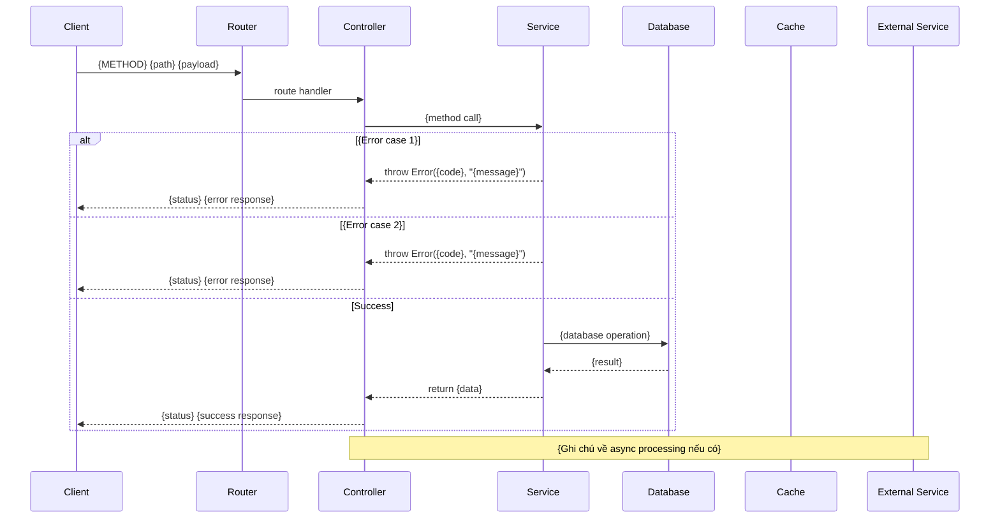

# 🏗️ TECHNICAL DESIGN DOCUMENT (TDD) — Template

> **Hướng dẫn sử dụng:** Thay thế nội dung trong `{...}` bằng thông tin thực tế. Xoá ghi chú hướng dẫn *(in nghiêng)* sau khi hoàn thành. Section đánh dấu `[Tuỳ chọn]` có thể bỏ nếu không áp dụng.

---

# 🏗️ TECHNICAL DESIGN DOCUMENT
## Tính năng: {Tên tính năng}

**Phiên bản:** {1.0}  
**Ngày tạo:** {DD/MM/YYYY}  
**Tài liệu tham chiếu:** {Feature FRA vX.0} · {WBS} · {Các FRA liên quan}  

---

## 1. TÓM TẮT THIẾT KẾ

*2-3 câu mô tả tổng quan: feature này thiết kế ra sao, pattern chính, điểm đáng chú ý nhất.*

*Nếu feature bổ sung lên feature khác → ghi rõ: thay đổi gì ở module cũ, module mới làm gì.*

**Tech Stack:**

| Hạng mục | Công nghệ | Ghi chú |
|---|---|---|
| {Runtime/Framework} | {vd: Node.js + Express} | Hiện có |
| {Database} | {vd: MongoDB + Mongoose} | Hiện có |
| {Cache} | {vd: Redis} | Hiện có / **Mới** |
| {Email/3rd party} | {vd: Nodemailer} | Hiện có / **Mới** |
| {Library mới 1} | {vd: geoip-lite} | **Mới** — {lý do chọn} |
| {Library mới N} | {vd: ua-parser-js} | **Mới** — {lý do chọn} |
| {Validation} | {vd: Joi} | Hiện có |
| {Error Handling} | {vd: Global handler + AppError} | Hiện có |
| {Logging} | {vd: Winston} | Hiện có |
| {Auth} | {vd: JWT → req.user} | Hiện có |
| {Response Format} | {vd: `{ statusCode, message, data }`} | Hiện có |

*Chỉ liệt kê library mới nếu feature cần thêm. Không lặp lại toàn bộ stack nếu không thay đổi.*

---

## 2. KIẾN TRÚC HỆ THỐNG

### 2.1 High-Level Architecture

*Vẽ sơ đồ tổng quan bằng ASCII art hoặc text diagram. Thể hiện:*
- *Các thành phần chính (Client, Server, DB, Cache, 3rd party)*
- *Hướng data flow*
- *Module mới nằm ở đâu trong hệ thống*

```
{Vẽ sơ đồ kiến trúc ở đây}

Ví dụ:
┌─────────┐       HTTPS        ┌────────────────────────┐
│ Client  │ ◄────────────── │  API Server            │
└─────────┘ ──────────────► │  ┌──────────────────┐  │
                              │  │ Module A (hiện có)│  │
                              │  └────────┬─────────┘  │
                              │           │ {tương tác} │
                              │  ┌────────▼─────────┐  │
                              │  │ Module B (MỚI)   │  │
                              │  └──┬──────┬────┬───┘  │
                              └─────┼──────┼────┼──────┘
                                    │      │    │
                              ┌─────▼┐  ┌──▼──┐ ┌▼─────┐
                              │  DB  │  │Cache│ │Email │
                              └──────┘  └─────┘ └──────┘
```

### 2.2 Design Patterns Applied

| Pattern | Áp dụng ở đâu | Lý do / SOLID Principle |
|---|---|---|
| {Pattern 1} | {Component/module} | {Lý do chọn + SOLID principle nào} |
| {Pattern N} | {Component/module} | {Lý do} |

*Chỉ liệt kê patterns thực sự áp dụng. Phổ biến: Event Emitter/Observer, Repository, Strategy, Middleware, Builder, Singleton, Factory.*

---

## 3. DATA MODELS

*Thiết kế schema/table cho mỗi entity. Language-agnostic — mô tả fields, types, constraints, relationships.*

### 3.1 {Tên Model/Collection/Table chính}

**Collection/Table:** `{tên_collection}`

| Field | Type | Required | Default | Index | Mô tả |
|---|---|---|---|---|---|
| `{field}` | {ObjectId/String/Number/Boolean/Date/Enum/Array} | ✅/⬜ | {giá trị hoặc null} | {Y/N} | {Mô tả} |

**Enum values:** *(nếu có)*

| Field | Giá trị cho phép |
|---|---|
| `{field}` | `VALUE_1`, `VALUE_2`, `VALUE_3` |

**Indexes:**

| Index | Fields | Type | Mục đích |
|---|---|---|---|
| {Tên/mô tả} | `{ field1: 1, field2: -1 }` | Compound / Single / TTL / Unique | {Query nào dùng index này} |

---

### 3.2 {Tên Model/Collection/Table thứ 2} — [Lặp lại cấu trúc 3.1]

---

### 3.N Cập nhật Model hiện có — [Tuỳ chọn: khi feature thêm fields vào entity đã có]

**Collection/Table:** `{tên hiện có}` — **THÊM fields:**

| Field mới | Type | Default | Mô tả |
|---|---|---|---|
| `{field}` | {Type} | {Default} | {Mô tả} |

---

### 3.X Cache Key Design — [Tuỳ chọn: nếu dùng Redis/cache]

| Key Pattern | Value | TTL | Mục đích |
|---|---|---|---|
| `{prefix}:{identifier}` | {Kiểu giá trị — counter/JSON/flag} | {TTL} | {Mục đích} |

---

## 4. API DESIGN (Chi tiết)

### 4.0 Endpoints sửa đổi — [Tuỳ chọn: khi feature tích hợp vào endpoint hiện có]

> *{N} endpoint hiện có **giữ nguyên** request/response format. Chỉ thêm logic: {mô tả thay đổi}.*

| # | Endpoint hiện có | Thay đổi |
|---|---|---|
| 1 | `{METHOD} {path}` | {Mô tả thay đổi ngắn gọn} |

**Event/Data payload chung:** *(nếu có)*

| Field | Type | Required | Mô tả |
|---|---|---|---|
| `{field}` | {Type} | ✅/⬜ | {Mô tả} |

---

### 4.1 `{METHOD} {/api/v1/path}` — {Mô tả ngắn}

*Lặp lại block này cho mỗi endpoint MỚI.*

**Request:**

| Thuộc tính | Giá trị |
|---|---|
| Method | {GET/POST/PUT/PATCH/DELETE} |
| Path | `{/api/v1/...}` |
| Auth | {Public / User / Admin} |
| Content-Type | {application/json / text/csv / ...} |

**Request Params / Query:** *(nếu có)*

| Param | Type | Required | Default | Validation | Mô tả |
|---|---|---|---|---|---|
| `{param}` | {string/number/date} | ✅/⬜ | {default} | {rules — vd: min 1, max 100} | {Mô tả} |

**Request Body:** *(nếu có)*

```json
{
  "{field}": "{example_value}"
}
```

**Validation Rules:**

| Field | Rules |
|---|---|
| `{field}` | {required, email, min, max, enum, etc.} |

**Response Success ({status code}):**

```json
{
  "statusCode": {200},
  "message": "{Success message}",
  "data": {
    "{response fields}"
  }
}
```

> Response errors: xem **Section 11 — Error Codes Mapping**.

---

### 4.N `{METHOD} {path}` — {Mô tả}

*Lặp lại cấu trúc 4.1 cho mỗi endpoint.*

---

## 5. SEQUENCE DIAGRAMS

*Vẽ Mermaid sequence diagram cho các luồng chính. Bao gồm cả nhánh lỗi (alt/else).*

*KHÔNG viết thêm Data Flow dạng text — sequence diagrams đã thể hiện đầy đủ luồng xử lý. Viết cả hai sẽ gây trùng lặp.*

### 5.1 {Tên luồng — vd: Luồng chính Happy Path + Error Cases}



### 5.2 {Tên luồng thứ 2}

*Lặp lại cho mỗi luồng quan trọng.*

---

## 6. EDGE CASE HANDLING

> 📎 Danh sách edge cases: xem **[FRA Section 5](./{feature-name}-feature-requirements-analysis.md)**.
> Tất cả edge cases đã được xử lý trong Sequence Diagrams (Section 5) và Error Codes (Section {N cuối}).

*KHÔNG copy bảng edge cases từ FRA vào đây — FRA là nguồn gốc duy nhất. System Design chỉ thể hiện cách xử lý qua Sequence Diagrams và Error Codes.*

---

## 7. EVENT / ASYNC DESIGN — [Tuỳ chọn: nếu feature có xử lý async, event-driven, hoặc background job]

### 7.1 {Tên component — vd: Event Emitter / Message Producer}

| Thuộc tính | Mô tả |
|---|---|
| Pattern | {Singleton + Observer / Producer-Consumer / Pub-Sub} |
| Events/Topics | {Liệt kê event names} |
| Payload | {Tham chiếu interface ở Section 4} |
| Async behavior | {Fire-and-forget / await result / ...} |

### 7.2 {Tên handler — vd: Event Handler / Consumer / Worker}

**Handler `{event.name}`:**

| Bước | Hành động | Lỗi thì sao |
|---|---|---|
| 1 | {Hành động} | {Error handling — vd: default value, skip, log, retry} |
| N | {Hành động} | {Error handling} |

> **Nguyên tắc:** {Mô tả nguyên tắc error handling chung — vd: wrap try-catch, KHÔNG throw, chỉ log}

### 7.3 Migration Path — [Tuỳ chọn: nếu thiết kế dự phòng chuyển đổi architecture]

| Hiện tại | Tương lai | Thay đổi cần thiết |
|---|---|---|
| {vd: Event Emitter} | {vd: Message Queue} | {vd: Thay emitter bằng producer, handler logic không đổi} |

---

## 8. UTILS / HELPER DESIGN — [Tuỳ chọn: nếu feature cần utility functions dùng chung]

*Mô tả input/output/behavior — language-agnostic. KHÔNG viết code.*

### 8.1 {Tên Utility — vd: GeoIP Lookup}

| Thuộc tính | Mô tả |
|---|---|
| Input | {Type + mô tả} |
| Output | {Type + mô tả} |
| Library gợi ý | {Tên library hoặc "tự implement"} |
| Error handling | {Behavior khi lỗi — vd: return default values} |
| Ghi chú | {Edge cases đặc biệt} |

### 8.N {Tên Utility tiếp theo}

*Lặp lại cấu trúc 8.1.*

**Thuật toán:** *(nếu logic phức tạp cần mô tả bước)*

| Bước | Hành động |
|---|---|
| 1 | {Hành động} |
| N | {Hành động} |

---

## 9. MIDDLEWARE DESIGN — [Tuỳ chọn: nếu feature cần middleware mới]

### 9.1 {Tên Middleware — vd: Admin Auth Middleware}

| Thuộc tính | Mô tả |
|---|---|
| Vị trí trong chain | {vd: Sau JWT auth middleware, trước Controller} |
| Input | {vd: req.user (đã set bởi middleware trước)} |
| Logic | {Mô tả logic kiểm tra} |
| Pass → | {Gọi next()} |
| Fail → | {Throw error + status code + message} |

**Middleware Chain:**

```
{Middleware 1} → {Middleware 2} → {Middleware N} → Controller
     ↓                ↓                ↓
{Mô tả việc}   {Mô tả việc}    {Mô tả việc}
```

---

## 10. DATABASE INDEXES — [Tuỳ chọn: gộp lại nếu có nhiều collection/table]

*Bảng tổng hợp tất cả indexes mới cần tạo. Dev/DBA dùng bảng này để review performance.*

| Collection/Table | Index | Type | Mục đích / Query |
|---|---|---|---|
| `{collection}` | `{ field1: 1, field2: -1 }` | {Compound/Single/TTL/Unique/Text} | {Query hoặc Phase nào dùng} |

> Cache keys: xem **Section 3.X — Cache Key Design**. KHÔNG lặp lại ở đây.

---

## 11. ERROR CODES MAPPING

*Bảng tổng hợp tất cả error responses của feature. FE dùng bảng này để handle errors. Đây là nguồn gốc duy nhất cho error codes — KHÔNG viết bảng error riêng trong mỗi API endpoint (Section 4).*

| HTTP Status | Error Code | Khi nào | Response Message |
|---|---|---|---|
| {400} | `{ERROR_CODE}` | {Điều kiện trigger} | "{Message hiển thị}" |
| {401} | `{ERROR_CODE}` | {Điều kiện} | "{Message}" |
| {403} | `{ERROR_CODE}` | {Điều kiện} | "{Message}" |
| {404} | `{ERROR_CODE}` | {Điều kiện} | "{Message}" |
| {429} | `{ERROR_CODE}` | {Điều kiện} | "{Message}" |
| {500} | `{ERROR_CODE}` | {Điều kiện} | "{Message}" |

---

*Tài liệu sẵn sàng cho implementation. Bắt đầu từ Phase 1 theo WBS.*

---
---

# 📐 HƯỚNG DẪN SỬ DỤNG TEMPLATE

## Quy trình

```
FRA (What)  →  WBS (Organize)  →  TDD (How)  →  Implementation
                                     ↑
                                  BẠN Ở ĐÂY
```

## Khi nào dùng section nào

| # | Section | Bắt buộc | Khi nào dùng |
|---|---|---|---|
| 1 | Tóm tắt + Tech Stack | ✅ | Luôn có — nguồn gốc duy nhất cho tech stack chi tiết |
| 2 | Kiến trúc (Architecture + Patterns) | ✅ | Luôn có |
| 3 | Data Models + Cache Keys | ✅ | Luôn có nếu feature có data persistence |
| 4 | API Design | ✅ | Luôn có nếu feature có API. Error tables → link Section 11 |
| 5 | Sequence Diagrams | ✅ | Luôn có — thay thế Data Flow (KHÔNG viết cả hai) |
| 6 | Edge Case Handling | ✅ | Chỉ link FRA — KHÔNG copy bảng edge cases |
| 7 | Event / Async Design | ⬜ | Khi feature có event-driven, background job, message queue |
| 8 | Utils / Helper Design | ⬜ | Khi feature cần utility functions dùng chung |
| 9 | Middleware Design | ⬜ | Khi feature cần middleware mới |
| 10 | Database Indexes | ⬜ | Khi có query phức tạp. Cache keys → link Section 3.X |
| 11 | Error Codes Mapping | ✅ | Nguồn gốc duy nhất cho errors — FE dùng bảng này |

## Nguyên tắc viết TDD

### Language-Agnostic
- **Data Models:** Mô tả fields, types, constraints, indexes — KHÔNG viết schema code cụ thể.
- **Utils:** Mô tả input/output/behavior dạng bảng — KHÔNG viết implementation code.
- **Event Handlers:** Mô tả bước xử lý + error handling dạng bảng — KHÔNG viết code.
- **Ngoại lệ:** API request/response dùng JSON (language-agnostic). Validation rules mô tả dạng text. Sequence diagrams dùng Mermaid.

### Nhưng đủ chi tiết để implement
- Dev đọc TDD phải biết **chính xác**: tạo bao nhiêu tables/collections, mỗi cái có fields gì, index gì, API nào trả response gì, error nào throw khi nào.
- Không quá abstract ("tạo service xử lý logic") — phải cụ thể ("check accountStatus trước check lockout, priority: DISABLED > LOCKED > credentials").

### Chống trùng lặp
- **Edge cases:** FRA là nguồn gốc → TDD chỉ link, KHÔNG copy bảng.
- **Error codes:** Chỉ nằm ở Section 11 → API sections chỉ link, KHÔNG viết bảng error riêng.
- **Cache keys:** Chỉ nằm ở Section 3.X → KHÔNG lặp lại ở Section 10.
- **Data flow:** Chỉ dùng Sequence Diagrams → KHÔNG viết thêm Data Flow dạng text.
- **Tech stack:** TDD là nguồn gốc chi tiết → FRA chỉ tóm tắt 1 dòng.

### Ranh giới TDD vs Code
| TDD mô tả ✅ | Code implement ✅ (không nằm trong TDD) |
|---|---|
| Field nào, type gì, index gì | Mongoose schema code, SQL CREATE TABLE |
| API trả response gì, error gì | Controller function code |
| Luồng xử lý bước 1, 2, 3 | Service function code |
| Error handling: log + không throw | Try-catch implementation |
| Thứ tự check: A trước B trước C | If-else code |

## Feature bổ sung lên feature đã có

| Tình huống | Cách viết trong TDD |
|---|---|
| Thêm fields vào model hiện có | Section 3.N "Cập nhật Model hiện có" — chỉ liệt kê fields MỚI |
| Tích hợp logic vào endpoint hiện có | Section 4.0 "Endpoints sửa đổi" — mô tả thay đổi, KHÔNG viết lại toàn bộ endpoint |
| Dùng middleware hiện có | Ghi trong bảng Tech Stack: "Hiện có". Không viết lại |
| Thêm middleware mới | Section 9 + ghi rõ vị trí trong chain |
| Dùng error codes hiện có | Section 11 — liệt kê cả cũ + mới, đánh dấu mới |

## Checklist trước khi submit TDD

- [ ] Mỗi field trong Data Model có type + required + default + index rõ ràng
- [ ] Mỗi API endpoint có request + response. Errors chỉ nằm ở Section 11 (KHÔNG viết bảng error riêng mỗi endpoint)
- [ ] Edge cases tham chiếu FRA (KHÔNG copy bảng edge cases vào TDD)
- [ ] Sequence diagrams cover ít nhất: 1 happy path + tất cả error branches
- [ ] KHÔNG có Data Flow dạng text (sequence diagrams đã đủ)
- [ ] Error codes mapping đầy đủ tại Section 11 — FE có thể dùng làm reference
- [ ] Cache keys chỉ nằm ở Section 3.X (KHÔNG lặp lại ở Section 10)
- [ ] Index strategy đã xem xét các query quan trọng từ use cases
- [ ] Nếu có async/event → migration path được mô tả rõ
- [ ] **Không có nội dung trùng lặp** giữa các sections trong cùng tài liệu
