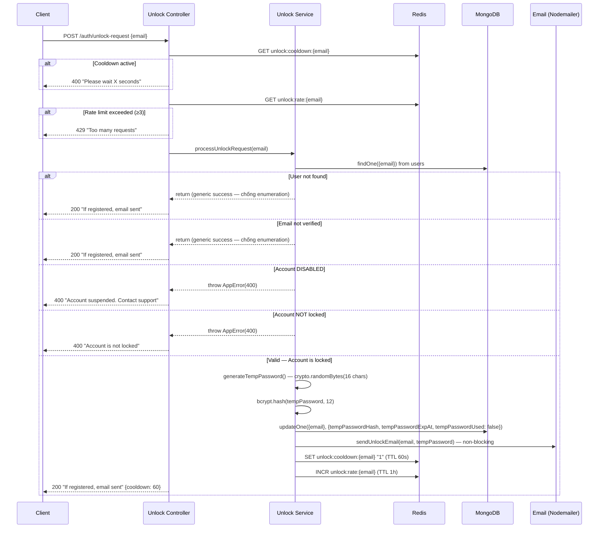
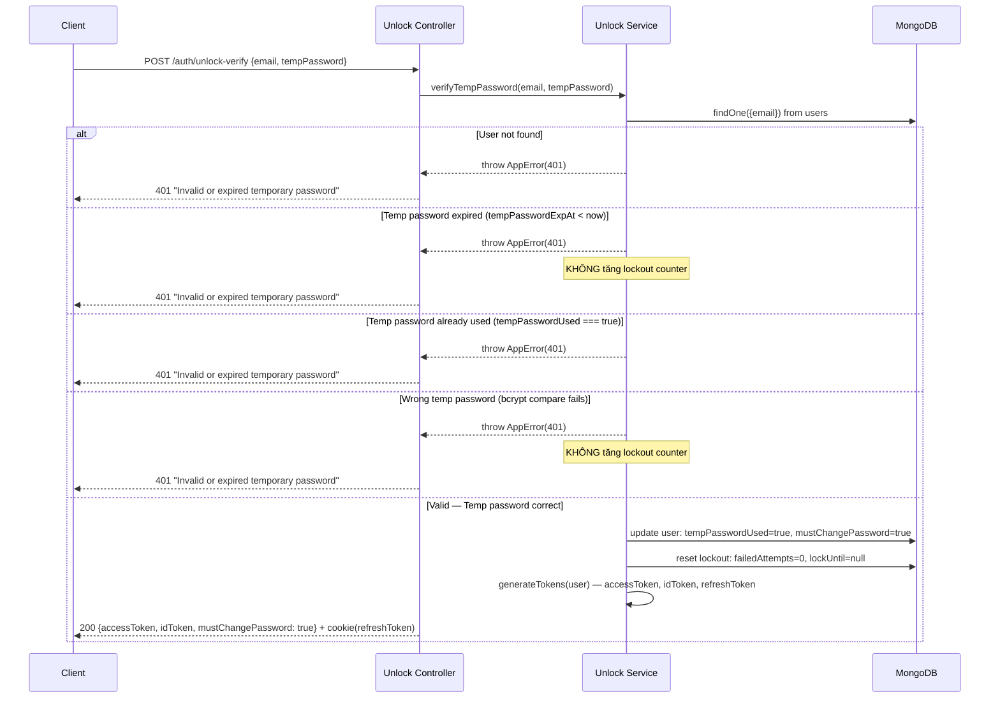

# 🏗️ TECHNICAL DESIGN DOCUMENT
## Tính năng: Mở khoá tài khoản qua Email + Bắt buộc đổi mật khẩu

**Phiên bản:** 1.0
**Ngày tạo:** 09/02/2026
**Tài liệu tham chiếu:** Unlock Account FRA v1.0 · Sign-in FRA v2.0 · Unlock Account WBS

---

## 1. TÓM TẮT THIẾT KẾ

Feature bổ sung module `unlock-account` vào hệ thống, tạo 2 endpoint mới (`unlock-request`, `unlock-verify`) và bổ sung logic check `mustChangePassword` vào middleware hiện có. Thiết kế tận dụng infrastructure đã có (Redis cho rate limiting, Nodemailer cho email, bcrypt cho hashing) và tuân thủ kiến trúc feature-based hiện tại.

**Tech Stack:**

| Hạng mục | Công nghệ | Ghi chú |
|---|---|---|
| Runtime | Node.js + TypeScript | Hiện có |
| Framework | Express | Hiện có |
| Database | MongoDB + Mongoose | Hiện có |
| Cache | Redis | Hiện có (OTP, rate limiting) |
| Validation | Joi | Hiện có |
| Error Handling | Global error handler + custom AppError class | Hiện có |
| Logging | Winston | Hiện có |
| Email | Nodemailer | Hiện có |
| Auth | JWT → `req.user = { userId, authId, email, roles }` | Hiện có |
| Password Hashing | bcrypt (cost ≥ 12) | Hiện có |
| Response Format | `{ statusCode, message, data }` | Hiện có |

> Không cần thêm library mới. Toàn bộ dùng hạ tầng đã có.

---

## 2. KIẾN TRÚC HỆ THỐNG

### 2.1 High-Level Architecture

```
┌─────────────┐       HTTPS        ┌──────────────────────────────┐
│  Client App │ ◄──────────────── │  Express API Server          │
│  (Web/Mobile)│ ──────────────► │                              │
└─────────────┘                    │  ┌─────────────────────┐    │
                                   │  │  Auth Module         │    │
                                   │  │  (Sign-in - hiện có) │    │
                                   │  └──────────┬──────────┘    │
                                   │             │               │
                                   │  ┌──────────▼──────────┐    │
                                   │  │  Unlock Account      │    │
                                   │  │  Module (MỚI)        │    │
                                   │  └──┬──────┬───────┬───┘    │
                                   │     │      │       │         │
                                   │  ┌──▼───┐  │    ┌──▼──────┐ │
                                   │  │Check │  │    │Force    │ │
                                   │  │Lock  │  │    │Change   │ │
                                   │  │State │  │    │Password │ │
                                   │  │      │  │    │Middleware│ │
                                   │  └──────┘  │    └─────────┘ │
                                   └────────────┼────────────────┘
                                          ┌─────┼─────┐
                                    ┌─────▼──┐ ┌▼────┐ ┌▼─────────┐
                                    │MongoDB │ │Redis│ │Nodemailer │
                                    │        │ │     │ │(Email)    │
                                    └────────┘ └─────┘ └───────────┘
```

### 2.2 Design Patterns Applied

| Pattern | Áp dụng ở đâu | Lý do / SOLID Principle |
|---|---|---|
| **Middleware Pattern** | `forceChangePassword.middleware.ts` — chain vào protected routes | Express pattern hiện có. Check `mustChangePassword` flag trước khi cho phép truy cập API. SOLID: **S** |
| **Repository Pattern** | `unlockAccount.service.ts` — tách business logic khỏi controller | Tách data access khỏi business logic. SOLID: **S**, **D** |
| **Singleton Pattern** | Redis client (hiện có) | Tái sử dụng connection |

---

## 3. DATA MODELS

### 3.1 Cập nhật User Model — Thêm fields vào `users` collection hiện có

**Collection:** `users` — **THÊM fields:**

| Field mới | Type | Required | Default | Index | Mô tả |
|---|---|---|---|---|---|
| `tempPasswordHash` | String | ⬜ | `null` | N | Hash bcrypt của mật khẩu tạm |
| `tempPasswordExpAt` | Date | ⬜ | `null` | N | Thời điểm hết hạn mật khẩu tạm (UTC) |
| `tempPasswordUsed` | Boolean | ⬜ | `false` | N | Đánh dấu mật khẩu tạm đã được sử dụng |
| `mustChangePassword` | Boolean | ⬜ | `false` | N | Flag bắt buộc đổi mật khẩu |
| `accountStatus` | String (Enum) | ⬜ | `'ACTIVE'` | Y (Single) | Trạng thái tài khoản: `ACTIVE`, `DISABLED` |

**Enum values:**

| Field | Giá trị cho phép |
|---|---|
| `accountStatus` | `ACTIVE`, `DISABLED` |

> **Ghi chú về `accountStatus`:** Field này được thêm ở đây với default `ACTIVE`. Các logic liên quan đến DISABLED (admin disable/enable) sẽ được implement trong feature riêng. Unlock Account chỉ **check** field này để từ chối unlock cho tài khoản bị DISABLED.

### 3.2 Redis Key Design

| Key Pattern | Value | TTL | Mục đích |
|---|---|---|---|
| `unlock:cooldown:{email}` | `"1"` (flag) | 60 giây | Cooldown giữa 2 lần gửi unlock email |
| `unlock:rate:{email}` | Counter (number) | 1 giờ | Rate limit unlock request: tối đa 3/giờ |

---

## 4. API DESIGN (Chi tiết)

### 4.0 Endpoints sửa đổi (Endpoint hiện có cần bổ sung logic)

> 1 endpoint hiện có cần bổ sung logic check/clear `mustChangePassword`.

| # | Endpoint hiện có | Thay đổi |
|---|---|---|
| 1 | `PUT /api/v1/me/password` (hoặc change password endpoint tương đương) | Sau khi đổi mật khẩu thành công → clear `mustChangePassword = false`, clear `tempPasswordHash`, `tempPasswordExpAt`, `tempPasswordUsed` |

---

### 4.1 `POST /api/v1/auth/unlock-request` — Yêu cầu gửi email unlock

**Request:**

| Thuộc tính | Giá trị |
|---|---|
| Method | POST |
| Path | `/api/v1/auth/unlock-request` |
| Auth | Public |
| Content-Type | application/json |

**Request Body:**

```json
{
  "email": "user@example.com"
}
```

**Validation Rules:**

| Field | Rules |
|---|---|
| `email` | required, valid email, trim, lowercase |

**Response Success (200):**

```json
{
  "statusCode": 200,
  "message": "If this email is registered, an unlock email has been sent",
  "data": {
    "cooldown": 60
  }
}
```

> Response message generic — không tiết lộ email tồn tại hay không.

> Response errors: xem **Section 10 — Error Codes Mapping**.

---

### 4.2 `POST /api/v1/auth/unlock-verify` — Đăng nhập bằng mật khẩu tạm

**Request:**

| Thuộc tính | Giá trị |
|---|---|
| Method | POST |
| Path | `/api/v1/auth/unlock-verify` |
| Auth | Public |
| Content-Type | application/json |

**Request Body:**

```json
{
  "email": "user@example.com",
  "tempPassword": "aB3$xY9#mK2!pQ7w"
}
```

**Validation Rules:**

| Field | Rules |
|---|---|
| `email` | required, valid email, trim, lowercase |
| `tempPassword` | required, string, min 12 chars |

**Response Success (200):**

```json
{
  "statusCode": 200,
  "message": "Login successful. You must change your password",
  "data": {
    "accessToken": "eyJhbGc...",
    "idToken": "eyJhbGc...",
    "mustChangePassword": true
  }
}
```

> `refreshToken` set vào httpOnly cookie — nhất quán với Sign-in.

> Response errors: xem **Section 10 — Error Codes Mapping**. Tất cả error cases trả cùng 1 message generic — chống enumeration.

---

## 5. SEQUENCE DIAGRAMS

### 5.1 Unlock Request Flow



### 5.2 Unlock Verify Flow



---

## 6. EDGE CASE HANDLING

> 📎 Danh sách edge cases: xem **[FRA Section 5](./unlock-account-feature-requirements-analysis.md)**.
> Tất cả edge cases đã được xử lý trong Sequence Diagrams (Section 5) và Error Codes (Section 10).

---

## 7. UTILS / HELPER DESIGN

### 7.1 Temp Password Generator

| Thuộc tính | Mô tả |
|---|---|
| Input | Không có (hoặc optional: `length: number`, default 16) |
| Output | String — mật khẩu tạm plaintext (16 ký tự) |
| Random source | **Crypto-secure random** (`crypto.randomBytes`) — KHÔNG dùng Math.random |
| Error handling | Nếu crypto fail → throw Error (không fallback sang Math.random) |

**Thành phần bắt buộc trong mật khẩu tạm:**
- Ít nhất 1 chữ hoa (A-Z)
- Ít nhất 1 chữ thường (a-z)
- Ít nhất 1 số (0-9)
- Ít nhất 1 ký tự đặc biệt (`!@#$%^&*`)

**Thuật toán:**

| Bước | Hành động |
|---|---|
| 1 | Random 1 ký tự chữ hoa (A-Z) bằng crypto.randomBytes |
| 2 | Random 1 ký tự chữ thường (a-z) |
| 3 | Random 1 ký tự số (0-9) |
| 4 | Random 1 ký tự đặc biệt (!@#$%^&*) |
| 5 | Fill phần còn lại (length - 4 = 12 ký tự) từ tập tất cả ký tự trên |
| 6 | Shuffle toàn bộ mảng ký tự (crypto-secure shuffle) |
| 7 | Join thành string → return |

---

## 8. MIDDLEWARE DESIGN

### 8.1 Force Change Password Middleware

| Thuộc tính | Mô tả |
|---|---|
| Vị trí trong chain | Sau JWT auth middleware, trước Controller (trên tất cả protected routes) |
| Input | `req.user` (đã set bởi JWT middleware) |
| Logic | Query user từ DB (hoặc từ JWT payload nếu có flag). Nếu `mustChangePassword === true` → chỉ cho phép truy cập endpoint change password. Tất cả endpoint khác → reject. |
| Pass → | Gọi `next()` nếu `mustChangePassword === false` HOẶC endpoint hiện tại là change password |
| Fail → | Throw error 403 "You must change your password before continuing" |

**Middleware Chain cho Protected Routes:**

```
JWT Auth Middleware → Force Change Password Middleware → Controller
       ↓                         ↓
  set req.user              check mustChangePassword
  (userId, email,           === true → chỉ cho phép
   authId, roles)            change password endpoint
```

**Whitelist endpoints khi `mustChangePassword = true`:**
- `PUT /api/v1/me/password` (change password)
- `POST /api/v1/auth/logout` (logout)

Tất cả endpoint khác → reject 403.

---

## 9. DATABASE INDEXES

| Collection | Index | Type | Mục đích |
|---|---|---|---|
| `users` | `{ accountStatus: 1 }` | Single | Check DISABLED status khi unlock request |

> Các index hiện có trên `users` collection (email unique, etc.) đã đủ cho query trong feature này.
> Redis keys: xem **Section 3.2**.

---

## 10. ERROR CODES MAPPING

| HTTP Status | Error Code | Khi nào | Response Message |
|---|---|---|---|
| 200 | - | Unlock request thành công (hoặc email không tồn tại — generic) | "If this email is registered, an unlock email has been sent" |
| 200 | - | Unlock verify thành công | "Login successful. You must change your password" |
| 400 | `COOLDOWN_ACTIVE` | Unlock request trong cooldown (< 60s) | "Please wait {remaining} seconds before requesting again" |
| 400 | `ACCOUNT_NOT_LOCKED` | Account không bị lock | "Account is not locked" |
| 400 | `ACCOUNT_DISABLED` | Account bị DISABLED | "Account suspended. Please contact support" |
| 401 | `INVALID_TEMP_PASSWORD` | Sai / hết hạn / đã dùng temp password | "Invalid or expired temporary password" |
| 403 | `MUST_CHANGE_PASSWORD` | User chưa đổi mật khẩu sau unlock, truy cập endpoint khác | "You must change your password before continuing" |
| 422 | `VALIDATION_ERROR` | Input validation fail | "Validation failed" |
| 429 | `RATE_LIMITED` | Vượt quá 3 unlock requests / giờ | "Too many unlock requests. Please try again later" |
| 503 | `SERVICE_UNAVAILABLE` | Redis down → không check được cooldown/rate limit | "Service temporarily unavailable" |

---

*Tài liệu sẵn sàng cho implementation. Bắt đầu từ Phase 1 theo WBS.*
